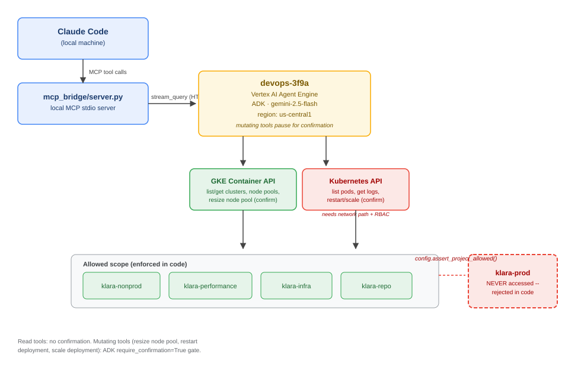

# devops-3f9a - GKE DevOps Assistant

## Overview

devops-3f9a is a GKE ops agent for the LUZ ops estate, built on Google's
Agent Development Kit (ADK) and deployed to Vertex AI Agent Engine. It
helps engineers inspect GKE clusters, pods, and deployments, and -- with
an explicit human confirmation step -- resize node pools, restart
deployments, and scale deployments.

This README follows the structure of
[adk-samples' software-bug-assistant](https://github.com/google/adk-samples/tree/main/python/agents/software-bug-assistant),
the reference sample this repo's other ops agent (`sba-us-central1`) is
based on.

## Agent Details

| Feature | Description |
| --- | --- |
| **Interaction Type** | Conversational (Agent Engine playground/API, or via the local MCP bridge from Claude Code) |
| **Complexity** | Intermediate |
| **Agent Type** | Single Agent |
| **Components** | Tools (GKE Container API, Kubernetes API), ADK tool confirmation |
| **Vertical** | DevOps / SRE -- GKE |

## Architecture



## Key Features

- **Scope enforced in code, not just the prompt.** Every tool calls
  `devops_3f9a/config.py:assert_project_allowed` before touching GCP --
  `klara-prod` is rejected regardless of what the model decides, or what
  the user asks for.
- **Confirmation-gated mutations.** `resize_node_pool`,
  `restart_deployment`, and `scale_deployment` use ADK's native
  `require_confirmation=True` -- nothing mutating runs without an
  explicit approval step, whether that's the Agent Engine playground's
  built-in prompt or the MCP bridge's two-call confirm flow.
- **Two access layers matched to two different reachability
  guarantees** -- see below.
- **Local MCP bridge** so Claude Code on your machine can drive this
  agent directly, including resolving its confirmation prompts.

### Tools

| Tool | Type | Confirmation required? |
| --- | --- | --- |
| `list_clusters` | read | no |
| `get_cluster` | read | no |
| `list_node_pools` | read | no |
| `list_pods` | read | no |
| `get_pod_logs` | read | no |
| `search_ops_docs` | read (RAG retrieval) | no |
| `resize_node_pool` | mutating | **yes** |
| `restart_deployment` | mutating | **yes** |
| `scale_deployment` | mutating | **yes** |

### Two access layers, two different prerequisites

1. **Cluster/node-pool tools** call the GKE **Container API**
   (`container.googleapis.com`) directly -- this always works regardless
   of a cluster's network configuration (private endpoint or not).
2. **Pod/deployment tools** call the target cluster's own **Kubernetes
   API** directly, using a bearer token minted from this agent's GCP
   credentials. This needs:
   - Network reachability from wherever the agent runs to each cluster's
     control plane endpoint.
   - The calling identity (the Agent Engine service account) to be
     authorized inside that cluster -- GKE's built-in IAM-to-RBAC
     authorization checks Cloud IAM roles (`roles/container.admin`,
     `roles/container.developer`, etc.) automatically for most clusters;
     a small number of clusters with custom/legacy authorization settings
     may additionally need an explicit `ClusterRoleBinding` for this
     agent's service account.

If pod/deployment tools fail with a connection or permission error,
that's this prerequisite, not a bug -- the agent will say so rather than
pretend the call succeeded.

## Setup and Installation

### Prerequisites

- Python 3.12
- [`uv`](https://docs.astral.sh/uv/) for dependency management
- `gcloud` CLI, authenticated with Application Default Credentials
  (`gcloud auth application-default login`)
- Access to the `klara-nonprod` GCP project

### GCP-side prerequisite (one-time, not yet done)

devops-3f9a deploys with a dedicated runtime service account,
`devops-agent-runtime-sa@klara-nonprod.iam.gserviceaccount.com`,
rather than the Agent Engine default per-project service agent. It
needs `roles/container.admin` (or narrower, e.g.
`roles/container.developer` for read + most mutations without full
admin) on each of the 4 allowed projects, and the Reasoning Engine
build/runtime service agent needs `roles/iam.serviceAccountUser` on it
so it can be attached at deploy time. **This has not been granted
yet** -- tool calls will fail with a permission error until it is.
Granting cross-project IAM roles needs explicit sign-off; see
`DEPLOY.md` for the exact commands.

### Install

```powershell
cd devops-3f9a
uv venv --python 3.12
uv pip install "google-adk==1.28.0" "mcp==1.26.0" "google-cloud-aiplatform[agent-engines,evaluation]>=1.93.0" "google-cloud-container>=2.55.0" "kubernetes>=31.0.0" "python-dotenv>=1.1.0"
```

## Deploy to Google Cloud

Full step-by-step instructions -- including the one-time GCP setup, the
`extra_packages` path trap that broke the first deploy attempt, testing
the confirmation-resume flow, and wiring the MCP bridge into Claude Code
-- are in **[`DEPLOY.md`](DEPLOY.md)**. Short version:

```powershell
$env:PYTHONPATH = (Get-Location)
.\.venv\Scripts\python.exe deployment\deploy.py
```

Current deployment: `projects/335505349498/locations/us-central1/reasoningEngines/5955858224837033984`

## Using it from Claude Code (MCP)

This repo's root `.mcp.json` registers `devops-3f9a` as a local MCP
server (`mcp_bridge/server.py`) exposing two tools:

- `ask_devops_agent(message, session_id)` -- ask it anything; if it
  wants to run a mutating action, this returns the pending confirmation
  instead of running it.
- `confirm_devops_agent_action(session_id, approve)` -- approve or
  reject that pending action.

See `DEPLOY.md` "Wire it into Claude Code via MCP" for setup.

## Files

- `devops_3f9a/agent.py` -- `root_agent` definition (model, tools, instruction).
- `devops_3f9a/prompt.py` -- the agent's system instruction.
- `devops_3f9a/config.py` -- the hard-coded project allowlist.
- `devops_3f9a/tools/gke_tools.py` -- all 8 GKE tools (`search_ops_docs`
  is defined inline in `agent.py`, backed by the RAG corpus below).
- `deployment/deploy.py` -- create/update the Agent Engine deployment.
- `mcp_bridge/server.py` -- local MCP server exposing this agent to
  Claude Code (or any MCP client) on your machine.
- `architecture-diagram.svg` -- the diagram above.
- `RAG.md` -- the `search_ops_docs` RAG corpus: what's indexed, why it
  lives in `us-west1`, and how to refresh it.
- `DEPLOY.md` -- step-by-step instructions to deploy this agent from a
  local machine to Vertex AI Agent Engine.
