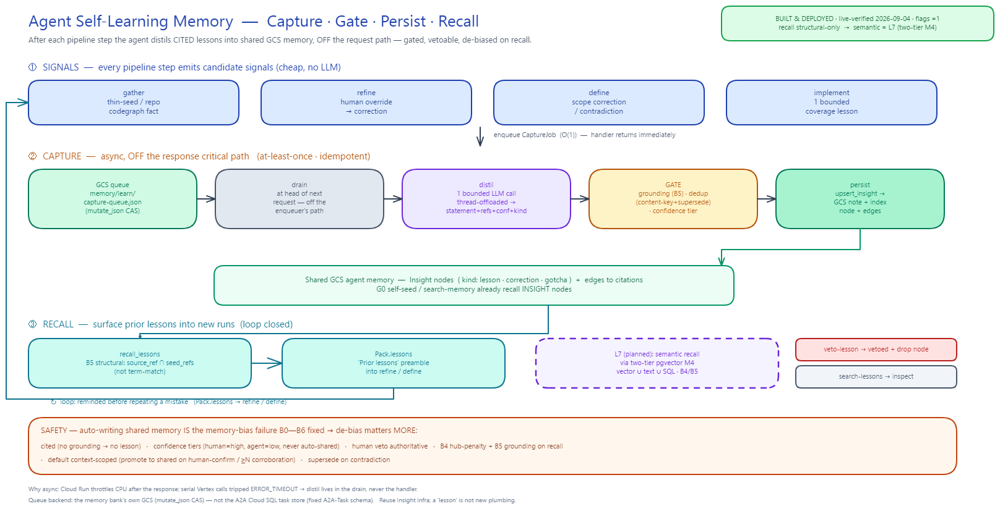

# PROPOSAL — Agent self-learning memory (auto-capture lessons to GCS)

> Status: **IMPLEMENTED & DEPLOYED (live-verified 2026-09-04)** — L0–L6 shipped in `common/learn/*`
> (committed in `b9948f7`). Flags `{KGA,TPD}_CAPTURE_LESSONS` / `_RECALL_LESSONS` are **declared and
> enabled (`="1"`) in `deployments/services.tf`** (code default is OFF via `common/learn/config.py`);
> the full capture → recall → veto loop was proven end-to-end on the deployed MCP tools.
> Recall today is **structural-only** (B5 `source_refs ∩ seed_refs`); **semantic recall lands with the
> two-tier memory M4** (§6 · §9). Author target: KGA + TPD agents.
> Related: [[RESEARCH-self-exploring-knowledge-gather]] (de-bias B0–B6),
> [[PROPOSAL-two-tier-agent-memory-pgvector]] (**the recall upgrade this needs** — M0–M2 built),
> [[task-store-cloud-sql]], PROPOSAL-KNOWLEDGE-REFINEMENT.
> Diagram: `self-learning-memory-loop.excalidraw` / `.png` (this dir) — the four-band loop
> (① signals · ② async capture: queue → drain → distil → gate → persist · ③ recall into the next run),
> plus the safety band (cited · confidence-tiered · vetoable · B4/B5 de-biased).



## 1. Goal

After **any** Testing-Agent pipeline step (gather · refine · approve · define · implement · post-run
review), the agent should **distil the valuable, non-obvious things it just learned into the shared
GCS agent memory** as durable, cited, recallable nodes — so **every future run of any agent** starts
smarter. Today only `refine` writes durable knowledge (Q&A → `Insight`); `gather` writes crawl notes,
and `define`/`implement` write **nothing** to memory. This proposal generalises "collect insight" into
a cross-step **self-learning** capability.

**Principle (carried from the KG design):** *nothing ungrounded, nothing unbounded, human owns the
gate.* A "lesson" must be **cited** and is **vetoable**; capture is **best-effort** and never breaks
the pipeline; recall is **de-biased** (a bad lesson must not poison future runs).

## 2. The core decision — reuse the `Insight` infrastructure

A "lesson" is not a new storage primitive. The existing `Insight` (common/models/refine.py) already
carries everything a lesson needs and is already wired end-to-end:

| Insight has… | …which a lesson needs |
|---|---|
| `statement` | the lesson text |
| `source_refs` | **citations** (grounding) |
| `confidence` (high/med/low) | human-confirmed vs agent-derived |
| `kind` (decision/assumption/…) | extend with `lesson` / `correction` / `gotcha` |
| `rejected`, `rationale` | veto trail, why |
| `context_id`, `run_id`, `created_at` | provenance |
| `bank.upsert_insight` + `Graph.add_insight` (CAS) | GCS write + index node + edges to sources |
| G0 self-seed + `search-memory` already surface `INSIGHT` nodes | **recall for free** |

So the work is **not** new plumbing — it is: (a) a few new `kind`s + provenance fields, (b) a shared
**capture step** that runs after each stage, (c) a **grounding/dedup/confidence gate**, (d) wiring the
capture into `gather`/`define`/`implement` (refine already distils), and (e) a **de-biased recall**
path that surfaces prior lessons into new runs.

## 3. Data model (L0)

Extend `common/models/refine.py`:

- New `kind`s: `LESSON = "lesson"`, `CORRECTION = "correction"` (human overrode the agent),
  `GOTCHA = "gotcha"` (a trap), reusing the existing `Insight` shape.
- New `Insight` fields (all defaulted, backward-compatible):
  - `origin_step: str` — `gather | refine | define | implement | review`
  - `scope: str = "context"` — `context` (this run only) | `shared` (promoted, cross-run)
  - `status: str = "active"` — `active | vetoed | superseded`
  - `supersedes: str = ""` — id of a lesson this one replaces (contradiction handling)
- Lessons **require** ≥1 `source_ref`; an uncited candidate is dropped or kept only as `confidence=low,
  scope=context` (never `shared`).

## 4. Capture step (L1–L3)

A shared, dependency-light helper — new package `common/learn/` (mirrors `common/interrogate/`):

```
capture_lessons(bank, *, context_id, run_id, step, artifacts, distiller=None) -> list[Insight]
```

Flow (bounded, best-effort, degrade-to-noop):
1. **Collect candidate signals** from the step's own artifacts — cheap, no LLM:
   - *refine:* human answers that **overrode** the agent recommendation (→ `correction`), declared gaps,
     `new_seed` re-grounding events.
   - *define/implement:* scope corrections the human made, plan/skeleton vs approved-understanding
     **contradictions**, generated-vs-expected mismatches.
   - *gather:* 0-link/thin-seed false-negatives, dev-panel repos found, drift/stop signals from the
     explore loop.
   - *review/compare:* explicit corrected facts (e.g. "QR removal is individual-only"), not-built gaps.
2. **Distil** — ONE `asyncio.to_thread`-offloaded LLM call turns candidate signals into `statement`
   + `source_refs` + `confidence` + `kind`. No signals → no call. Failure → heuristic passthrough or
   noop. (Same offload discipline as `refine.next_questions`; see the Cloud-Run-timeout constraint.)
3. **Grounding gate** — drop any lesson whose `source_refs` don't resolve to a real pack/index node
   (reuse `explore.index.graph_grounded` / `match_index_nodes`). Mirrors the G4 lead-grounding gate.
4. **Dedup** — content-key (normalised statement) + recall of near-duplicate existing lessons; skip or
   `supersede` instead of re-writing.
5. **Persist** — `bank.upsert_insight` + one batched CAS `update_index`. Append a `capture` run-log.

Wire `capture_lessons` in (default-OFF flag per agent, see §8):
- `knowledge_gathering/executor/gather.py` (after crawl / explore loop) and `refine.py` (extend the
  existing distillation to also emit cross-cutting `lesson`/`correction`, beyond per-question insights).
- `test_plan_definition/executor/define.py` + `implement.py` — **new memory writes** (these write
  nothing today; this is where define/implement corrections finally become durable).

### 4b. Execution model — ASYNC, off the response critical path

Capture must **never delay a step's response or gate the next step**. The handler computes and returns
the step result to the client **first**; distillation runs **afterward, concurrently**. The human gate
stays instant — the client sees the step complete and moves on while the agent learns in the background.

**Cloud-Run caveat (why "async" ≠ naive fire-and-forget):** once the request's response is sent, Cloud
Run **throttles CPU on the instance** unless CPU-always-allocated is set — so a bare post-response
`asyncio.create_task(...)` can be starved or killed mid-distillation (and serial blocking Vertex calls
have already tripped `ERROR_TIMEOUT` and killed an instance here).

**Chosen design — durable background job on the memory bank's own store (default).** The step handler,
right before returning, **enqueues a lightweight `CaptureJob`** (context_id, run_id, step, a compact
signal payload) onto a durable queue and returns immediately. A **background drain** — a small worker
coroutine, and/or opportunistic draining at the head of the *next* request to that agent — pulls pending
jobs and runs the distillation + grounding gate + `upsert_insight`. Properties:
- **Fully decoupled** from the response: the client's step reply and the next step never wait on capture.
- **Not lost on a cold hand-off:** the job is persisted, so an instance recycle between enqueue and
  distillation just means the next drain picks it up (**at-least-once** — the drain removes a job only
  after its capture runs; the content-key insight ids / `supersede` dedup + CAS index write make
  re-processing idempotent).
- **Reuses existing infra, no new queue service.**

*Enqueue is O(1)*, so it adds negligible latency to the handler — the expensive LLM distillation happens
entirely in the drain, off the request path.

> **Backend (as implemented in L1):** the queue lives on the **memory bank's own GCS** (`memory/learn/
> capture-queue.json`), read/written with a generic compare-and-set (`MemoryBank.mutate_json`, a
> generalisation of the index CAS loop). Chosen over the A2A **Cloud SQL `DatabaseTaskStore`** because
> that store has a fixed A2A-Task schema (awkward for arbitrary jobs), whereas the bank's GCS is
> self-contained, equally durable, reuses the store the lessons already live in, and is unit-testable
> with the fake bucket. A dedicated Cloud SQL `capture_jobs` table remains a drop-in alternative backend
> if the queue ever needs SQL-side querying.

**Fallback (only if the task-store route is deferred):** `asyncio.create_task(capture_lessons(...))`
after the result event is enqueued, under Cloud Run **CPU-always-allocated** (or `min-instances ≥ 1`);
simpler but best-effort and **drops the lesson** if the instance recycles mid-capture. Not the default.

Either way the LLM call stays **thread-offloaded + bounded**, and **dedup (content-key + `supersede`)
plus the CAS index write** make concurrent/duplicate/re-processed captures safe.

## 5. What counts as a "valuable lesson"

Prioritise **high-signal, non-obvious, reusable** items; skip the obvious/derivable:
- **Corrections** — the human overrode the agent (strongest signal; `confidence=high`).
- **Corrected facts about the feature-under-test** (e.g. tenant/behaviour facts).
- **Deployed-agent limitations / gotchas** surfaced during the run.
- **Cross-run contradictions** — a new answer contradicts a prior lesson (→ `supersede`).
- **Recurring declared gaps.**
Explicitly **not**: raw tool output, secrets, one-off values, anything already in the pack/codegraph.

## 6. Recall — closing the loop (L4)

Lessons are worthless unless future runs see them. Recall already half-works (`INSIGHT` nodes are in
the index and G0 self-seed surfaces them insights-first). Add:
- **Prioritise `LESSON`/`CORRECTION` kinds** in G0 self-seed and in the refine/define pack preamble
  ("Prior lessons") so the agent is reminded before it repeats a mistake.
- **Cross-run scoping:** lessons are `scope=shared` → recalled at **gather/expansion** time (not inside
  a B0 run-scoped refine pack). Confirm interaction with B0 (`load_pack` filters by `run_id`): lessons
  influence seeding/hypothesis and are surfaced, they are not re-interrogated as pack nodes.

**Recall upgrade — structural today, semantic next ([[PROPOSAL-two-tier-agent-memory-pgvector]]).**
L4 as shipped is **structural-only**: `common/learn/recall.py` surfaces a lesson only when its
`source_refs` intersect the run's seed anchors (B5), so a semantically-identical lesson learned on a
*different* ticket never resurfaces. That proposal's **M0–M2 are already built** (`common/db.py`,
`common/memory/pg/*`, `common/memory/retrieve.py` — the `MEMORY_BACKEND=gcs|hybrid|postgres` facade);
its **M4** ports lesson recall onto the hybrid **vector ∪ full-text ∪ SQL** path (keeping the B4
hub-penalty + B5 grounding), so a `shared` lesson resurfaces on a *similar* new run even with zero
token/edge overlap — **without** re-opening the memory-bias hole (§7). This is the missing piece that
makes `scope=shared` genuinely reusable; until M4 lands, cross-run recall stays conservative (structural).

## 7. Safety — this is the memory-bias problem again (CRITICAL)

Auto-writing to shared memory **is exactly the failure mode B0–B6 just fixed**: a saturated/incorrect
memory that bleeds into unrelated runs. Self-learning makes the de-bias phases **more** important, not
less. Mandatory safeguards:
- **Confidence tiers** — human-confirmed `high`; agent-derived `low` (vetoable), never auto-`shared`.
- **Mandatory citations** (§4.3) — no grounding, no lesson.
- **Human veto / retraction** — a `veto-lesson <id>` MCP tool sets `status=vetoed` (reusing the
  `rejected` pattern); vetoed lessons are excluded from recall and never re-promoted.
- **De-biased recall** — lesson recall runs through **B4 IDF hub-penalty + B5 grounding**: an
  over-general or off-topic lesson can't flood an unrelated run's promotions. (When semantic recall
  lands, the same B4/B5 gates run on the **vector path** — [[PROPOSAL-two-tier-agent-memory-pgvector]] §9.)
- **Promotion criteria** — `context` → `shared` only when human-confirmed **or** corroborated across
  ≥N runs; default stays `context`.
- **Supersede on contradiction** — a newer, higher-confidence lesson replaces an older one rather than
  both being recalled.

## 8. Bounds, config, rollout

- **One LLM call per step, thread-offloaded, and OFF the response critical path** (§4b) — capture never
  gates the step's reply or the next step. Best-effort; degrade to heuristic/noop; never raise into the
  pipeline. (Cloud-Run liveness/timeout history: serial blocking Vertex calls have killed an instance.)
- **Flags:** `KGA_CAPTURE_LESSONS`, `TPD_CAPTURE_LESSONS` (+ `*_RECALL_LESSONS` for the recall side) —
  code default OFF (`common/learn/config.py` `_on`), **declared and currently enabled (`="1"`) in
  `deployments/services.tf`**. Dark-launch capability; presently ON in the deployed config.
- **CAS index writes** batched per step; run-log of captures for auditability.

## 9. Phasing

| Phase | Deliverable | Files |
|---|---|---|
| **L0 ✅ DONE** | `lesson`/`correction`/`gotcha` kinds + Insight provenance fields (`origin_step`/`scope`/`status`/`supersedes`, all defaulted → backward-compatible) | `common/models/refine.py`, `common/models/__init__.py` |
| **L1 ✅ DONE** | `common/learn/` capture (`capture_lessons`: grounding gate + content-keyed dedup + veto-skip + best-effort) + **async harness** (`CaptureJob`/`enqueue`/`drain`, at-least-once) on a GCS-durable queue (§4b) + `MemoryBank.mutate_json` CAS + tests (`tests/test_learn.py`, 7) | `common/learn/*`, `common/memory/bank.py`, tests |
| **L2 ✅ DONE** | Capture human decisions at **refine** on finalize (async enqueue, flag-gated `KGA_CAPTURE_LESSONS`) | `knowledge_gathering/executor/refine.py`, `common/learn/signals.py` |
| **L3 ✅ DONE** | Capture at **define** (first TPD memory writes) + **gather** (codegraph-repo fact). *implement deferred* — scenarios aren't decisions, would flood | `test_plan_definition/executor/define.py`, `knowledge_gathering/executor/gather.py` |
| **L4 ✅ DONE** | **Recall** grounded lessons (B5 structural: source_ref ∩ seed_refs; not term-match) into the refine/define pack preamble (`Pack.lessons`), flag-gated `*_RECALL_LESSONS` | `common/learn/recall.py`, `common/models/pack.py`, both executors |
| **L5 ✅ DONE** | Governance: `search-lessons` / `veto-lesson` agent commands + MCP tools; head-of-request `drain` (async, off the reply path) | `common/learn/govern.py`, `executor/memory.py` + `base.py`, `bridge/mcp_server.py` |
| **L6 ✅ DONE + DEPLOYED** | Flags declared in `deployments/services.tf` (`{KGA,TPD}_CAPTURE_LESSONS` / `_RECALL_LESSONS`), **currently enabled `="1"`**; code default OFF via `common/learn/config.py`. Deployed & live-verified 2026-09-04 (capture → recall → veto proven on the deployed MCP tools) | `deployments/services.tf`, `common/learn/config.py` |
| **L7 — planned** | **Semantic recall** — route lesson recall through the two-tier **hybrid** path (vector ∪ text ∪ SQL, B4/B5) so `shared` lessons surface on *similar* runs, not just token/edge-overlapping ones. Depends on [[PROPOSAL-two-tier-agent-memory-pgvector]] **M4** (M0–M2 built) | `common/memory/retrieve.py`, `common/learn/recall.py` |

## 10. Testing (mirrors the existing suite)

Distil-signal → lesson; grounding gate drops uncited; dedup/supersede; veto excludes from recall;
recall ranking applies IDF hub-penalty; capture never raises on a broken step; flags gate cleanly.

## 11. Open questions

- Where is the human veto surfaced in the client flow (a review gate after each step, or a periodic
  `search-lessons` sweep)?
- `context` → `shared` promotion: human-confirm only, or corroboration threshold N?
- LLM cost/latency budget per step (one extra call per stage × pipeline length).
- Do we ever auto-**correct the pack** from a recalled lesson, or only surface it? (Surface-only is
  safer for v1.)

## 12. TL;DR

**Built & deployed (L0–L6; live-verified 2026-09-04, flags `="1"`).** Reuse `Insight` → add a `lesson`
kind + a shared `capture_lessons` step after each stage, **gated, cited, vetoable, de-biased on recall**.
It closes the loop the B-phases opened: the agent stops re-learning the same corrections, without
re-introducing the memory-bias those phases removed. **Remaining (L7):** upgrade recall from structural
to **semantic** once the two-tier pgvector M4 lands.
