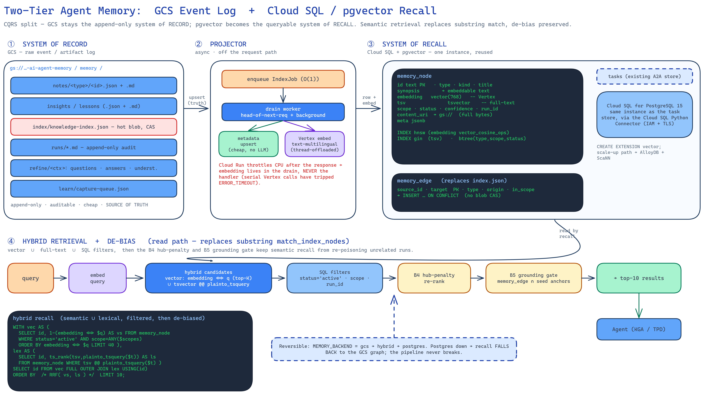
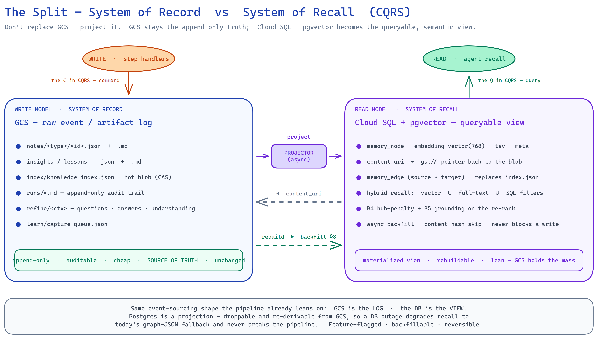

# PROPOSAL — Two-tier agent memory: GCS event log + Cloud SQL/pgvector semantic recall

> Status: **design / implementation plan** (no code yet). Target: KGA + TPD (+ test-evaluation) shared `common` memory.
> Decision (confirmed): **Cloud SQL for PostgreSQL + `pgvector`**, reusing the instance the A2A task store already runs on.
> Related: [[PROPOSAL-agent-self-learning-memory]] (this is the recall upgrade it needs), [[RESEARCH-self-exploring-knowledge-gather]] (B0–B6 de-bias), [[task-store-cloud-sql]], [[implement-serial-vertex-calls-cloudrun-timeout]].
> Diagram: `two-tier-agent-memory-pgvector.excalidraw` / `.png` (this dir) — the four-part architecture (record · projector · recall · read-path).



---

## 0. TL;DR (read this first)

Today the whole memory is **GCS blobs** and retrieval is **case-insensitive substring matching** over a
node's `id`/`title`/`type` (`match_index_nodes`). That is an **event/artifact log with a keyword index**,
not a memory — semantically-related knowledge is invisible unless the exact token overlaps.

Split it in two (**CQRS**), don't replace it:

- **GCS stays the system of record** — the raw, append-only event/artifact tier: crawl notes, rendered
  markdown, run-logs, refine Q&A/understanding, the capture-queue. Cheap, auditable, human-readable,
  source of truth. **Unchanged.**
- **Cloud SQL + `pgvector` becomes the system of recall** — a queryable materialized view: one
  `memory_node` table carrying a Vertex **embedding**, a **tsvector**, and **structured metadata**
  (scope / status / veto / run_id / kind), plus a `memory_edge` table that replaces `knowledge-index.json`.
  Retrieval becomes **hybrid**: vector similarity `∪` full-text `∪` SQL filters — and the existing
  **B4 hub-penalty + B5 grounding** de-bias moves onto the SQL/re-rank path so semantic recall can't
  re-poison unrelated runs.

Reuse the Cloud SQL instance already wired for the task store ([[task-store-cloud-sql]]). Embeddings run
**off the request path** (Cloud Run throttles CPU post-response, and serial Vertex calls have already
tripped `ERROR_TIMEOUT` here — [[implement-serial-vertex-calls-cloudrun-timeout]]). Feature-flagged,
backfillable, and reversible: GCS remains the truth, so a Postgres outage degrades recall to today's
graph-JSON behaviour — it never breaks the pipeline.

---

## 1. Problem — GCS is an event log, the "index" is keyword match

`MemoryBank` (`common/memory/bank.py`) persists everything as GCS objects:

| What | Where (GCS) | Shape |
|---|---|---|
| Distilled notes | `memory/notes/<type>/<id>.{json,md}` | one blob per node |
| Insights / lessons | `memory/notes/insight/<id>.{json,md}` | one blob per insight |
| **The index** | `memory/index/knowledge-index.json` | `{nodes[], edges[]}`, one blob, **compare-and-set** |
| Run-logs | `memory/runs/*.md` | append-only audit |
| Refine artifacts | `memory/refine/<ctx>/{questions,answers,understanding,state}` | per-context |
| Capture queue | `memory/learn/capture-queue.json` | CAS job list |

Retrieval is **entirely lexical + structural** — there is no embedding anywhere in the tree:

- `match_index_nodes(graph, q)` → nodes where `q` is a **substring** of `id`/`title`/`type`
  (`explore/index.py`). A query for *"payment reminder"* misses a node titled *"dunning run"*.
- `rank_promotions(...)` → **B4 IDF hub-penalty** rank of those substring hits.
- `graph_grounded(...)` → **B5** structural gate: candidate must share an edge with a seed anchor.
- `recall_lessons(...)` → lessons whose `source_refs ∩ seed_refs` is non-empty (`learn/recall.py`) —
  **structural only**; a semantically identical lesson learned on a *different* ticket never surfaces.

**Consequences**

1. **Recall is brittle.** Knowledge is found only by exact token overlap or an existing edge. The whole
   point of agent memory — "I have seen something *like* this before" — is unreachable.
2. **The index is a single hot blob.** `knowledge-index.json` is rewritten under a CAS retry loop on every
   write; it must be fully loaded and linearly scanned to answer any query. It grows unbounded and does
   not scale to cross-project memory.
3. **No metadata query surface.** "active, non-vetoed lessons in scope=shared for repo X" is not a query —
   it is a full scan + Python filter. Governance ([[PROPOSAL-agent-self-learning-memory]] L5) is bolted on.

The user's read is correct: **GCS behaves like an event-history tracker.** Good — keep it as one, and add
a real recall tier beside it.

---

## 2. The split — system of record vs system of recall (CQRS)



> Diagram: `cqrs-split-record-vs-recall.excalidraw` / `.png` (this dir). The **command** side (writes → GCS,
> the system of record) and the **query** side (recall reads → pgvector, the system of recall) are kept in
> sync by the async **projector**; the `content_uri` back-pointer keeps Postgres lean, and the
> **rebuild/backfill** arrow shows the read model is a droppable, re-derivable projection of GCS.

```
        WRITE (unchanged, source of truth)                 READ (new, queryable)
   ┌───────────────────────────────────────┐        ┌──────────────────────────────────┐
   │  GCS — raw event / artifact tier       │        │  Cloud SQL + pgvector — recall     │
   │  • notes .json/.md   • run-logs        │  ───▶  │  • memory_node(embedding,tsv,meta) │
   │  • insights/lessons  • refine Q&A      │ project│  • memory_edge (graph)             │
   │  • capture-queue     • understanding   │        │  hybrid: vector ∪ text ∪ filters   │
   └───────────────────────────────────────┘        └──────────────────────────────────┘
        append-only · auditable · cheap                materialized view · rebuildable
```

- **GCS = write model + audit.** Every artifact still lands in GCS exactly as today. It is the durable
  truth and the human-readable trail. Nothing is deleted or migrated out.
- **Postgres = read model + semantic index.** A compact, embedded projection of each node: the text that
  matters, its vector, its full-text tsvector, and its metadata — plus a `content_uri` pointer **back to
  the GCS blob** for the full bytes. Postgres stays lean; GCS holds the mass.
- **Rebuildable by construction.** Because Postgres is a *projection* of GCS, it can be dropped and
  re-derived at any time by a backfill pass (§8). This is what makes the migration safe and reversible.

This is the same event-sourcing shape the pipeline already leans on: GCS is the log; the DB is the view.

---

## 3. Why Cloud SQL + `pgvector` (and not the alternatives)

You already run **Cloud SQL for PostgreSQL** for the A2A task store, dialed through the **Cloud SQL Python
Connector** (socketless, IAM-auth + TLS — `common/taskstore.py`, [[task-store-cloud-sql]]). Adding the
`vector` extension to that instance is the lowest-friction path to a real memory:

| Option | Verdict | Why |
|---|---|---|
| **Cloud SQL + `pgvector`** ✅ | **Chosen** | One DB holds vectors **and** relational metadata **and** full-text. Reuses the running instance, the Connector, the SQLAlchemy async engine, the Terraform. Hybrid search + the B4/B5 de-bias become plain SQL. No new service. |
| AlloyDB + ScaNN | Scale-up path | Postgres-compatible with the ScaNN vector index + in-DB embedding (`google_ml_integration` calls Vertex from SQL). Better vector recall/latency at large scale — but a new, heavier, costlier service. Documented as the migration target if volume demands it. |
| Vertex AI Vector Search | Rejected for v1 | Managed ANN, but a **pure** vector index: you still need Postgres/GCS for metadata, transactions, veto/scope filters, and the edges. Splits vectors from metadata, adds index-rebuild latency and another service — wrong shape for this metadata-rich, vetoable memory. |
| Firestore vector search | Rejected | Serverless vectors, but weak on relational filters/joins and the edge graph; would fragment the model. |

**pgvector specifics.** `CREATE EXTENSION vector;` (Cloud SQL PG 15+). Column `embedding vector(768)`;
cosine distance operator `<=>`; ANN index `USING hnsw (embedding vector_cosine_ops)` (HNSW for recall/latency;
IVFFlat as the low-memory alternative). Full-text via `tsvector` + GIN. All in one transaction, one instance.

---

## 4. Data model

Two tables (a thin projection — the heavy content stays in GCS behind `content_uri`):

```sql
CREATE EXTENSION IF NOT EXISTS vector;

CREATE TABLE memory_node (
  id           text PRIMARY KEY,              -- canonical id, e.g. 'jira:LUZ-158390', 'insight:...'
  type         text NOT NULL,                 -- jira-issue | confluence-page | codegraph | insight | ...
  kind         text,                          -- for insights: decision|assumption|lesson|correction|gotcha
  title        text,
  synopsis     text,                          -- the embeddable text (title + synopsis + statement)
  source_url   text,
  content_uri  text,                          -- gs:// pointer back to the full note .md in GCS
  run_id       text,                          -- provenance (B0 pack scoping)
  context_id   text,
  scope        text NOT NULL DEFAULT 'context',   -- context | shared
  status       text NOT NULL DEFAULT 'active',    -- active | vetoed | superseded
  confidence   text NOT NULL DEFAULT 'high',       -- high (human) | med | low (agent-derived)
  created_at   timestamptz NOT NULL DEFAULT now(),
  embedding    vector(768),                   -- Vertex text embedding; NULL until the async backfill fills it
  tsv          tsvector,                      -- full-text over title+synopsis (lexical recall; keeps substring parity)
  meta         jsonb NOT NULL DEFAULT '{}'    -- labels, components, depth, supersedes, seed_refs, ...
);

CREATE INDEX memory_node_embedding_hnsw ON memory_node
  USING hnsw (embedding vector_cosine_ops);
CREATE INDEX memory_node_tsv_gin ON memory_node USING gin (tsv);
CREATE INDEX memory_node_filter ON memory_node (type, scope, status);
CREATE INDEX memory_node_run ON memory_node (run_id);

CREATE TABLE memory_edge (                    -- replaces knowledge-index.json edges
  source_id  text NOT NULL,
  target     text NOT NULL,
  type       text,
  origin     text,                            -- description|comment|issuelink|child|insight-kind|...
  in_scope   boolean DEFAULT false,
  PRIMARY KEY (source_id, target)
);
CREATE INDEX memory_edge_target ON memory_edge (target);
```

**Mapping from today's models** (no data-contract churn):
- `Note` / `Insight` → one `memory_node` row (+ their `links` / `source_refs` → `memory_edge` rows), exactly
  what `Graph.add_note` / `Graph.add_insight` build today — but as rows, not a rewritten JSON blob.
- The blob CAS (`update_index`) is **replaced by row upserts** (`INSERT … ON CONFLICT (id) DO UPDATE`),
  which are natively concurrency-safe — the CAS retry loop disappears for the index.
- `embedding` is **nullable and backfilled async** (§5, §7) so a write never blocks on Vertex.

**Multilingual note.** LUZ content is Swiss/German as well as English. Use Vertex
**`text-multilingual-embedding-002`** (768 dims) or **`gemini-embedding-001`** rather than the
English-centric `text-embedding-005`, so a German dunning page and an English test note land near each other.

---

## 5. Write path — GCS unchanged, Postgres projected async

Keep GCS as the synchronous source of truth; project into Postgres **off the request path**.

1. **Step handler writes GCS exactly as today** (`upsert_note` / `upsert_insight` / run-log). No behaviour
   change; GCS is authoritative.
2. **Enqueue an `IndexJob`** (node id + type + a compact payload) — O(1), reusing the existing durable
   `mutate_json` CAS queue that the self-learning capture-queue already rides on. The handler returns
   immediately.
3. **A drain worker** (the same head-of-next-request + background drain pattern as
   [[PROPOSAL-agent-self-learning-memory]] §4b) pulls jobs and, per node:
   - **Metadata upsert** (cheap, no LLM): `INSERT … ON CONFLICT DO UPDATE` the row + edges, `tsv` computed
     in SQL. This makes filters/full-text consistent quickly even before the vector exists.
   - **Embedding backfill**: one **thread-offloaded, bounded** Vertex embedding call
     (`asyncio.to_thread`, same discipline as `refine.next_questions`) → `UPDATE … SET embedding = $1`.

**Why async, not dual-write-inline.** Cloud Run throttles CPU on the instance once the response is sent
unless CPU-always-allocated is set, and **serial blocking Vertex calls have already killed an instance here
with `ERROR_TIMEOUT`** ([[implement-serial-vertex-calls-cloudrun-timeout]]). Embedding is the slow part, so
it must live in the drain, not the handler. Metadata is cheap and can go either inline or in the drain.

**Failure model.** Postgres is best-effort and **never source of truth**. If the DB is down or the embed
fails: the job stays queued (at-least-once), GCS is intact, and recall falls back to the GCS graph (§6,
§8). Upserts are idempotent (`ON CONFLICT` + content-keyed ids), so re-processing is safe.

---

## 6. Read path — hybrid retrieval that keeps the de-bias

Every current retrieval call gets a Postgres implementation behind the same function signature, so the
executors don't change shape — only the backend does (flag-gated, §8).

| Today (GCS graph) | Becomes (Postgres) |
|---|---|
| `match_index_nodes(graph, q)` — substring | `tsv @@ plainto_tsquery(q)` **∪** `embedding <=> embed(q)` top-K (hybrid) |
| `rank_promotions(...)` — B4 IDF hub-penalty | hybrid candidates **re-ranked** by the same IDF hub-penalty (computed from `df` via SQL `COUNT`), or fused with RRF |
| `graph_grounded(cand, anchors)` — B5 edge gate | `EXISTS (SELECT 1 FROM memory_edge WHERE …)` — the identical structural gate as a SQL predicate |
| `recall_lessons(seed_refs)` — structural only | **semantic + structural**: vector-nearest lessons **AND** `source_refs ∩ seed_refs`, filtered `status='active'`, `scope IN (…)`, re-ranked by confidence + grounding |

**Hybrid query sketch** (semantic ∪ lexical, filtered, then de-biased):

```sql
WITH vec AS (
  SELECT id, 1 - (embedding <=> $q_embed) AS vscore
  FROM memory_node
  WHERE status = 'active' AND scope = ANY($scopes) AND type = ANY($types)
  ORDER BY embedding <=> $q_embed
  LIMIT 40
),
lex AS (
  SELECT id, ts_rank(tsv, plainto_tsquery($q_text)) AS lscore
  FROM memory_node
  WHERE status = 'active' AND tsv @@ plainto_tsquery($q_text)
  LIMIT 40
)
SELECT id FROM vec FULL OUTER JOIN lex USING (id)
ORDER BY /* RRF or weighted vscore+lscore */ ... LIMIT 10;
```

Then apply, in app or SQL, the **B4 hub-penalty** (suppress tokens with `df/N > hub_ratio` once the corpus
is saturated) and the **B5 grounding gate** (`memory_edge` join to seed anchors). **The de-bias is not
dropped — it is ported.** This is the crux: semantic recall *widens* what can surface, and B4/B5 are exactly
what stop that widening from re-poisoning unrelated runs (§9).

**Payoff.** `search-memory "payment reminder"` now returns the *dunning-run* node; a lesson learned on
LUZ-156281 surfaces on a semantically-similar new ticket even with zero token/edge overlap — while an
off-topic saturated-domain lesson is still gated out.

---

## 7. Embeddings

- **Model:** Vertex AI `text-multilingual-embedding-002` (768 dims) — Swiss/German + English corpus.
  `gemini-embedding-001` (configurable output dims) is the upgrade if quality demands it.
- **Where:** in the drain worker only, thread-offloaded and bounded (never in a request handler) — see §5.
- **Embeddable text:** `title + "\n" + synopsis` for notes; `statement` for insights/lessons. Keep it short
  and stable so re-embeds are rare; store a content hash in `meta` to skip re-embedding unchanged text.
- **Query embeddings:** one call per `search-memory` / recall, cached per query string within a turn.
- **Cost/latency:** embeddings are cheap and batched; the request path pays **zero** Vertex latency because
  it only enqueues. (AlloyDB's in-DB `embedding()` would remove even the app-side call — a scale-up lever.)

---

## 8. Migration, backfill, reversibility

- **Feature flag `MEMORY_BACKEND`** (default `gcs`):
  - `gcs` — today's behaviour, untouched.
  - `hybrid` — **write both** (GCS sync + Postgres async projection); **read Postgres, fall back to the GCS
    graph** on any miss/error. The safe dark-launch mode.
  - `postgres` — read Postgres authoritative (GCS still the write truth). Flip only after backfill + soak.
- **One-shot backfill** (`tools/backfill_memory.py`): scan all GCS `memory/notes/**` + the index → upsert
  rows + edges → embed. Idempotent (`ON CONFLICT`), resumable, safe to re-run. This *derives* Postgres from
  GCS — proving the projection is complete and the DB is disposable.
- **Reversible:** to roll back, set `MEMORY_BACKEND=gcs`. Nothing was removed from GCS, so recall returns to
  the graph-JSON path with zero data loss. `DROP TABLE memory_node, memory_edge;` is a no-op on truth.
- **Terraform:** enable the `vector` extension flag on the existing Cloud SQL instance; add a `memory`
  database/schema; grant the agents' SA `roles/cloudsql.client` (already granted for the task store). Watch
  the known gotchas: a `-replace` of the Cloud Run service wipes the `allUsers` invoker
  ([[cloudrun-replace-wipes-iam]]); `terraform.tfvars` image tags aren't tracked
  ([[tfvars-gitignored-image-tag-not-tracked]]).

---

## 9. Safety — semantic recall re-opens the memory-bias problem

The B0–B6 phases ([[RESEARCH-self-exploring-knowledge-gather]]) fought exactly one failure: a saturated
memory bleeding into unrelated runs. **Vector recall makes that easier, not harder** — cosine similarity
will happily surface a plausible-but-off-topic neighbour. So the de-bias is *more* important here, and must
run on the vector path:

- **Structural grounding stays mandatory (B5).** A vector hit is a *candidate*; it only promotes if it also
  passes the `memory_edge` grounding gate to a seed anchor. Semantic nearness alone never promotes.
- **Hub-penalty stays (B4).** Applied as a re-rank over hybrid candidates so a saturated domain can't flood
  recall. (Recall precision has already gone to 0.00 from drift without a leak — [[pqs-precision-zero-despite-no-leak]];
  read precision, not just leaks.)
- **Metadata filters do the coarse cut in SQL:** `status='active'` (excludes vetoed/superseded),
  `scope` gating (a `context` lesson never leaks cross-run; only `shared` is recalled broadly), `run_id`
  for B0 pack scoping.
- **Human veto still authoritative:** `veto-lesson` sets `status='vetoed'` → filtered out at the SQL layer;
  vetoed rows are never re-promoted.
- **This unblocks [[PROPOSAL-agent-self-learning-memory]].** That proposal's `recall_lessons` is structural-
  only *because* there was no safe semantic recall. pgvector + B4/B5 filters is the missing piece that lets
  captured lessons resurface on *similar* work without re-poisoning *unrelated* work.

---

## 10. Bounds, config, rollout

- **Flags (safe defaults):** `MEMORY_BACKEND=gcs` (→ `hybrid` → `postgres`), `MEMORY_EMBED_MODEL=
  text-multilingual-embedding-002`, `MEMORY_EMBED_DIMS=768`, `MEMORY_HYBRID_K=40`, `MEMORY_RECALL_LIMIT=10`.
  Wired in `deployments/services.tf` / `variables.tf`. Dark-launchable.
- **Reuse, don't add infra:** same Cloud SQL instance, same Connector/engine (`taskstore.py` factory
  generalised to hand out a shared engine), same drain/queue infra as the capture-queue.
- **Never on the critical path:** enqueue O(1) in the handler; embed + upsert in the drain; recall best-effort
  with a GCS fallback. A DB outage degrades recall — it never breaks a step.
- **The two agents must not import each other** — the memory backend lives in `common/memory/` (a
  `PgMemoryStore` behind the existing `MemoryBank` surface), per [[test-agent-common-shared-engine]].

---

## 11. Phasing

| Phase | Deliverable | Files |
|---|---|---|
| **M0 ✅ DONE** | Shared async engine factory extracted from `taskstore.py` (one pool for task store + memory); `memory_node`/`memory_edge` DDL (generated-`tsvector` column, lazy idempotent apply); `PgMemoryStore` skeleton (upsert/set_embedding + lexical `search`/`grounded`/`recall`) | `common/db.py`, `common/memory/pg/{schema,store,__init__}.py`, `common/taskstore.py` (now delegates), `tests/test_db.py` |
| **M1 ✅ DONE** | Predicates moved to `common/memory/graph_index.py` (+ back-compat shim in `explore/index.py`); `common/memory/retrieve.py` facade (`MEMORY_BACKEND` dispatch, Postgres→graph fallback); `search-memory` rewired through it (`store=None` ⇒ today's behaviour). 16 new tests; suite 279 pass, ruff clean | `common/memory/{graph_index,retrieve}.py`, `explore/index.py`, `executor/memory.py`, `tests/test_{graph_index,retrieve_facade}.py` |
| _M0 deferred_ | `vector` extension enablement + HNSW index in terraform live only when the store is populated (M4/M5) — the DDL ships the extension/create-if-not-exists, terraform note is M6 | `deployments/cloudsql.tf` |
| **M2 ✅ DONE** | Async **projector**: `MemoryBank.on_write` seam fires after each GCS write → `index_on_write` enqueues a deduped `IndexJob` (gcs-gated no-op); `drain_index` reads the node back from GCS → `upsert_node`+`upsert_edges` (metadata, no embed yet; `embedder` param is the M3 seam); `maybe_drain_index` wired beside the `learn.drain` head-of-request flush in both base executors. 5 new tests; suite 284 pass, ruff clean | `common/memory/pg/project.py`, `common/memory/bank.py` (on_write), `common/executor.py` (wire), `{kga,tpd}/executor/base.py`, `tests/test_index_projector.py` |
| **M3 ✅ DONE** | **Embeddings**: `embed.py` (Vertex `text-multilingual-embedding-002`, cached model, asymmetric DOCUMENT/QUERY tasks, lazy `vertexai` import, `build_embedder` gated on `VERTEX_*`); drain embeds via the injected embedder thread-offloaded + best-effort; **content-hash skip** (`meta.emb_hash` via merged-jsonb upsert + `embedding_fresh`) avoids re-embedding unchanged re-projects; `aembed_query` ready for M4. No embedder configured ⇒ metadata-only (M2). +`google-cloud-aiplatform` dep (lazy). 4 new tests; suite 288 pass, ruff clean | `common/memory/pg/embed.py`, `pg/store.py` (emb_hash + `embedding_fresh`), `pg/project.py` (skip + wire), `pyproject.toml`, `tests/test_pg_embed.py` |
| **M4 ✅ DONE** | **Hybrid `search`**: vector-nearest (`embedding <=> q`) ∪ full-text (`tsv @@ q`), **RRF-fused** (`rrf_fuse`, pure + unit-tested), filtered to active + scope (+type), empty-query → most-recent; facade **embeds the query** (`aembed_query`, gated on Vertex config, lazy import) → the already-wired `search-memory` is now semantic under hybrid/postgres. 5 new tests; suite 293 pass, ruff clean | `common/memory/pg/store.py` (`search`+`rrf_fuse`), `common/memory/retrieve.py`, `tests/test_pg_search.py` |
| **M4b ✅ DONE** | **Semantic lesson recall**: `store.recall` = structural (`source_refs ∩ seed_refs`) ∪ semantic (vector-nearest, **`scope='shared'` only** — the de-bias so a `context` lesson never leaks cross-run); `retrieve.recall_lessons` async facade (embeds the pack's grounded-titles as the query, PG→graph fallback); the two sync `_recall_into` helpers (refine + define) rewired to `async`/`await`. 5 new tests; suite 298 pass, ruff clean | `common/memory/pg/store.py` (`recall`), `common/memory/retrieve.py`, `{refine,define}.py`, `tests/test_pg_recall.py` |
| **M4c** _(optional / deferred)_ | **Semantic seed-promotion + PG de-bias port**: make `self_seed`/`ground_leads`/`loop` promote **vector-nearest** fetchable seeds (not just substring) with B4 hub-penalty + B5 grounding computed over the PG candidate set. Deferred deliberately: B4/B5 already run correctly on the in-memory graph (GCS-populated under every backend) and **nothing consumes a PG-ported B4/B5 until this exists**; it adds a Vertex call to every crawl and can't be tested offline. Low ROI vs. risk — do only if gather seed-recall proves too lexical | `explore/self_seed.py`, `explore/ground_leads.py`, `explore/loop.py`, `pg/store.py` |
| **M5 ✅ DONE** (tool) | **Backfill** — `enqueue_all` (one IndexJob per GCS-index node) → `drain_index` until empty; reuses the projector end-to-end so it inherits the mapper, embeddings, content-hash skip, and idempotency; durable queue ⇒ resumable. Logic in `common/memory/pg/backfill.py` (packaged/testable), thin CLI at `tools/backfill_memory.py`. 3 new tests; suite 301 pass, ruff clean. _Soak-in-`hybrid`-then-flip-`postgres` is the ops step (§8 runbook), pending real DB._ | `common/memory/pg/backfill.py`, `tools/backfill_memory.py`, `tests/test_backfill.py` |
| **M6 ✅ DONE** (config) | Terraform vars `memory_backend`/`memory_embed_model`/`memory_embed_dims` (default `gcs`) + a shared `local.memory_env` injected into all three agent containers (inert under `gcs`); reuses existing `DB_*`/`VERTEX_*` env, no new secret/instance. `terraform fmt` clean, `terraform validate` = Success. Rollout/rollback runbook in **Appendix B** (deploy `gcs` → backfill → HNSW → `hybrid` soak → `postgres`). _Live `apply` + soak pending a real DB._ | `deployments/variables.tf`, `deployments/cloudsql.tf`, `deployments/services.tf`, Appendix B |

---

## 12. Testing (mirrors the existing suite; offline)

- **Projection:** `upsert_note` → row + edges present; content-hash skip avoids re-embed; concurrent upserts
  idempotent (no CAS needed — `ON CONFLICT`).
- **Hybrid recall:** a synonym query (no token overlap) returns the semantically-near node; a saturated-domain
  hub token is suppressed (B4); an ungrounded vector hit is dropped (B5); vetoed/`context`-scope rows never
  surface.
- **Fallback:** with the DB unreachable, retrieval falls back to the GCS graph and the pipeline still passes —
  proving Postgres is non-critical.
- **Offline harness:** stub the embedder (deterministic fake vectors) + use a local Postgres/pgvector (or a
  SQLite-vector shim) so the suite stays hermetic like the KGA/TPD eval harness ([[kga-evaluation-adk-ragas-research]]).

---

## 13. Open questions

- **Embedding model & dims:** `text-multilingual-embedding-002` (768) vs `gemini-embedding-001` (larger,
  configurable) — pick on a small recall benchmark over real LUZ notes.
- **Local Postgres, or AlloyDB from the start?** AlloyDB's in-DB `embedding()` + ScaNN removes the app-side
  embed call and scales further — worth it now, or keep it as the M-later scale-up?
- **Index type:** HNSW (recall/latency) vs IVFFlat (memory) — depends on corpus size after backfill.
- **Fusion:** RRF vs weighted `α·vscore + (1-α)·lscore` — tune α on the benchmark.
- **How much lives in PG vs GCS?** Proposal keeps full content in GCS behind `content_uri`; revisit if the
  extra GCS read on `get-note` hurts (could denormalise `synopsis`/`md` into PG).

---

## 14. One-paragraph summary

Keep GCS as the append-only **event/record** tier it already is; add **Cloud SQL + `pgvector`** as the
**recall** tier — a rebuildable projection of GCS carrying Vertex embeddings, full-text, and metadata, with
the graph edges as rows instead of a hot JSON blob. Retrieval becomes hybrid (vector ∪ text ∪ SQL filters),
embeddings run off the request path, the whole thing is flag-gated, backfillable, and reversible, and the
**B4/B5 de-bias moves onto the vector path** so semantic recall makes the agents smarter without re-opening
the memory-bias hole. It also unblocks the self-learning proposal's recall, which is structural-only today
precisely because there was no safe semantic memory to lean on.

---

# Appendix A — Detailed implementation plan (code-level)

> This expands §11's M0–M6 roadmap into concrete files, signatures, SQL, and rewire points, grounded in the
> current tree. **Guiding rule (least change):** every new backend hides behind an *existing* signature —
> `MemoryBank`'s methods and the four retrieval predicates — so executors barely change; GCS stays the write
> truth; everything is flag-gated (`MEMORY_BACKEND`, default `gcs`) and falls back to today's graph path.

## A.0 What already exists (reuse, don't rebuild)

| Concern | Existing code to reuse | How the plan leans on it |
|---|---|---|
| Cloud SQL async engine | `common/taskstore.py` → `_db_config()`, `_connector_engine()` | Extract into `common/db.py` so the task store **and** the memory store share ONE engine/pool. |
| Durable CAS queue + off-path drain | `common/learn/queue.py` → `enqueue()`/`drain()` over `bank.mutate_json()` | Clone the shape for the `IndexJob` projector queue. |
| Best-effort, never-raise capture | `common/learn/capture.py` | Same discipline for embed/upsert — a DB error logs + degrades, never breaks a step. |
| Vertex client + thread-offload | `common/llm/vertex.py` → `complete()` / `agenerate()` (`asyncio.to_thread`) | Same `to_thread` wrapper for the embedding call; same `VERTEX_PROJECT/LOCATION` env. |
| Graph retrieval predicates | `knowledge_gathering/explore/index.py` → `match_index_nodes` / `rank_promotions` / `graph_grounded` | Move to `common/` (they're dependency-free, graph-dict only) so they serve as the **fallback** behind the facade; re-export for back-compat. |
| Recall into the pack | `common/models/pack.py` `Pack.lessons` (rendered "Prior lessons") | `recall_lessons` keeps returning `list[str]`; only its internals change. |

## A.1 Dependencies (`test-agent/pyproject.toml`)

Add two **core** deps (both run inside the deployed agent, so not an extra):

```toml
"pgvector>=0.3,<0.4",                 # SQLAlchemy Vector type + asyncpg codec registration
"google-cloud-aiplatform>=1.60",      # vertexai.language_models.TextEmbeddingModel (Vertex embeddings)
```

`asyncpg` + SQLAlchemy async already come via `a2a-sdk[postgresql]`; the Cloud SQL Connector via
`cloud-sql-python-connector[asyncpg]`. No new infra dep.

## A.2 — M0 · DB engine factory + schema

**`common/db.py`** (new) — lift the connection logic out of `taskstore.py` and cache one engine:

```python
# common/db.py
_engine = None  # module-level singleton; one pool shared by task store + memory store

def get_engine():
    """The shared async SQLAlchemy engine (Cloud SQL Connector / TCP / URL), or None if no DB env.
    Reuses taskstore._db_config; created eagerly (no connection opened yet)."""
    global _engine
    if _engine is None:
        cfg = _db_config()            # moved here from taskstore.py
        _engine = None if cfg is None else _build_engine(cfg)   # _connector_engine / URL / TCP
    return _engine
```

Then `taskstore.build_task_store()` calls `common.db.get_engine()` instead of building its own (behaviour
identical; `DatabaseTaskStore(engine, create_table=True)` unchanged). One pool, one Connector.

**`common/memory/pg/schema.sql`** (new) — the DDL from §4 (extension + `memory_node` + `memory_edge` +
HNSW/GIN/btree indexes). `CREATE EXTENSION IF NOT EXISTS vector;` — pgvector is on the Cloud SQL extension
allowlist and the terraform-created login role has `cloudsqlsuperuser`, so it can create it (see A.10).

**`common/memory/pg/store.py`** (new) — `PgMemoryStore(engine)`, schema created lazily on first use (mirrors
`DatabaseTaskStore(create_table=True)` — no startup await):

```python
class PgMemoryStore:
    def __init__(self, engine): self._engine, self._ready = engine, False
    async def _ensure(self):                      # idempotent DDL, once per process
        if not self._ready:
            async with self._engine.begin() as c:
                await c.execute(text(SCHEMA_SQL))
            self._ready = True
    async def upsert_node(self, node: dict) -> None: ...      # INSERT … ON CONFLICT (id) DO UPDATE
    async def upsert_edges(self, edges: list[dict]) -> None: ...
    async def set_embedding(self, node_id: str, vec: list[float]) -> None: ...
    async def search(self, *, q_text, q_embed, types, scopes, k) -> list[str]: ...   # A.6
    async def grounded(self, candidate, anchors) -> bool: ...                        # A.6
    async def recall(self, *, seed_refs, q_embed, limit) -> list[str]: ...           # A.6
```

**Deliverable:** the DB objects exist and `PgMemoryStore` connects; nothing reads it yet.

## A.3 — M1 · Read side behind a facade (with graph fallback)

Move the three predicates from `knowledge_gathering/explore/index.py` → **`common/memory/graph_index.py`**
(unchanged code — they only touch the graph dict), and re-export from the old module so nothing breaks:

```python
# knowledge_gathering/explore/index.py  (back-compat shim)
from common.memory.graph_index import match_index_nodes, rank_promotions, graph_grounded  # noqa: F401
```

Add **`common/memory/retrieve.py`** — the single dispatch point (backend flag → Postgres or graph fallback):

```python
def backend() -> str: return os.environ.get("MEMORY_BACKEND", "gcs").lower()

async def search_nodes(bank, q, *, store=None) -> list[dict]:
    if backend() in ("hybrid", "postgres") and store:
        try: return await store.search(q_text=q, q_embed=await aembed_query(q), ...)
        except Exception: log.warning(...)          # hybrid → fall through to graph
    graph, _ = bank.load_index(); return match_index_nodes(graph, q)   # today's path
# …rank_seeds(), is_grounded(), recall_lessons() follow the same dispatch+fallback shape
```

**Rewire the call sites** (exhaustive — grep-verified) to the facade, keeping their arguments:

| File:line | Call today | Becomes |
|---|---|---|
| `knowledge_gathering/executor/memory.py:47` | `match_index_nodes(graph, q)` | `retrieve.search_nodes(bank, q, store=…)` |
| `knowledge_gathering/explore/self_seed.py:75,83` | `match_index_nodes` + `rank_promotions` | `retrieve.search_nodes` / `retrieve.rank_seeds` |
| `knowledge_gathering/explore/ground_leads.py:23` | `match_index_nodes(graph, lead)` | `retrieve.search_nodes` (grounding still gates via edges) |
| `knowledge_gathering/explore/loop.py:215` | `graph_grounded(graph, s, anchors)` | `retrieve.is_grounded(bank, s, anchors, store=…)` |
| `common/learn/recall.py` (used by `refine.py:35`, `define.py:38`) | structural `source_refs ∩ seed_refs` | `retrieve.recall_lessons` (semantic ∪ structural) |

`MEMORY_BACKEND=hybrid` reads Postgres first, silently falls back to the graph on any miss/error →
**safe dark launch**. `gcs` (default) is byte-for-byte today.

## A.4 — M2 · Async projector (write side, off the request path)

**`common/memory/pg/project.py`** (new) — clone `learn/queue.py`:

```python
INDEX_QUEUE = f"{ROOT}/index/index-queue.json"
@dataclass
class IndexJob: id: str; node_id: str; node_type: str; kind: str = ""

def enqueue_index(bank, job):                         # O(1) CAS append — safe on the request path
    bank.mutate_json(INDEX_QUEUE, lambda q: [*q, asdict(job)], default=[])

async def drain_index(bank, store, embedder, *, max_jobs=50) -> int:
    # per job: read the note/insight from GCS → upsert_node + upsert_edges (cheap) →
    #          embed synopsis (content-hash skip) → set_embedding.  At-least-once, idempotent.
```

**Enqueue hook** — in `MemoryBank.upsert_note` / `upsert_insight`, after the GCS write, best-effort enqueue
when the projector flag is on (bank gains an optional `on_write` callback set by `build_bank`, so `common`
stays free of the pg import when the flag is off). GCS write is unchanged and remains the truth.

**Where the drain runs** — reuse the self-learning drain seam: the executors already drain the capture queue
at the head of the next request + a background task; add `drain_index(...)` right beside it (both are
best-effort, both O(pending)).

## A.5 — M3 · Embeddings (Vertex, thread-offloaded, bounded)

**`common/memory/pg/embed.py`** (new):

```python
_MODEL = os.environ.get("MEMORY_EMBED_MODEL", "text-multilingual-embedding-002")   # Swiss/German + EN
def _model():
    import vertexai; from vertexai.language_models import TextEmbeddingModel
    vertexai.init(project=os.environ["VERTEX_PROJECT"], location=os.environ["VERTEX_LOCATION"])
    return TextEmbeddingModel.from_pretrained(_MODEL)

def embed_texts(texts, *, task):                        # task = RETRIEVAL_DOCUMENT | RETRIEVAL_QUERY
    from vertexai.language_models import TextEmbeddingInput
    return [e.values for e in _model().get_embeddings([TextEmbeddingInput(t, task) for t in texts])]

async def aembed(texts, *, task):                       # off the event loop, like llm.agenerate
    return await asyncio.to_thread(embed_texts, texts, task=task)
```

- **Asymmetric embeddings** — store documents with `task=RETRIEVAL_DOCUMENT`, embed queries with
  `RETRIEVAL_QUERY`. This measurably lifts recall over using one task type for both.
- **Content-hash skip** — store `sha1(synopsis)` in `meta`; re-embed only when it changes → cheap re-projects.
- **Bounded + offloaded** — embeddings happen only in `drain_index`, never in a handler (Cloud Run CPU
  throttle + the `ERROR_TIMEOUT` history — §5).

## A.6 — M4 · Hybrid retrieval + de-bias, as SQL

`PgMemoryStore.search` — semantic ∪ lexical, filtered, fused, then B4/B5 applied:

```sql
WITH vec AS (
  SELECT id, 1 - (embedding <=> :q) AS vs
  FROM memory_node
  WHERE status='active' AND scope = ANY(:scopes) AND type = ANY(:types) AND embedding IS NOT NULL
  ORDER BY embedding <=> :q LIMIT :k),
lex AS (
  SELECT id, ts_rank(tsv, plainto_tsquery(:t)) AS ls
  FROM memory_node
  WHERE status='active' AND tsv @@ plainto_tsquery(:t) LIMIT :k)
SELECT id, COALESCE(vs,0), COALESCE(ls,0) FROM vec FULL OUTER JOIN lex USING (id);
```

- **Fusion**: Reciprocal-Rank Fusion (`1/(60+rank_v) + 1/(60+rank_l)`) in-app, or weighted `α·vs+(1-α)·ls`.
- **B4 hub-penalty**: unchanged algorithm from `rank_promotions` — a token's `df` is now `SELECT count(*) …
  tsv @@ token`; suppress tokens with `df/N > hub_ratio` once `N ≥ 20`; score survivors by `idf`. Applied as
  the re-rank over the fused candidate set (same math, SQL-sourced `df`).
- **B5 grounding** (`grounded`): `SELECT EXISTS(SELECT 1 FROM memory_edge WHERE (source_id=:c AND target=ANY(:a))
  OR (target=:c AND source_id=ANY(:a)))` — the identical structural gate, now a predicate.
- **`recall`** (lessons): `WHERE kind IN ('lesson','correction','gotcha') AND status='active' AND
  scope='shared'`, take vector-nearest **∪** rows with `source_refs && :seed_refs`, order human-confidence
  first — semantic reach **plus** the structural anchor, both gated.

De-bias is **ported, not dropped** — this is the safety crux (§9).

## A.7 — M5 · Backfill (GCS → Postgres)

**`test-agent/tools/backfill_memory.py`** (new, CLI): read every `memory/notes/**` sidecar + `memory/index/
knowledge-index.json` from GCS → `upsert_node` + `upsert_edges` → `aembed` in batches → `set_embedding`.
Idempotent (`ON CONFLICT`), resumable (skip rows whose stored content-hash matches), safe to re-run. Proves
Postgres is a *derivation* of GCS (so the DB is disposable). Run once before flipping `hybrid`; re-run after
any bulk GCS import.

## A.8 — M6 · Config, terraform, rollout runbook

**Env (services.tf → both agent services):**

| Var | Default | Meaning |
|---|---|---|
| `MEMORY_BACKEND` | `gcs` | `gcs` → `hybrid` → `postgres` |
| `MEMORY_EMBED_MODEL` | `text-multilingual-embedding-002` | Vertex embedding model |
| `MEMORY_EMBED_DIMS` | `768` | vector column width (must match the model) |
| `MEMORY_HYBRID_K` | `40` | per-arm candidate cap |
| `MEMORY_RECALL_LIMIT` | `10` | rows returned to the pack |

Reuses existing `DB_INSTANCE_CONNECTION_NAME` / `DB_USER` / `DB_PASSWORD` / `DB_NAME` / `VERTEX_PROJECT` /
`VERTEX_LOCATION` — **no new secret**. `deployments/cloudsql.tf` needs only a one-line note that the shared
instance now also hosts `memory_node`/`memory_edge` (same DB, same role).

**Rollout runbook:** deploy on `gcs` (no-op) → run backfill → set `hybrid` (reads PG, falls back to graph;
watch recall/precision on the eval harness) → soak → set `postgres`. **Rollback** = set `gcs`; GCS untouched,
zero data loss.

## A.9 — Tests (offline, mirrors the existing suite)

- **`tests/test_pg_store.py`** — `upsert_node`/`upsert_edges` idempotent (`ON CONFLICT`); `set_embedding`
  round-trips; hybrid `search` returns a synonym hit (no token overlap) via a **stub embedder** (deterministic
  fake vectors); B4 suppresses a hub token; B5 drops an ungrounded hit; vetoed/`context`-scope rows never surface.
- **`tests/test_retrieve_facade.py`** — `MEMORY_BACKEND=gcs` byte-for-byte equals today; `hybrid` with the DB
  unreachable falls back to the graph and the pipeline still passes (Postgres is non-critical).
- **`tests/test_index_projector.py`** — `upsert_note` enqueues an `IndexJob`; `drain_index` upserts row+edges;
  content-hash skip avoids re-embed; at-least-once (a re-drained job is idempotent).
- **Harness**: run against a local `pgvector` container **or** a SQLite-vector shim so CI stays hermetic like
  the KGA/TPD eval harness ([[kga-evaluation-adk-ragas-research]]); the embedder is always stubbed offline.
- **Eval hook** (`tests/eval/`): does `hybrid` lift PQS **recall** without dropping **precision**
  ([[pqs-precision-zero-despite-no-leak]])? Gate the flip on that.

## A.10 — Implementation gotchas (dig-once facts)

- **`CREATE EXTENSION vector` privilege**: pgvector is Cloud-SQL-allowlisted; the terraform `google_sql_user`
  gets `cloudsqlsuperuser`, which may create allowlisted extensions — so the lazy DDL works with the *app's*
  role, no manual step. (If a future hardened role lacks it, run the extension once via `deploy.sh`.)
- **HNSW build memory**: on `db-f1-micro` (dev tier) an HNSW index over a large corpus can be memory-heavy;
  start with IVFFlat or a small `m`/`ef_construction`, or bump the tier before backfilling a big corpus.
- **Dimension lock**: `vector(768)` must equal the model's output dims; changing `MEMORY_EMBED_MODEL` to a
  different width needs a column migration + full re-embed. Guard with `MEMORY_EMBED_DIMS`.
- **asyncpg ↔ pgvector codec**: register the vector type on each raw asyncpg connection (SQLAlchemy
  `connect` event → `pgvector.asyncpg.register_vector`), or bind embeddings as `'[…]'::vector` text literals.
- **Shared pool**: the memory store and `DatabaseTaskStore` share one engine — size the pool for both; a
  memory query storm must not starve task-store writes.
- **Doc drift to fix**: `cloudsql.tf`'s header still describes the `/cloudsql` **socket**, but the code dials
  via the **Cloud SQL Python Connector** ([[task-store-cloud-sql]]) — correct the comment while touching the file.
- **`deploy.sh` / tfvars traps** (unchanged but relevant): image tags are working-tree-only
  ([[tfvars-gitignored-image-tag-not-tracked]]); a `terraform -replace` of a Cloud Run service wipes the
  `allUsers` invoker ([[cloudrun-replace-wipes-iam]]); the AI-attribution commit trailer is hook-blocked
  ([[repo-blocks-ai-attribution-commit-trailer]]).

## A.11 — Sequencing & size

M0→M1 are independent of embeddings and land the read-side fallback safely (small). M2→M3 add the write
projection + embeddings (the bulk). M4 is the retrieval SQL + de-bias port (the value). M5→M6 are backfill +
rollout. Each phase is shippable behind `MEMORY_BACKEND=gcs` (dark), so it can merge incrementally without
touching production behaviour until the flip. No change to the A2A contract, the MCP tools, or the client
pipeline — only the memory backend behind `MemoryBank` and the four predicates.

---

# Appendix B — M6 deploy & rollout runbook

> Terraform for the recall tier is **authored** (`deployments/`); the steps below are the **ops
> flip**, to run against the real Cloud SQL instance when you're ready. Nothing here changes
> behaviour until step 3 — `terraform apply` with the default `memory_backend="gcs"` is a no-op flip
> of three inert env vars.

## B.1 What the terraform adds

- **Vars** (`variables.tf`): `memory_backend` (`gcs`→`hybrid`→`postgres`, default `gcs`),
  `memory_embed_model` (`text-multilingual-embedding-002`), `memory_embed_dims` (`768`).
- **`local.memory_env`** (`cloudsql.tf`) injected into **all three** agent containers (kga/tpd/tev)
  via `services.tf`. Inert under `gcs` (the code reads the DB / embeds only when the backend is
  `hybrid`/`postgres`), so it is wired unconditionally — a flip is just a tfvars edit + apply, no
  bank rebuild. Reuses the existing `DB_*` (task-store) + `VERTEX_PROJECT/LOCATION` env already on
  the agent; **no new secret, no new instance.**
- **No DB flag needed for pgvector**: it's on the Cloud SQL extension allowlist and the app creates
  it lazily (`CREATE EXTENSION IF NOT EXISTS vector` in `PgMemoryStore._ensure`); the terraform
  `google_sql_user` carries `cloudsqlsuperuser`, which may create allowlisted extensions.

## B.2 Rollout (dark → hybrid → authoritative)

1. **Deploy on `gcs` (no-op).** Build + apply the memory-tier image with `memory_backend="gcs"`.
   Production behaviour is unchanged; the tables don't exist yet and nothing reads them.
2. **Create schema + backfill.** With the DB env present, run the backfill — it lazily applies the
   DDL (extension + `memory_node`/`memory_edge`) and projects every GCS-index node (metadata +
   embeddings):
   ```bash
   # against the deployed instance (Cloud SQL Connector env set) or via a proxy:
   uv run python test-agent/tools/backfill_memory.py
   ```
3. **Create the ANN index** once the corpus has embeddings (it is intentionally *not* in the lazy
   DDL — HNSW build cost/memory depends on corpus size + tier; on `db-f1-micro` prefer IVFFlat or a
   small `m`):
   ```sql
   CREATE INDEX IF NOT EXISTS memory_node_embedding_hnsw
     ON memory_node USING hnsw (embedding vector_cosine_ops);
   ```
4. **Flip `hybrid` + soak.** Set `memory_backend="hybrid"` in `terraform.tfvars`, apply. Recall now
   reads pgvector and **falls back to the GCS graph** on any miss/error. Watch the eval harness:
   does hybrid lift PQS **recall** without dropping **precision** ([[pqs-precision-zero-despite-no-leak]])?
5. **Flip `postgres`.** Once soaked, set `memory_backend="postgres"` and apply — pgvector authoritative
   (still degrades to the graph on a DB error; GCS is still the write truth).

## B.3 Rollback

Set `memory_backend="gcs"` and apply. Nothing was removed from GCS, so recall returns to the
substring-graph path with **zero data loss**; `DROP TABLE memory_node, memory_edge;` is a no-op on
truth. The recall tier is disposable by construction (§2).

## B.4 Apply gotchas (carried from prior deploys)

- `terraform.tfvars` is gitignored — the image tag + `memory_backend` flips are working-tree-only,
  never in `git status` ([[tfvars-gitignored-image-tag-not-tracked]]). Only `tfvars.example` is tracked.
- A `terraform -replace` of a Cloud Run service **wipes the `allUsers` invoker** → clients get a GFE
  401/403; re-add the invoker iam_member ([[cloudrun-replace-wipes-iam]]).
- `deploy.sh` can die before its final apply on the harmless Cloud Build log-streaming error
  (`set -e`); finish with a manual `terraform apply -var=image=<tag>` ([[deploy-sh-cloudbuild-streaming-abort]]).
- The pool is shared with the A2A task store (one engine, `common/db.py`) — size it for both; a recall
  query storm must not starve task-store writes.
