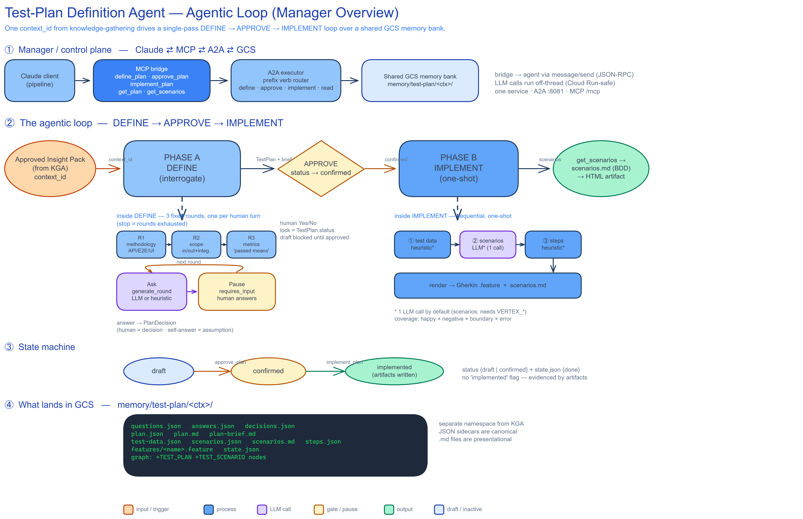

# Test-Plan Definition Agent — Agentic Loop (Manager Overview)

**Scope:** `test-agent/src/test_plan_definition` — Step 3+4 of the Testing Agent.
**Audience:** manager / architecture overview (the *shape* of the loop and the
decisions that drive it, not a line-by-line walkthrough).
**Source:** code trace, 2026-09-07.



---

## TL;DR

The Test-Plan Definition (TPD) agent turns an **approved insight pack** (from the
knowledge-gathering agent) into an **executable BDD test suite**. It does this
with a single agentic loop over one shared `context_id`:

> **DEFINE** (interrogate the human, 3 fixed rounds) → **APPROVE** (lock the plan)
> → **IMPLEMENT** (one-shot generation of data + scenarios + steps).

Everything is persisted to a shared **GCS memory bank**, and the whole thing is
served as one Cloud Run service that speaks both **A2A** (agent-to-agent JSON-RPC)
and **MCP** (the tools Claude calls).

---

## 1. The manager / control plane

Three tiers, one request path. The client never touches business logic directly —
it drives the loop through a fixed tool surface.

| Tier | What it is | Key entry points |
|------|-----------|------------------|
| **MCP bridge** | The 6 tools Claude calls | `define_plan`, `approve_plan`, `implement_plan`, `get_plan`, `get_scenarios`, `plan_card` |
| **A2A executor** | A prefix verb router | text starting `define` / `approve` / `implement` / `get-*` dispatches to the matching handler |
| **GCS memory bank** | Shared, durable state | `memory/test-plan/<ctx>/` |

- The bridge forwards every tool call to the agent as an A2A **`message/send`
  (JSON-RPC 2.0)**; the same `context_id` threads all the way from gather → refine
  → define, so no state is passed by hand.
- Long LLM calls run **off the event loop** (`asyncio.to_thread`) so a multi-second
  Vertex call never starves Cloud Run's `/livez` probe and gets the instance killed.
- **The client owns every confirm gate.** Before starting define, before approve,
  and before implement, Claude asks the human a Yes/No — the agent never
  auto-advances.

---

## 2. The agentic loop

### Phase A — DEFINE (interrogate)

A multi-turn interrogation, but deliberately a **single fixed pass** over exactly
three rounds, in order:

1. **methodology** — API / E2E / UI (default: API)
2. **scope** — feature in/out of scope + one question per integration touched
3. **metrics** — what "passed" means + the coverage bar

The engine is a simple ask/pause cycle: `generate_round` produces the round's
questions (via the LLM when Vertex is configured, else a heuristic strategy), the
agent **pauses** (`requires_input`), the human answers with
`define_plan(answer=…)`, and the answer is distilled into a `PlanDecision`
(a human answer is a high-confidence *decision*; an agent self-answer is a
low-confidence *assumption*).

> **Design note — the stop condition is structural, not confidence-gated.** The
> loop advances **one round per human turn** and stops when the three rounds are
> exhausted. There is no "am I confident enough?" gate deciding whether to ask
> more. Confidence is computed only at the end and merely sets the plan's status.

**Output:** a `TestPlan` (`methodology`, `scope`, `out_of_scope`, `metrics`) plus a
human-readable `plan-brief.md`. Status is `confirmed` if there are no open gaps,
otherwise `draft`.

### Gate — APPROVE (lock)

`approve_plan` is the reconfirm gate. There is **no separate lock object** — it
simply flips `TestPlan.status` to `confirmed`. **The status field *is* the lock.**
A `draft` plan (with unresolved open gaps) is blocked from implementation until
approve force-confirms it.

### Phase B — IMPLEMENT (one-shot)

`implement_plan` refuses unless `status == confirmed`, then generates
**sequentially** (each step depends on the previous):

**test data → scenarios → steps → Gherkin `.feature`**

> **Design note — one LLM call by default.** Only **scenarios** calls the LLM, and
> only when `VERTEX_*` is configured. **test-data** and **steps** are heuristic
> unless `detail=True` / `TPD_LLM_DETAIL` is set. This is a deliberate fix: three
> serial blocking Vertex calls once blocked the event loop past Cloud Run's
> timeout and killed the instance.

The heuristic scenario path expands a **coverage matrix** — happy × negative ×
boundary × error over up to 8 grounded notes → up to **32 scenarios**
(a `happy only` metric collapses this to happy alone).

**Output:** `get_scenarios` returns `scenarios.md` (BDD/Gherkin), which the client
renders into the final HTML artifact.

---

## 3. State machine

```
draft  ──approve_plan──▶  confirmed  ──implement_plan──▶  implemented
```

Two coupled states drive the lifecycle: **`TestPlan.status` {draft | confirmed}**
and the resumable **session `state.json` {done}**. There is no separate
`implemented` flag — implementation is evidenced by the written scenario artifacts
plus the run-log.

---

## 4. What lands in GCS

All TPD artifacts live in a **separate namespace** from the knowledge-gathering
agent's (`memory/refine/<ctx>/`), keyed by the same `context_id`:

```
memory/test-plan/<ctx>/
  questions.json  answers.json  decisions.json     # interrogation trail
  plan.json  plan.md  plan-brief.md                # the plan + human brief
  test-data.json  scenarios.json  scenarios.md  steps.json
  features/<name>.feature                          # BDD export
  state.json                                       # resumable session
memory/runs/<ts>_plan-<run_id>.md                  # run-log
```

The shared knowledge graph also gains `TEST_PLAN` + `TEST_SCENARIO` nodes with
provenance edges back to the source notes/insights. Read-back always goes through
the **JSON sidecars** (schema-drift tolerant); the `.md` files are
presentational / write-only.

---

## 5. Manager takeaways

- **Deterministic, resumable loop.** Fixed 3-round define + status-gated implement
  means the flow is predictable and every step is persisted, so a dropped session
  resumes from `state.json`.
- **Cheap by default, richer on demand.** One LLM call in the default path keeps it
  fast and Cloud-Run-safe; `detail` / `TPD_LLM_DETAIL` opts into fuller generation.
- **Human stays in control.** Client-owned Yes/No gates + the status-as-lock model
  mean nothing gets generated off an unapproved plan.
- **Natural extension point.** The loop currently ends at *authoring* the suite
  (scenarios + steps + `.feature`). The obvious next stage is **executing** that
  suite and feeding results back — the twin evaluation agent already scores the
  authored plan; a self-healing execution stage would close the loop.
```
