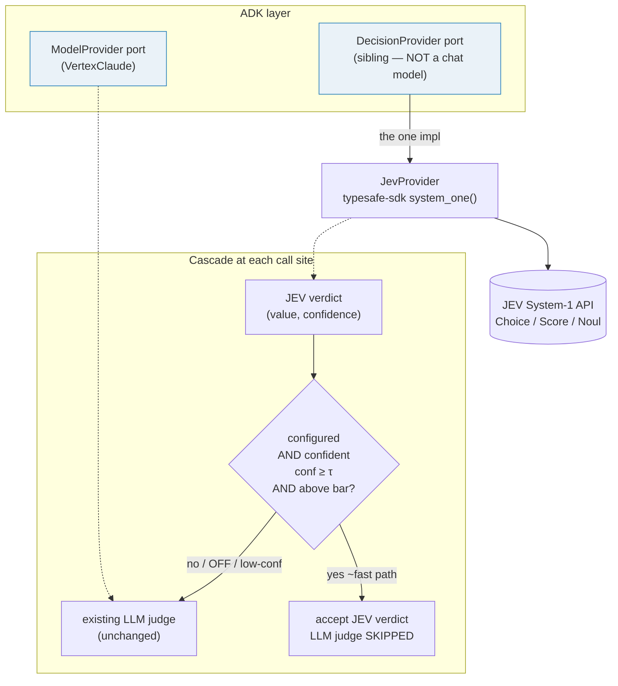

# Plan — Apply JEV to test-agent-v2

*Plan · 2026-09-22 · branch `experiment/jev-decision-provider` · consolidates [`RESEARCH-jev-in-test-agent-v2.md`](RESEARCH-jev-in-test-agent-v2.md) (design), [`EXPERIMENT-jev-results.md`](EXPERIMENT-jev-results.md) (modeled) and [`EXPERIMENT-jev-calibration.md`](EXPERIMENT-jev-calibration.md) (live).*

## Objective

Front the agents' typed LLM decisions (judge a suite, gate an interrogation, score groundedness) with **JEV** — a fast, calibrated System-1 decision engine — via a `DecisionProvider` port beside `ModelProvider`, in a **cascade**: JEV first, the existing LLM judge only on the low-confidence tail. Flag-gated, default OFF, the LLM path untouched. Strictly additive: worst case falls back to today's behaviour.

## Architecture

**Call sites** (each an LLM/heuristic decision today; all opt-in or already-on judged tiers — the deterministic scorers stay LLM-free, **I8**):

| Site | File | JEV primitive | Status |
|---|---|---|---|
| Assured-gen judge (headline win) | `implement/assured/loop.py::_decision_gate` | **Score** ×1 | ✅ built |
| TEV semantic judge | `test_evaluation/eval/judge.py::build_semantic_judge` | **Noul** | ✅ built |
| TEV RAGAS judged tier | `test_evaluation/eval/judge.py` | Score / Noul | ⬜ J7 |
| Refine / define gate | `common/interrogate/loop.py` | Noul | ⬜ J7 |
| KGA recall/grounding gates (B3/B4/B5) | `knowledge_gathering/gather/explore/*` | Noul / Score | ⬜ J7 |
| Model routing (optional) | provider `tier=` | Choice | ⬜ J7 |

## Roadmap

```mermaid
flowchart LR
    J0["J0 Port + 1 call site<br/>✅ done"] --> J1["J1 Assured score gate<br/>✅ done"]
    J1 --> J2["J2 Real transport<br/>typesafe-sdk 0.7.1<br/>✅ done"]
    J2 --> J3["J3 Calibration harness<br/>+ oracle bug fix<br/>✅ done"]
    J3 --> J4["J4 Calibrate τ<br/>✅ done — accept<br/>fast-path fails"]
    J4 --> J5["J5 Pre-prod gates<br/>✅ done"]
    J5 --> J6["J6 Deploy wiring<br/>✅ wired, OFF"]
    J6 --> J7["J7 Design fork<br/>richer state / reject cascade<br/>◀ next"]

    classDef done fill:#d5f5e3,stroke:#27ae60;
    classDef next fill:#fdebd0,stroke:#e67e22;
    class J0,J1,J2,J3,J4,J5,J6 done;
    class J7 next;
```

### Done (this branch)
- **J0 — Port + fake + first call site.** `common/adk/providers/{decision,jev}.py` (`DecisionProvider` Protocol, `Verdict`, `JevProvider`), `FakeDecisionProvider` in conftest, `_DECISION_REGISTRY` selected by `TPD_DECISION_BACKEND`; TEV `build_semantic_judge` → `noul()`.
- **J1 — Assured score gate.** `_decision_gate` runs one `score()` + confidence gate, LLM judge on the tail; `suite_state()` is the shared source of truth for what a Score sees.
- **J2 — Real transport.** `JevProvider` wraps `typesafe-sdk==0.7.1` (`system_one`), lazy-imported, opt-in `jev` extra, locked in `uv.lock`; verified live end-to-end; `is_configured()` gated on `TYPESAFE_API_KEY`.
- **J3 — Calibration harness + oracle fix.** `tools/jev_calibrate.py` (real JEV vs the real LLM judge on goldens). Found+fixed a real bug: `loads_obj` returned the tool-call envelope `{"parameters": {…}}` so `JudgeVerdict` silently scored 0.0 (false rejection) — fixed at the shared parser + regression test.

### J4 — Calibrate τ  ✅ DONE (result: accept fast-path does not pay off — keep OFF)
Calibrated against the production LLM judge on **N=15** (3 goldens × 5 variants, incl. a `drop1` borderline probe). Full tables in [`EXPERIMENT-jev-calibration.md`](EXPERIMENT-jev-calibration.md).

**Result — gate-accurate sweep (fast path fires only on confident ACCEPTS, mirroring `_decision_gate`):**
- JEV↔judge agreement **11/15**; the `drop1` probe produced real divergence (4 disagreements at the accept boundary), so — unlike run 1 — there is a genuine precision signal.
- **No τ pays off.** The three JEV-accept rows all sit at conf ≤0.36 and 2/3 are false-accepts. Above **τ=0.40 the fast path never fires** (0% take-rate → pure overhead, always falls back to the LLM); below it, it fires only on false-accepts (accept-precision 0.00 at τ 0.30–0.36). The exit criterion — accept-precision ≥0.90 at a useful take-rate on divergent+accept-side data — is **tested and fails**.
- **Confidence on correct accepts:** the LLM-accepted rows (n=3) sit at conf mean 0.35 / max 0.41, and JEV agreed on **1/3** — unsure *and* unreliable on accepts.
- **Latency:** JEV `score()` **0.77 s** vs LLM judge median-of-3 **40 s** (~39 s/gate) — real, but unreachable on the accept side.

**Why (root cause, data-backed):** the confidence signal is strong+correct on **rejects** (mismatch/one at conf 0.70–0.98, all right) and weak on **accepts** (≤0.36, half wrong) — the design asymmetry (JEV scores `[kind] title` bullets; the judge reads full scenario **steps**). The current gate captures the accept side (fails) and discards the reject side (where JEV is confident+correct — run 1's misleading "60% @ 1.00" was in fact 9 correct rejects the accept-only gate throws away).

**Decision:** keep the feature **OFF**; τ stays 0.80 (moot at 0% take-rate). The blocker is **not** N — it's the accept-side asymmetry, so more of the same calibration won't move it. Two design forks (a spike each, tracked under J7 — **not** more J4):
1. **Feed JEV judge-equivalent state** (full steps, not title bullets), then re-calibrate — directly tests the asymmetry hypothesis; the promising path to lift accept confidence.
2. **Reject-side cascade** — a confident JEV *reject* skips the judge and goes straight to regenerate (needs a regenerate path that doesn't depend on the judge's textual issues).

*Harness fix this step:* the sweep now mirrors the accept-only gate (`jev_acc AND conf ≥ τ`); run 1 counted confident rejects and read a false 1.00 precision at every τ.

### J5 — Pre-prod gates  ✅ DONE (each a pass or a gated mitigation)
- **32K context — PASS (structural).** JEV `state` is `suite_state` = `pack.summary_text()` + one `[kind] title` bullet per scenario — the *already-summarised* deterministic pack, never raw scenario steps. Title bullets run ~1–2 KB and the summary a few KB, so the largest state is well under 32 K chars; "summarise first" is the default shape, not an extra step. Confirm at scale with `len(suite_state(pack, scenarios))` on the biggest plan.
- **Data residency — GATED (vendor-controlled).** `TypeSafeClient()` takes no endpoint/region in our wrapper (`jev.py::_call`); the region is the vendor's hosted default, which we neither control nor can pin to `europe-west6`. Mitigation: feature stays OFF; before enabling with **customer** state, confirm the vendor region or restrict to non-customer data (the goldens are synthetic). Blocking for prod-with-customer-data.
- **Calibration drift — PROCESS.** τ is per-model; re-run `tools/jev_calibrate.py` on any SDK/model update. The `jev` extra is pinned `==0.7.1` so the version cannot drift silently.
- **Exit:** met — two passes + one explicit gated mitigation.

### J6 — Deploy wiring  ✅ DONE (wired, default OFF; not applied)
Deploy-ready and flag-flippable without turning anything on:
- **Secret:** `google_secret_manager_secret.typesafe_api_key` (`<name_prefix>-typesafe-api-key`) + accessor IAM for the shared SA — `main.tf`, mirroring the Atlassian/bitbucket pattern (version added out-of-band; also surfaced in the `secret_ids` output).
- **Image:** `jev` extra added to the Dockerfile `pip install` and **pinned** `typesafe-sdk==0.7.1` in `pyproject.toml` (the image uses pip, not `uv.lock`, so the pin is what makes the install reproducible).
- **Env:** `local.decision_env` (`cloudsql.tf`) injects `TPD_DECISION_BACKEND` / `TPD_DECISION_CONF_MIN` / `TYPESAFE_API_KEY` into **TPD + TEV** only when the new vars are set (`tpd_decision_backend`, `tpd_decision_conf_min`, `typesafe_secret_enabled`); all default empty/false → nothing injected → LLM path. Documented in `terraform.tfvars.example`.
- **Three states supported:** (a) backend unset → OFF; (b) `backend='jev'` + `typesafe_secret_enabled=false` → key absent, `is_configured()` false → routes to LLM (the "set-without-key" case); (c) backend + secret enabled + version added → JEV on.
- **Exit:** `terraform fmt` clean; the three states are wired. The live boot smoke-test runs at actual deploy — **not applied here** (wire-without-deploy per the user; J4 says keep OFF regardless).

### J7 — Design fork ◀ NEXT (the accept fast-path failed J4; extending call sites is deferred)

J4 is a clean negative: the confident-**accept** cascade cannot be calibrated to pay off, because JEV's accept-side confidence is both low (≤0.36) and uncorrelated with correctness. Two forks could still make JEV earn its place. This is a **design writeup + recommendation**, not a build — the next actual step is a spike, gated on the user's go.

**Root-cause recap (from J4):** JEV grades `pack summary + [kind] title` bullets while the LLM judge reads full scenario **steps**. So JEV is confident+correct where a suite is obviously wrong (mismatch/one → conf 0.70–0.98, all right) but unsure+wrong on the borderline-good suites that decide an *accept*. The two forks attack the two halves of that sentence.

#### Fork 1 — Richer JEV state *(recommended first: cheapest, tests the root cause directly)*
Feed the Score the same full scenario steps the judge sees, not just title bullets.
- **Change:** in `_decision_gate`, build a JEV-specific state from the full step text (a new `decision_state()` beside `suite_state()`, or extend `suite_state` with a `detail=` flag) — the Score `state` is just a `str`, and J5 confirmed full steps still fit 32 K.
- **Hypothesis / expected signal:** accept-side confidence rises and starts separating correct from incorrect accepts → a τ with accept-precision ≥0.90 at a non-zero take-rate appears in `jev_calibrate.py`.
- **Cost:** one small code change + one ~40-min calibration re-run. **Kill criterion:** if accept confidence stays ≤~0.4 with richer state, JEV's Score simply isn't reliable for this accept and we stop here.

#### Fork 2 — Reject-side cascade *(higher value if it lands, but a bigger change)*
Put the cascade where JEV is already confident+correct: a confident JEV **reject** skips the LLM judge and goes straight to regenerate. This is where most early assured-loop rounds live, so the ~39 s/gate saving is actually captured.
- **Blocker:** regeneration today consumes the LLM judge's textual `issues`/`reflections`; a JEV reject carries none. Needs either a regenerate path that runs without issue-text on fast-rejected rounds, or a cheap generic reflection.
- **Gate change:** `_decision_gate` would return a *rejecting* verdict on `conf ≥ τ AND score < threshold` (today it only ever returns an accept) — a real semantics change, so flag-gated + its own calibration (reject-side precision).

**Recommendation:** run Fork 1 first (cheap, decisive). Only if it fails **and** the latency matters, take on Fork 2.

*Deferred until a fork pays off:* the remaining call-site rows (TEV RAGAS tier, refine/define interrogation gate, KGA B3/B4/B5 gates, model routing), each additive + flag-gated.

## Decisions
- **D-JEV-1** `DecisionProvider` is a **sibling** port to `ModelProvider` — JEV has no `generate_content`; forcing it through `complete()`/an `LlmAgent`/`BaseLlm` would be wrong.
- **D-JEV-2** The cascade **fronts** the LLM judge, never replaces it → strictly additive.
- **D-JEV-3** Default **OFF** via `TPD_DECISION_BACKEND`; unknown backend → `None` (no raise).
- **D-JEV-4** The confidence gate calibrates the **Score** path only — `NoulAnswer` carries no confidence in SDK 0.7.1 (`ChoiceAnswer`/`ScoreAnswer` do).
- **D-JEV-5** Calibrate against the **production LLM judge as oracle** (agreement), not hand labels — the cascade only needs to make the same accept/reject call.
- **D-JEV-6** SDK **lazy-imported**, optional `jev` extra, no network import at module load; the offline suite never needs the package.
- **D-JEV-7** Calibration is **gate-accurate**: the τ sweep counts only confident *accepts* (`jev_acc AND conf ≥ τ`), because `_decision_gate` fast-paths accepts only. Counting confident rejects (run 1) inflates precision to a meaningless 1.00. → J4 is a clean **negative** on the accept fast-path, not "needs more data".

## Invariants
- **I8** — deterministic scorers (`evaluate_pack`/`evaluate_plan`/`metrics/*`) stay LLM-free. JEV touches only the opt-in judged tiers + the always-on assured judge.
- **suite_state()** is the single source of truth for the text a Score decision grades — the gate and the calibration harness MUST use it (else calibration drifts from production).
- Assured already trades away I3 (1-LLM-call default); JEV Score×1 **reduces** calls, so it helps rather than worsens the latency budget.

## Risks / open questions
- **Judge asymmetry** — JEV scores `pack summary + [kind] title` bullets while the LLM judge sees full scenario steps; plausibly why JEV ran lenient (all its errors in the first run were low-confidence false-accepts — the confidence gate is the safety net).
- **Small-N calibration** — do not set a production τ on N=12.
- **typesafe-sdk early-access** — constraint unpinned, `uv.lock` pins 0.7.1; API may shift; re-verify on upgrade.
- **Blocking `system_one()` in the async assured loop** — one sync network call per gate; opt-in + off by default; revisit only if it shows up as latency (would be a port-wide async decision, not local).

## Definition of done
JEV is ON in a deployed environment with a calibrated τ, the assured judge measurably cheaper/faster on the goldens with no quality regression vs the LLM-only path, and every pre-prod gate (J5) documented — or a clear, recorded decision to keep it OFF because the numbers didn't justify it.
