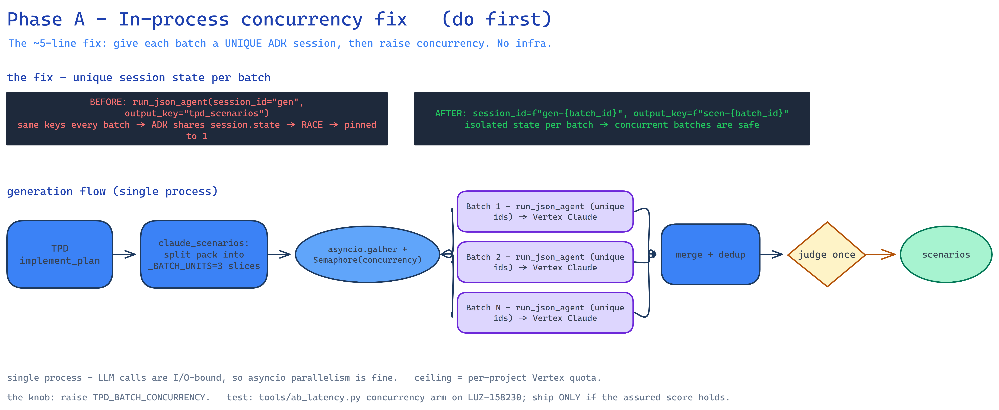
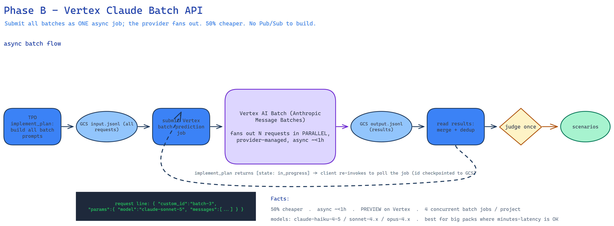
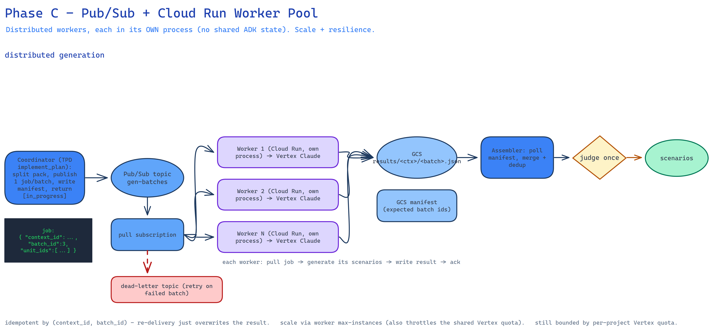

# PLAN — Parallelize the heavy scenario generation

**Goal.** Cut the dominant, pack-size-scaling latency stage — implement's **batched scenario generation** —
by running the batches **in parallel** instead of `_BATCH_CONCURRENCY=1` (sequential). Diagram:
One diagram per phase (embedded under each section below): `parallel-gen-A-inprocess`,
`parallel-gen-B-batchapi`, `parallel-gen-C-workerpool` (`.excalidraw` / `.png`). A combined one-page
overview is in `parallel-generation.png`.

## Where the time is (from the LUZ-158230 A/B)
Implement is ~60% of LLM wall-clock and the only stage that scales with pack size. Generation splits the
pack's grounded units into `_BATCH_UNITS=3` slices → **N sequential** `run_json_agent` calls
(`implement/generate/llm.py`), each an ADK Runner→LiteLlm→Vertex. Turbo's B1 (assured iters 2→1) already
halved it; parallelizing the batches is the next ~2–3× on top.

## Why it's pinned to 1 today (root cause — confirmed by ADK docs)
ADK's `ParallelAgent` guide: parallel runs **share `session.state`; each must write a UNIQUE key or they
race**. `run_json_agent` hardcodes `app_name="tpd-gen"`, `user_id="tpd"`, `session_id="gen"` **and the same
`output_key`** for every batch → concurrent batches clobber each other's state → the "empty/degraded batches"
seen in prod → forced to 1. So the block is a **shared-state key collision**, not (yet proven) a Vertex quota
wall. That makes **Phase A** a few-line fix, and gates whether B/C are needed.

---

## Phase A — In-process concurrency fix (do first; cheapest; no infra)

**Change (`common/testplan/llm/adk.py::run_json_agent`):** derive a **unique** `session_id`/`app_name` and a
unique `output_key` per call (e.g. suffix a monotonic counter or the batch id). Then make
`_BATCH_CONCURRENCY` an env knob (`TPD_BATCH_CONCURRENCY`, default stays 1 until proven).

**Test (already have the harness):** add a `TPD_BATCH_CONCURRENCY=2/3` arm to `tools/ab_latency.py`, run on
LUZ-158230, **gate on the assured score** (a silent regression re-degrades batches to the heuristic). Ship the
raised default only if the score holds.

**Effort:** S. **Win:** implement ~273s → ~140s (2-wide) / ~100s (3-wide). **Bounds:** one instance's event
loop (fine — LLM calls are I/O-bound) and the **per-project Vertex quota** (the real ceiling).

**Invariant:** keep the per-batch heuristic fallback + `claude_scenarios` returns None only when EVERY batch
fails (partial success returns the merged set).

---

## Phase B — Vertex Claude Batch API (async, provider-managed fan-out)

**When:** A hits the Vertex quota, OR you want an **offline "submit & come back"** mode + the **50% batch
discount**. The provider runs the fan-out — no Pub/Sub to build.

**Design:**
1. Coordinator writes all batch prompts as one JSONL to GCS (`batches/<ctx>/input.jsonl`).
2. Submit **one Vertex batch-prediction job** (Anthropic Message Batches on Vertex; supports
   haiku-4-5/sonnet-4.x/opus-4.x).
3. **Poll** for completion; the existing chunked `implement_plan` already fits — return `[state: in_progress]`,
   the client re-invokes, each re-invoke polls the job; the job id is checkpointed to GCS to resume.
4. On done: read results JSONL → merge + dedup → **judge once** → persist.

**Trade-offs:** async latency (mins–hrs, usually <1h), **preview**, **4 concurrent batch jobs/project**. New
code: a `submit_batch`/`poll_batch` path in the provider + a batch generator branch. Best for big packs where
minutes-latency is acceptable and cost matters.

---

## Phase C — Pub/Sub + Cloud Run Worker Pool (your idea; distributed, scalable, resilient)

**When:** many tickets generating at once, resilience (retries/dead-letter), real-time-ish parallelism beyond
one instance. A **documented ADK pattern** (Google codelab: ADK agent in a Cloud Run Worker Pool + Pub/Sub).

**Architecture (see diagram):**
1. **Coordinator** (TPD `implement_plan`): split the pack into batches; publish one **job message** per batch
   to a Pub/Sub topic `gen-batches` (`{context_id, batch_id, unit_ids, plan_ref}`); write a **manifest**
   (`results/<ctx>/manifest.json`, expected batch ids) to GCS; return `[state: in_progress]`.
2. **Worker pool** — a Cloud Run **Worker Pool** (or service) with a Pub/Sub **pull** subscription; **reuses the
   TPD image** with a `worker` entrypoint. Each worker = an ADK generator agent in **its own process** (→ no
   shared ADK state, sidesteps Phase-A's race entirely). Pulls a batch → generates its scenarios → writes
   `results/<ctx>/<batch_id>.json` to GCS → **acks**. Scale via max-instances (also throttles Vertex quota).
3. **Assembler** (coordinator on re-invoke): poll the manifest vs present result blobs; when all batches are in
   → merge + dedup → **judge once** → persist scenarios → `[state: done]`. (Optional Redis/DB counter instead
   of GCS polling — Redis is already wired to TEV.)

**Infra:** Pub/Sub topic + pull subscription + **dead-letter** topic; a worker Cloud Run service (new
`variables.tf`/`services.tf` entry, IAM for pub/sub + GCS + Vertex); reuse the GCS bank as the result store.

**Trade-offs:** heaviest build; distributed-systems concerns (idempotency, partial failure, ordering, DLQ);
**still bounded by the per-project Vertex quota** (parallel workers share it) — so C buys decoupling +
resilience + horizontal scale *up to quota*, not infinite parallelism.

---

## Cross-cutting decisions
- **D1 — Phase A first.** Diagnose + likely fix in-process; gate B/C on whether A hits the quota / needs async.
- **D2 — Single-pass generation** for the distributed path (drop the iterative reflect→regenerate). Compatible
  with turbo (iters=1); forgoes only the reflection improvement round.
- **D3 — GCS = result store + manifest** (reuse the bank); optional Redis completion counter (already on TEV).
- **D4 — Worker = the TPD image + a `worker` entrypoint** (reuse; don't build a parallel service/codebase).
- **D5 — Idempotency:** jobs keyed by `(context_id, batch_id)`; Pub/Sub re-delivery just overwrites the result
  blob. Partial failure → per-batch heuristic (existing) or DLQ + retry.
- **D6 — Quota is the shared ceiling** across A/B/C; make batch concurrency / worker max-instances configurable
  and tune to the project's Vertex Claude quota.

## Measurement / guardrail
Every phase is measured by `tools/ab_latency.py` (latency per stage + PQS/TPS + assured score). A raised
concurrency / new path ships only if the **assured score holds** vs the sequential baseline.

## Rollout
Phase A (1 PR, harness-gated) → measure → **stop if A is enough**. Only escalate to B (async + cost) or C
(scale + resilience) if A's quota ceiling or the UX/scale requirements demand it — don't build the queue before
the 5-line fix is disproven.
