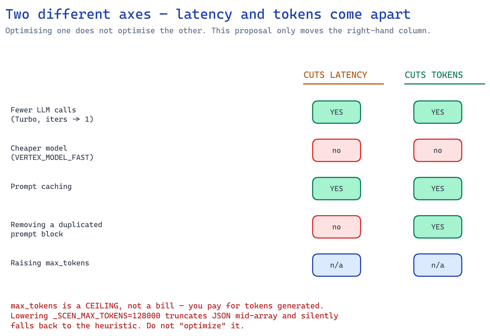
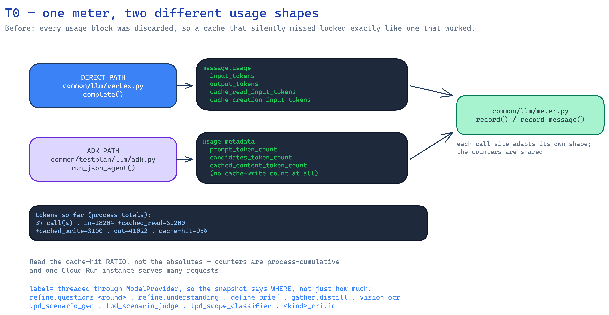
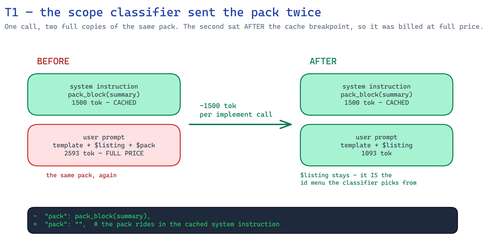
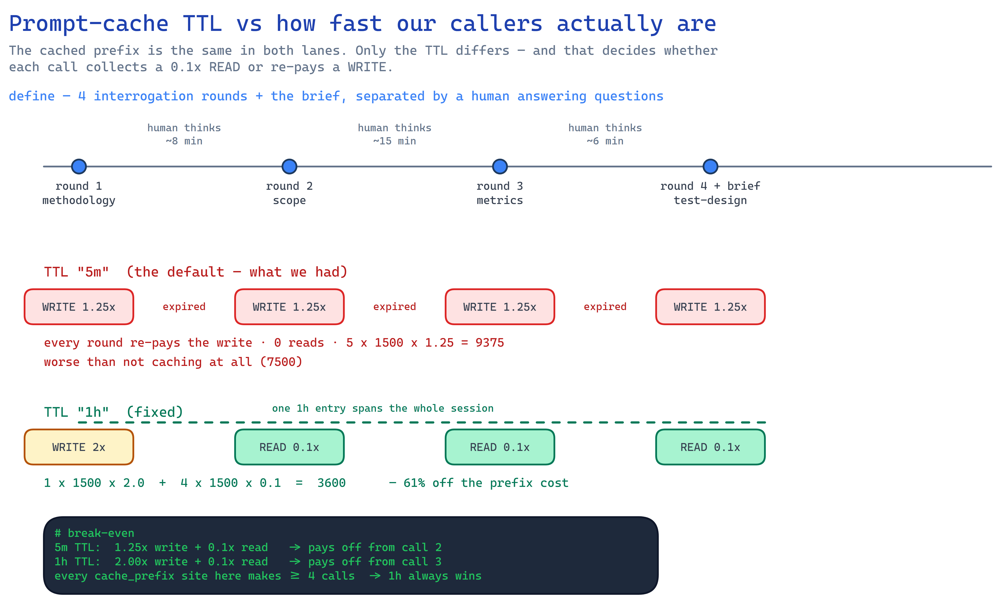
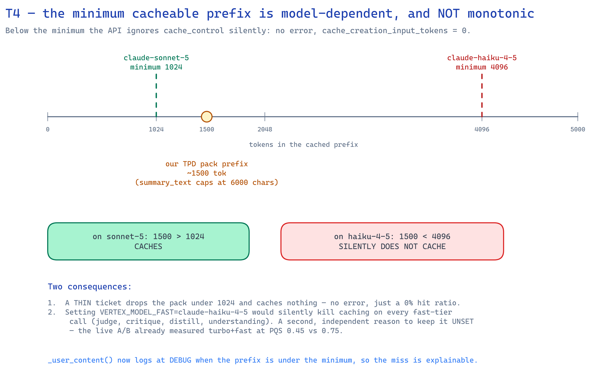
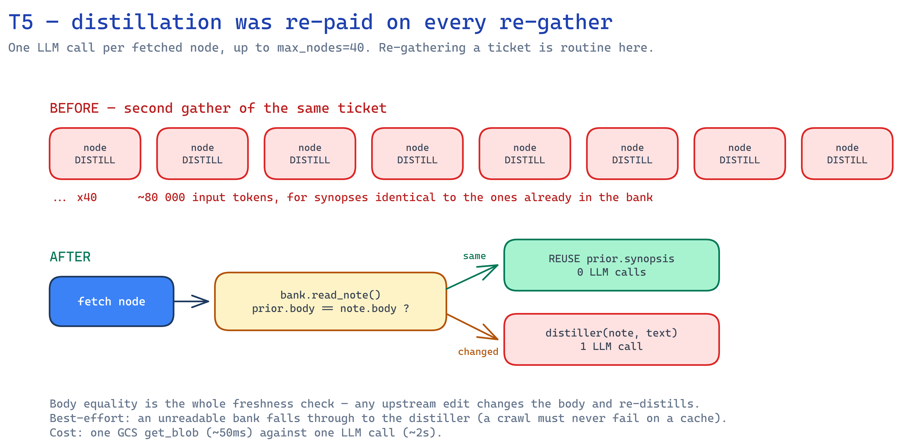
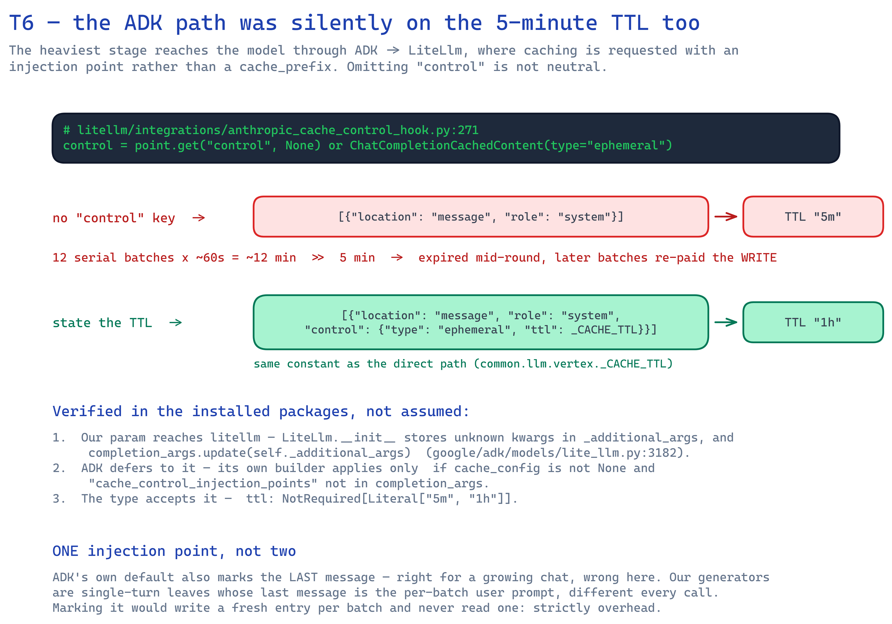
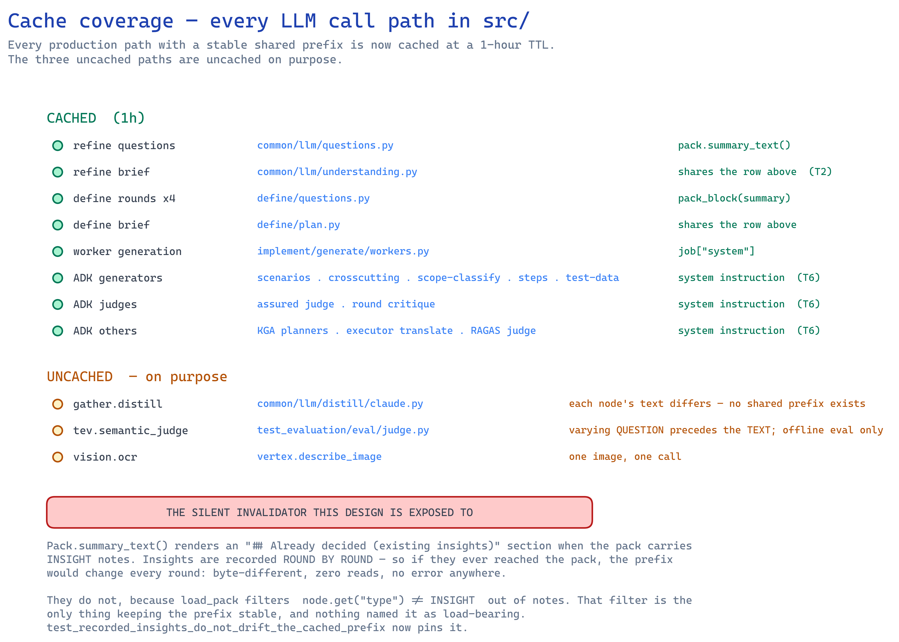
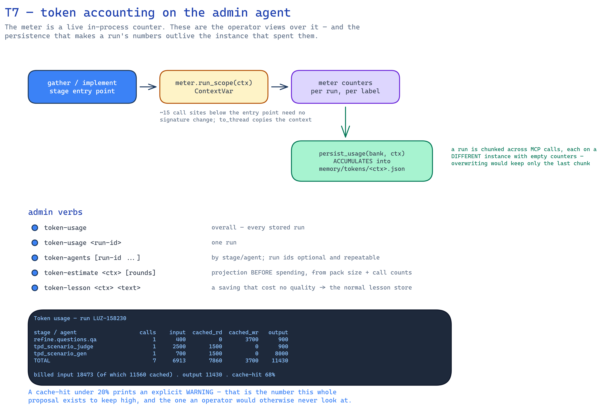

# PROPOSAL — LLM token optimization

**Goal.** Cut what the agents spend on input tokens without changing what the model is asked to
decide. Every change here is either *the same prompt, billed less* or *a call that did not need to
happen*. No prompt was shortened for its own sake, and no quality knob (`effort`, iteration counts,
model tier) was touched — those trade quality for cost and belong to `PLAN-latency-optimization.md`.

**Status: phases T0–T7 are BUILT and merged into the working tree.** 780 passed / 16 skipped, ruff
clean. Scope: `test-agent-v2`, model `claude-sonnet-5` on Vertex.

---

## 0. Why this is separate from the latency plan



`PLAN-latency-optimization.md` and `PLAN-parallel-generation.md` optimize **wall-clock**. They found
that Vertex is throughput-bound, so parallelism bought nothing, and that the remaining lever was
fewer/cheaper round-trips (Turbo, the fast tier).

Tokens are a different axis, and the two come apart:

| | Cuts latency | Cuts tokens |
|---|---|---|
| Fewer LLM calls (Turbo, iters→1) | ✅ | ✅ |
| Cheaper model (`VERTEX_MODEL_FAST`) | ✖ (measured: no gain) | ✖ — same tokens, lower **price** |
| Prompt caching | ✅ (modest) | ✅ (up to 90% on the cached span) |
| Removing a duplicated prompt block | ~0 | ✅ |
| Raising `max_tokens` | — | **no effect** — you are billed for tokens *generated*, not for the ceiling |

That last row matters because `_SCEN_MAX_TOKENS = 128000` looks alarming and is not a cost at all.
It is the model's real output ceiling and lowering it silently truncates JSON mid-array — the
documented root cause of the heuristic-fallback bug. **Do not "optimize" it.**

---

## 1. The finding that gates everything else: nothing was measured



Before this work, `grep -rn "usage\|input_tokens\|cache_read" src/` returned **zero hits outside
comments**. Every Vertex response carries a `usage` block — `input_tokens`, `output_tokens`,
`cache_creation_input_tokens`, `cache_read_input_tokens` — and `complete()` discarded all of it.

That is not just a missing dashboard. It means **the prompt caching added in commit `a62009d` was
never verified to work**, and (per §3) most of it was not working. A cache that silently misses is
worse than no cache: you pay a **1.25× write** on every call and never collect a read.

### T0 — Token meter (BUILT)

`src/common/llm/meter.py` — a process-local counter, fed from both model paths:

| Path | Where | Usage shape |
|---|---|---|
| Direct `complete()` | `common/llm/vertex.py` | Anthropic `message.usage` |
| ADK / LiteLlm | `common/testplan/llm/adk.py::_record_usage` | google.genai `usage_metadata` |

The two report different field names for the same thing (`cached_content_token_count` vs
`cache_read_input_tokens`), so each call site adapts its own shape and both feed one set of
counters. `complete()` gained a `label=` argument threaded through `ModelProvider` — without it a
snapshot says *how much* was spent but never *where*, which is the only actionable question.

Labels now in use: `refine.questions.<round>`, `refine.understanding`, `define.questions.<round>`,
`define.brief`, `gather.distill`, `vision.ocr`, `implement.worker`, plus every ADK agent name
(`tpd_scenario_gen`, `tpd_scenario_judge`, `tpd_scope_classifier`, `<kind>_critic`, …).

`implement_plan` and `crawl` log `meter.summary_line()` on completion:

```
tokens so far (process totals): 37 call(s) · in=18204 +cached_read=61200 +cached_write=3100 · out=41022 · cache-hit=95%
```

**Read the cache-hit ratio, not the absolute numbers** — counters are process-cumulative, and one
Cloud Run instance serves many requests. A hit ratio near 0% across a run whose calls share a pack
prefix is the alarm.

> ⚠️ **Known gap.** The ADK/LiteLlm bridge exposes no cache-*write* count, so ADK-path calls report
> reads with no matching writes. The ratio is still directionally right; the absolute write figure
> is understated on the implement stage.

---

## 2. T1 — The scope classifier sent the pack twice (BUILT)



`classify_in_scope` builds its agent with `system=pack_block(summary)` — the pack, cached — and then
called `scope_classify_prompt(...)`, whose stored template ended in `$pack`, rendering **the entire
pack a second time** in the user message. The second copy sat after the cache breakpoint, so it was
billed at full price on every implement call.

```diff
- "pack": pack_block(summary),
+ "pack": "",  # the pack rides in the cached system instruction — see the docstring
```

Measured on a 12-unit pack:

| | user prompt |
|---|---|
| before | 2 593 tok |
| after | 1 093 tok |
| **saved** | **1 500 tok per implement call** (≈58%) |

The node `$listing` (`id :: title :: synopsis[:160]`) **stays** — that is the menu the classifier
picks ids from, not a duplicate of the pack.

---

## 3. T2 + T3 — The prompt cache was mostly not working



Two independent defects, both invisible without T0.

### T2 — `refine.understanding` never used the cache at all (BUILT)

Within one refine pass, `claude_questions` and `claude_understanding` read the **same pack**.
`claude_questions` correctly passed it as `cache_prefix`; `claude_understanding` embedded it inline
in the prompt body, so it was billed at full price on every pass *and* never shared the sibling's
cache entry.

Fixed by giving `understanding_prompt` the same `include_context=False` seam `question_prompt`
already had, and passing `cache_prefix=pack.summary_text()` — **byte-identical** to what
`claude_questions` passes, which is the whole requirement for a prefix match.

| | understanding prompt body |
|---|---|
| before | 1 940 tok, billed 1.0× |
| after | 74 tok + a shared prefix billed ~0.1× |

### T3 — The 5-minute TTL expired between every pair of calls (BUILT)

`cache_control: {"type": "ephemeral"}` defaults to a **5-minute** TTL. Every caller we have is slower
than that:

- **define** — 4 interrogation rounds + the brief, separated by *a human reading questions and
  answering them*. Minutes to hours.
- **refine** — same shape, 4 passes.
- **implement** — one round runs up to `TPD_GEN_MAX_BATCHES=12` serial batches at ~60s each.

So the prefix expired before the next call, and each call paid the **1.25× write** and collected no
read. The cache was pure overhead: strictly worse than not caching.

```diff
- "cache_control": {"type": "ephemeral"}
+ "cache_control": {"type": "ephemeral", "ttl": _CACHE_TTL}   # "1h"
```

The 1-hour TTL costs **2×** on the write and **0.1×** per read, so it beats uncached from the third
call — and every `cache_prefix` site makes at least four. Modelled on the define stage's 1 500-token
prefix over 5 calls:

| | prefix cost (token-equivalents) |
|---|---|
| 5-min TTL, every call a miss | 5 × 1500 × 1.25 = **9 375** |
| no caching at all | 5 × 1500 × 1.0 = **7 500** |
| 1-hour TTL | 1 × 1500 × 2.0 + 4 × 1500 × 0.1 = **3 600** |

**~61% off the prefix cost, and the old configuration was 25% worse than no cache.**

### T4 — Diagnosing a prefix that is too short to cache (BUILT)



The minimum cacheable prefix is **model-dependent and not monotonic**: `claude-sonnet-5` needs
1 024 tokens, but `claude-haiku-4-5` needs **4 096**. Below the minimum the API ignores
`cache_control` silently — no error, `cache_creation_input_tokens: 0`.

This is a live trap here. `PlanPack.summary_text()` caps the TPD pack at 6 000 chars ≈ 1 500 tokens,
just above sonnet's line — **a thin ticket drops below it and caches nothing**. And if anyone sets
`VERTEX_MODEL_FAST=claude-haiku-4-5`, the 1 500-token prefix is under haiku's 4 096 minimum, so
every fast-tier call (judge, critique, distill, understanding) silently stops caching.

`_user_content` now logs at DEBUG when the prefix is under ~4 096 chars, so the miss is explainable
instead of a ghost hunt. **No behavioural change** — it is a diagnostic.

> **Deployment note.** The A/B in `PLAN-latency-optimization.md` already recommends leaving
> `VERTEX_MODEL_FAST` unset (turbo+fast measured PQS 0.45 vs 0.75). T4 is a second, independent
> reason: it would also break prompt caching on the fast tier. Keep it unset.

---

## 4. T5 — Distillation was re-paid on every re-gather (BUILT)



`crawl()` calls the distiller once per fetched node — up to `max_nodes=40` LLM calls per gather, at
~2 000 input tokens each (`text[:8000]`). Re-gathering the same ticket is routine in this codebase:
a fresh context per repo, a re-run after a fix, `gather_codebase` on a converged context. Every one
re-distilled every unchanged node.

The bank already holds the previous synopsis. `_cached_distill` reads it and reuses it when the body
it was distilled from is byte-identical:

```python
if prior is not None and prior.synopsis and prior.body == note.body:
    log.info("distill cache hit: %s (unchanged body) — no LLM call", note.id)
    return prior.synopsis
```

Body equality is the entire freshness check — any upstream edit changes the body and re-distills.
Best-effort: an unreadable bank falls through to the distiller (a crawl must never fail on a cache).

**Cost:** one GCS `get_blob` per node (~50ms) against an LLM call (~2s). On a re-gather of 40
unchanged nodes that is **~40 LLM calls and ~80 000 input tokens avoided**; on a first gather it
costs ~2s of GCS reads.

---

## 5. What was deliberately NOT done

Each of these was considered and rejected — recording why, so they are not re-proposed.

| Candidate | Verdict |
|---|---|
| Lower `_SCEN_MAX_TOKENS` from 128000 | **No.** `max_tokens` is a ceiling, not a bill. Lowering it truncates JSON mid-array → schema-invalid → silent heuristic fallback. Already the documented root cause of a prod bug. |
| Trim the `$listing` synopsis slice in scope-classify | **No.** 160 chars × N nodes is the classifier's only signal about what each node *is*. Cutting it trades classification accuracy for ~500 tokens; faithfulness and scope precision are what the classifier exists to protect. |
| Shorten prompt bodies / drop Gherkin + pack-grounding guidance | **No.** These were added by the quality workstream to fix measured defects. Cost is ~3 000 tokens of *static* text that the cache is designed to absorb — fix the cache (T3), don't delete the instructions. |
| Set `VERTEX_MODEL_FAST` to cut cost | **No** (for now). It cuts price-per-token, not tokens, and the live A/B measured a quality collapse combined with Turbo. It also breaks caching below haiku's 4 096-token minimum (§T4). |
| Reduce `TPD_ASSURED_MAX_ITERS` / `TPD_JUDGE_SAMPLES` | **Out of scope.** Real token savings, but they trade quality — that is the Turbo lever, already owned by the latency plan. |
| Per-request token isolation in the meter | **No.** Counters are process-cumulative; per-run attribution needs a request-scoped context and belongs to `Benchmark`, not to a counter. The cache-hit ratio is what an operator actually reads. |

---

## 6. T6 — The ADK path was silently on the 5-minute TTL too (BUILT)



The implement generators — the heaviest stage — reach the model through ADK → LiteLlm, where caching
is requested with `cache_control_injection_points` rather than a `cache_prefix`. We passed:

```python
[{"location": "message", "role": "system"}]      # no "control" key
```

Reading the installed `litellm` 1.100.1 settles what that means:

```python
# litellm/integrations/anthropic_cache_control_hook.py:271
control = point.get("control", None) or ChatCompletionCachedContent(type="ephemeral")
```

**Omitting `control` silently selects the 5-minute TTL.** So the stage with the longest run — up to
`TPD_GEN_MAX_BATCHES=12` serial batches at ~60s — was the one stage still expiring mid-round, and
every later batch re-paid the write. The type does accept a TTL
(`ttl: NotRequired[Literal["5m", "1h"]]`), so the fix is to state it:

```python
[{"location": "message", "role": "system",
  "control": {"type": "ephemeral", "ttl": _CACHE_TTL}}]   # same constant as the direct path
```

Two things verified in the installed packages rather than assumed:

1. **Our param reaches litellm.** `LiteLlm.__init__` stores unknown kwargs in `_additional_args`,
   and `completion_args.update(self._additional_args)` puts them on the call
   (`google/adk/models/lite_llm.py:3182`).
2. **ADK defers to it.** ADK has its own `_cache_control_injection_points` builder, applied only
   `if cache_config is not None and "cache_control_injection_points" not in completion_args` — its
   comment: *"A caller who named their own injection points at construction has said more about
   their provider than the app-level config can, so leave those alone."*

**One injection point, not two.** ADK's own default also marks the **last message**, which is right
for a growing chat and wrong here: our generators are single-turn leaves whose last message is the
per-batch user prompt, different on every call. Marking it would write a fresh entry per batch and
never read one — strictly overhead. Our single system-message point is the correct shape for this
workload.

> This closes what an earlier draft of this proposal listed as the largest unfixable gap. The
> recommendation there — switch to `TPD_GEN_MODE=workers` to inherit the direct path's TTL — is no
> longer needed *for caching*. It remains a valid option for the throughput reasons in
> `PLAN-parallel-generation.md`.

---

## 6b. Cache coverage audit — every LLM call path

Verified by enumerating every `complete()` and `agent_model()` call site in `src/`. **Every
production path with a stable shared prefix is now cached at a 1-hour TTL.** The three uncached
paths are uncached on purpose.



| Call site | Prefix | Status |
|---|---|---|
| `common/llm/questions.py` — refine questions | `pack.summary_text()` | ✅ cached 1h |
| `common/llm/understanding.py` — refine brief | `pack.summary_text()` | ✅ cached 1h · **shares the row above** (T2) |
| `define/questions.py` — 4 define rounds | `pack_block(summary)` | ✅ cached 1h |
| `define/plan.py` — define brief | `pack_block(summary)` | ✅ cached 1h · **shares the row above** |
| `implement/generate/workers.py` | `job["system"]` | ✅ cached 1h |
| ADK: scenarios · crosscutting · scope-classify · steps · test-data | system instruction | ✅ cached 1h (T6) |
| ADK: assured judge · round critique | system instruction | ✅ cached 1h (T6) |
| ADK: KGA planners · executor translate · RAGAS judge | system instruction | ✅ cached 1h (T6) |
| `common/llm/distill/claude.py` | — | ⬜ **correctly uncached** — each node's text is different; there is no shared prefix to mark |
| `test_evaluation/eval/judge.py` — semantic judge | — | ⬜ **knowingly uncached** — the varying QUESTION precedes the TEXT, so there is no stable *leading* prefix. Offline eval harness, not a request path |
| `vertex.describe_image` — vision OCR | — | ⬜ **correctly uncached** — one image, one call |

### The silent invalidator this design is exposed to

The cached prefix is `Pack.summary_text()`, which renders an `## Already decided (existing insights)`
section whenever the pack carries INSIGHT notes. Insights are recorded **round by round** — so if
they ever reached the pack, the prefix would change on every round: byte-different, zero reads, and
no error anywhere.

They do not, because `load_pack` filters `node.get("type") != INSIGHT` out of `notes`. That filter is
the only thing keeping the prefix stable across rounds, and nothing named it as load-bearing.
`test_recorded_insights_do_not_drift_the_cached_prefix` now pins it: it records an insight into a
real `MemoryBank` between two `load_pack` calls and asserts the rendered prefix is unchanged.

---

## 6c. T7 — Token accounting on the admin agent (BUILT)



The meter from T0 answers "how much, and where" for the **current process**. Three operator
questions need more than that, so the counters gained a run dimension and a home in the bank.

### Run attribution without signature churn

`meter.run_scope(ctx)` is a `ContextVar`, not a parameter on `record()`. The run id is known at
exactly one place — the stage entry point — while the ~15 sites that actually spend tokens are
several frames below it, so threading it through every signature would be churn for no gain.
`asyncio.to_thread` copies the context, so the blocking off-loop calls stay attributed correctly.

`implement_plan` and `crawl` now wrap their bodies in a scope and call `persist_usage` on the way
out. **Persistence accumulates, it does not overwrite** — a run is chunked across several MCP calls
(the assured loop pauses and resumes), each landing on a different Cloud Run instance with its own
empty counters. Overwriting would silently keep only the last chunk, and a token report that
under-reports is worse than no report.

### The verbs

| Verb | Answers |
|---|---|
| `token-usage` | Overall — every stored run, plus anything this process has not persisted yet |
| `token-usage <run-id>` | One run |
| `token-agents [run-id ...]` | Per stage/agent. Run ids are optional and repeatable — the difference between "which agent is expensive in general" and "...on this ticket" |
| `token-estimate <ctx> [assured-rounds]` | A projection **before** spending |
| `token-lesson <ctx> <text>` | Record a saving that cost no quality |

Every usage view prints a **cache-hit ratio**, and under 20% it prints an explicit `WARNING`
pointing at §6b. That is the number this entire proposal exists to keep high, and the one an
operator would otherwise never think to look at.

### The estimate is a model, and says so

`token-estimate` projects from the pack it *would* run against: grounded-unit count → batch count
(`ceil(units / 3)`) → the per-stage call counts that are actually in the code, times the measured
prompt shapes from §2. Two things it gets right that a naive model does not:

- **The cache write is charged once per distinct prefix, not once per stage.** Every TPD stage shares
  one `pack_block(summary)`, so they share one entry — charging per stage overstated the bill by
  ~4x the prefix. The first stage on a prefix pays; later ones only read.
- **Prefixes are keyed by the string, not by its token count.** Two different prefixes of equal size
  are not the same cache entry (a prefix match is byte-exact, §3). When the two strings genuinely
  *are* identical — a pack with no confirmed understanding — they do share one entry, and string
  keying gets that right for free.

It prints the old-5m-TTL figure alongside, so the §3 saving stays visible, and it labels itself an
estimate with `Compare with: token-usage <ctx>` — the actuals are one command away, so a bad model
gets caught rather than quietly trusted.

### Lessons go through the existing store, not a new one

`token-lesson` writes an ordinary `Insight` via the existing `common.learn.capture_lessons`, under a
new canonical kind `TOKEN_SAVING` added alongside `LESSON` / `CORRECTION` / `GOTCHA`. Adding it to
`learn/store.py::_KINDS` is what makes it visible to recall and governance — without that one line
it would persist and then be invisible, which is how the first version of this shipped and what
`test_token_lesson_goes_through_the_normal_lesson_store` now prevents.

**The quality half is the point.** Anything that trades accuracy for cost is a config knob (Turbo,
`effort`, iteration counts) and belongs in a tfvar. A lesson here is a change that was *measured* to
be free, so a future run can apply it without re-litigating.

---

## 7. How to verify on the next live run

1. Deploy and run one full pipeline (gather → refine → define → implement) on a real ticket.
2. Grep the Cloud Run logs for `tokens so far (process totals)`.
3. Check, in order:
   - **`cache-hit` > 0%.** If it is 0%, caching is still dead — check the prefix length (§T4) and
     whether the prefix string is byte-identical between the calls that should share it.
   - **`cache-hit` rising across the define rounds.** Round 1 writes; rounds 2-4 and the brief should
     read. If round 2 writes again, the TTL or the prefix changed between rounds.
   - **`distill cache hit:` lines on a re-gather.** Absent on a second gather of the same ticket
     means the body is not stable across fetches (T5 is then a no-op, not a bug).
4. Compare against `RESEARCH-kga-evaluation-adk-ragas` PQS / `tpd-evaluation` TPS: **none of T0–T5
   should move a quality score.** If one does, the change was not cost-neutral and should be
   reverted — that is the acceptance criterion for this whole proposal.

---

## 8. Change inventory

| File | Change | Phase |
|---|---|---|
| `src/common/llm/meter.py` | **new** — per-label token counters, snapshot, summary line | T0 |
| `src/common/llm/vertex.py` | record `usage`; `label=`; 1h cache TTL; short-prefix diagnostic | T0/T3/T4 |
| `src/common/adk/model.py`, `providers/{base,vertex_claude,litellm}.py` | thread `label=` through the provider port | T0 |
| `src/common/testplan/llm/adk.py` | `_record_usage` from ADK `usage_metadata` | T0 |
| `src/common/testplan/llm/{templates,prompts}.py` | drop the duplicated `$pack` from scope-classify | T1 |
| `src/common/llm/{templates,prompts,understanding}.py` | `include_context=False` + shared `cache_prefix` | T2 |
| `src/common/llm/{questions,distill/claude}.py`, `define/{questions,plan}.py`, `implement/generate/workers.py` | call-site labels | T0 |
| `src/knowledge_gathering/gather/crawl/crawl.py` | `_cached_distill`; token log line | T5 |
| `src/test_plan_definition/implement/generate/pipeline.py` | token log line | T0 |
| `src/common/admin/tokens.py` | **new** — persist/read usage, the three views, the estimate, the lesson | T7 |
| `src/common/llm/meter.py` | `run_scope` ContextVar + per-run counters | T7 |
| `src/common/models/refine.py`, `models/__init__.py`, `learn/store.py` | canonical `TOKEN_SAVING` lesson kind, registered in `_KINDS` | T7 |
| `src/admin_agent/agent.py`, `common/admin/__init__.py` | 4 verbs + exports | T7 |
| `implement/generate/pipeline.py`, `gather/crawl/crawl.py` | `run_scope` + `persist_usage` on the way out | T7 |
| `tests/test_token_optimization.py` | **new** — 10 cases pinning each saving | — |
| `tests/test_admin_tokens.py` | **new** — 8 cases over the admin surface | — |

**Why the tests exist:** every saving here is invisible at runtime. A duplicated pack still produces
a correct answer; a cache prefix that never matches still returns text. Only the bill notices — so
without these guards the regressions come back silently, exactly as they did the first time.
