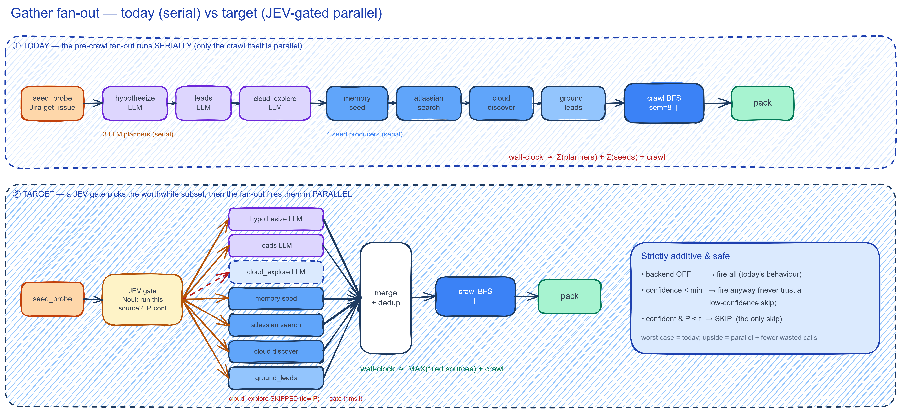
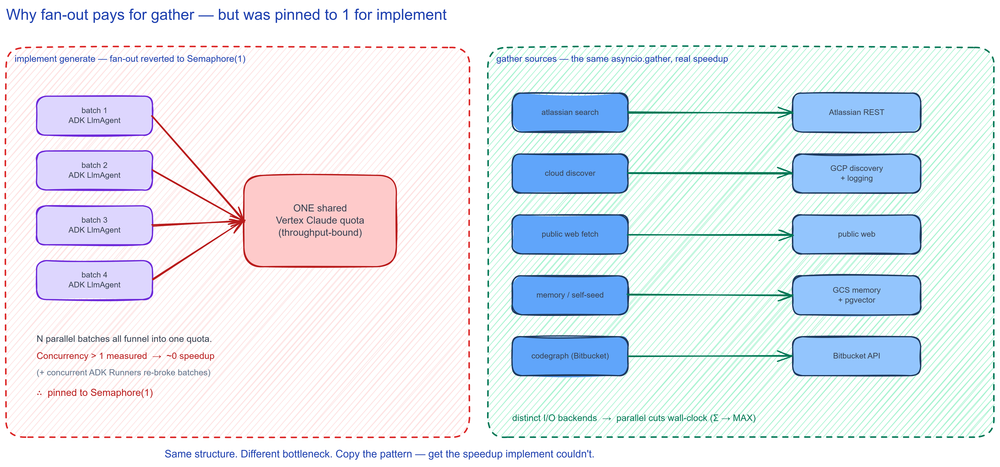
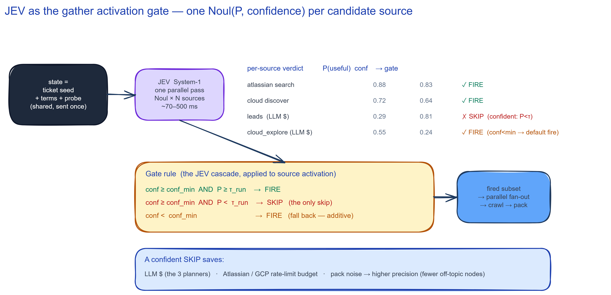
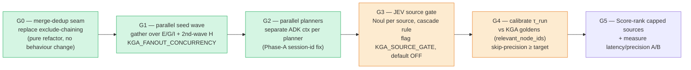

# Proposal — Parallel, JEV-gated gather fan-out

*Proposal · 2026-09-22 · branch `experiment/jev-decision-provider` · builds on
[`PLAN-parallel-generation.md`](PLAN-parallel-generation.md) (the implement fan-out),
[`PLAN-jev-apply-v2.md`](PLAN-jev-apply-v2.md) + [`RESEARCH-jev-in-test-agent-v2.md`](RESEARCH-jev-in-test-agent-v2.md) (the decision port),
and the tier design in [`PLAN-gcp-service-exploration-tiers.md`](PLAN-gcp-service-exploration-tiers.md).*

---

## TL;DR

Gather's pre-crawl fan-out — three LLM planners then four seed producers — runs **strictly
serially today**; only the crawl itself is parallel. Two things follow from the code:

1. **The serial part is independently parallelizable.** The 3 planners share one input and write
   distinct keys; 4 of the seed producers are independent reads. Wrap them in the *same*
   `asyncio.gather` pattern the implement stage already uses, and wall-clock drops from **Σ of the
   hops to MAX of the hops**.
2. **It pays here where it didn't for implement.** Implement's fan-out is pinned to `Semaphore(1)`
   because every batch funnels into **one shared Vertex quota** (throughput-bound — measured ~0
   speedup). Gather's sources hit **distinct backends** (Atlassian REST, GCP discovery/logging,
   public web, GCS/pgvector, Bitbucket). Distinct I/O → parallel actually cuts the clock. *Same
   structure, different bottleneck.*

On top of the fan-out, front it with a **JEV activation gate**: one calibrated `Noul(P, confidence)`
per candidate source answering *"will this source yield in-scope knowledge for this ticket?"* — run
the source only when JEV is **confident it won't help** enough to skip it. This is the exact JEV
cascade already shipped for the assured judge (`DecisionProvider` port, default OFF, strictly
additive), reused as a **source selector** instead of a suite scorer.

> **The principle.** *Don't fire the sources one at a time, and don't fire the ones a fast calibrated
> gate says won't pay. Pick the worthwhile subset, then fan it out in parallel. Worst case is
> exactly today's behaviour.*

---

## Implementation status (2026-09-22 · branch `experiment/parallel-gather-jev-gated`)

Built **G0/G1 (parallel seed wave) + G3 (JEV gate scaffolding, default OFF)**; **G2 (parallel
planners) deferred** on evidence found during implementation. What landed, and the three deviations
from the original proposal:

- **G0/G1 — the seed producers fan out** in `expansion_round` via `asyncio.gather` under
  `Semaphore(KGA_FANOUT_CONCURRENCY)` (default 4). The free/instant `memory_self_seed` runs first and
  its seeds join the exclude the wave sees; the I/O-bound producers (semantic, atlassian-search,
  ground-leads, cloud-discover) run concurrently. `ground_leads`'s 3-tuple is unpacked in the merge.
- **G3 — the gate** is `explore/source_gate.py`: `select_sources()` (wired, no-op unless
  `KGA_SOURCE_GATE` **and** a `TPD_DECISION_BACKEND`) + `apply_cascade()` (pure, unit-tested). One
  `noul` per candidate; SKIP only on confident-and-below-`τ_run`. Default `conf_min=0.40` mirrors J4.
- **G2 — planners kept SERIAL (deferred), not a win here.** Two facts surfaced in the code: (1) the 3
  planners all hit the **one shared Vertex Claude quota** — the *exact* wall that made implement's
  fan-out worthless (throughput-bound); the distinct-backend argument that justifies G1 does **not**
  apply to them. (2) implement's own `Semaphore(1)` comment records that concurrent in-process ADK
  Runners returned **simultaneously-empty** structured output *even with isolated per-call Runners*
  (the `run_json_agent` path) → silent degrade. Parallelizing the planners re-buys that risk for a
  marginal (400-token calls) latency gain against a shared quota. Left serial; revisit only with the
  Phase-B batch API (same off-ramp implement took).

**Deviation 1 — G0 is NOT "no behaviour change".** The capped producers (`atlassian_search` top-5,
`cloud_discover` top-8) filter `exclude` *before* the cap, so under parallelism each sees only the
initial exclude and can spend a cap slot on a seed a sibling already found; the post-fan-out dedup
then drops it, netting one fewer unique seed. Bounded (the capped sources target near-disjoint
id-spaces) but real — named as a `ponytail:` ceiling in `expansion_round`, gated by the PQS/recall
A/B. **The recall guard (I-PG-2) applies to the parallelism itself, not only the gate.**

**Deviation 2 — a missing dependency edge.** `hypothesize` writes `terms` (`_plan`: `terms = hyp`)
and every term-consuming seed producer reads it, so the true shape is **two waves** — planners ∥,
*then* seeds ∥ — not one flat fan-out. Fully overlapping them would feed seeds the pre-hypothesis
terms (a quality regression). Wall-clock is `MAX(planners) + MAX(seeds)`, not `MAX(all hops)`.

**Deviation 3 — roadmap re-anchored.** **G2 is the realistic definition-of-done** (G0/G1 + gate
scaffolding); the planner parallelism and G4–G5 calibration are an explicitly-optional spike carrying
the accept-side risk the JEV experiment already calibrated negative (a source gate asks "will this
help?" — the accept side, where JEV had no safe τ).

**Diagrams** (open the `.excalidraw`, PNG renders inline):
- Current vs target fan-out — [`gather-fanout-current-vs-target.excalidraw`](gather-fanout-current-vs-target.excalidraw) · [`.png`](gather-fanout-current-vs-target.png)
- The JEV activation gate — [`gather-jev-activation-gate.excalidraw`](gather-jev-activation-gate.excalidraw) · [`.png`](gather-jev-activation-gate.png)
- Why it pays for gather, not implement — [`gather-backend-diversity.excalidraw`](gather-backend-diversity.excalidraw) · [`.png`](gather-backend-diversity.png)

---

## Where it slots (grounded in the code)



`GatherAgent._run_async_impl` (`knowledge_gathering/gather/agent.py:86`) runs the pipeline in this
order — everything inside **one** A2A request, no cross-request parallelism:

| Phase | Sub-activity | File | Cost | Concurrency today |
|---|---|---|---|---|
| probe | `seed_probe` (Jira `get_issue`) | `gather/domain.py:49` | free | serial, always first |
| plan (only if `explore=True`) | **hypothesize** → focus terms | `explore/planners/hypothesize.py` | **LLM $** | serial (1/3) |
| | **leads** → external leads | `explore/planners/ask_llm.py` | **LLM $** | serial (2/3) |
| | **cloud_explore** → service hints | `explore/planners/cloud_explore.py` | **LLM $** | serial (3/3) |
| expand | memory **self-seed** | `explore/seeds/self_seed.py:44` | free | serial |
| | semantic self-seed (opt-in, default OFF) | `explore/seeds/self_seed.py:84` | embed | serial |
| | **atlassian search** (JQL+CQL) | `explore/seeds/atlassian_search.py:20` | free¹ | serial |
| | **ground_leads** (needs `leads`) | `explore/seeds/ground_leads.py:31` | free¹ | serial |
| | **cloud discover** (service discovery) | `explore/seeds/cloud_discover.py:106` | free¹ | serial |
| crawl | frontier BFS over all seeds | `crawl/crawl.py:28` | heuristic² | **concurrent** (`Semaphore(8)` + `asyncio.gather`, `crawl.py:36,55`) |

¹ *free of LLM $, but hits Atlassian / GCP rate limits.*  ² *default distiller is `heuristic_distill`
— no LLM in the crawl body.*

The planners run one-after-another at `agent.py:71,77,82`; the seed producers are sequential `await`s
in `expansion_round` (`explore/expand.py:16`, body `:48-69`). **Only the crawl is parallel.** So the
fan-out that feeds the crawl is exactly the serial stretch worth attacking — and unlike the earlier
"serial blocking Vertex blew Cloud Run liveness" incident, every blocking call here is already
`asyncio.to_thread`-offloaded, so the win on the table is pure **latency (Σ→MAX)**, not unblocking.

---

## Part 1 — Parallelize the fan-out (the "fan-out like implement" ask)

### The two independent clusters

From the dependency graph (`agent.py:62-84`, `expand.py:48-69`):

- **Hard sequence (real data dep):** `seed_probe` → everything · **`hypothesize` → `terms` → every
  term-consuming seed producer** (`_plan` does `terms = hyp`; `atlassian_search` / `cloud_discover` /
  `semantic_self_seed` all read it) · `leads` → `ground_leads` · `cloud_explore` → `cloud discover` ·
  (all seeds) → `crawl`. The `hypothesize → terms` edge is why the fan-out is **two waves** (planners
  ∥, then seeds ∥), not one — overlapping them would feed seeds the pre-hypothesis terms.
- **Independent → parallelizable:**
  - **Cluster A — the 3 planners** (`hypothesize`, `leads`, `cloud_explore`): all consume the same
    `PlanInput(probe)` and write distinct session keys (`kga_hypothesis` / `kga_leads` /
    `kga_cloud_plan`). No inter-dependency.
  - **Cluster B — the seed producers** (`memory self-seed`, `atlassian search`, `cloud discover`;
    `ground_leads` runs in a **second wave** after `leads`). Independent reads on different backends.

`ground_leads` is the only intra-fan-out dependency — model it as a two-wave fan-out (leads-wave, then
ground_leads joins the seed-wave), not a reason to keep the whole thing serial.

### The mechanism — reuse the implement pattern, verbatim shape

Implement's fan-out is `asyncio.gather` over a bounded `asyncio.Semaphore` (`implement/generate/llm.py:93-109`).
Copy that shape into `expansion_round` and `_plan`:

```python
# explore/expand.py — seed producers, was: 4 sequential awaits
sem = asyncio.Semaphore(_fanout_concurrency())          # KGA_FANOUT_CONCURRENCY, default 4
async def _run(src):                                    # src = one seed producer coroutine
    async with sem:
        return await src()
waves = await asyncio.gather(*(_run(s) for s in fired), return_exceptions=True)
seeds = _merge_dedup(waves)                             # exclude-chaining becomes a post-fanout merge
```

Three details the code forces:

1. **Dedup moves after the fan-out.** Today each step threads `exclude | set(new_seeds)` to the next
   (`expand.py:51,55,60,67`) to avoid duplicate seeds. Under parallelism that chaining can't exist —
   replace it with a single merge-dedup over the collected wave. **This is a behaviour change, not a
   pure refactor:** the capped producers (`atlassian_search` top-5, `cloud_discover` top-8) apply
   `exclude` *before* the cap, so a parallel producer that sees only the initial exclude can spend a
   cap slot on a seed a sibling already found — the merge drops the duplicate, netting one fewer
   unique seed (bounded tail-recall; the caps target near-disjoint id-spaces). Recovered partly by
   running the free `memory_self_seed` first and folding its seeds into the wave's exclude; the
   residual is gated by the PQS/recall A/B, upgrade path = post-dedup cap re-fill.
2. **Planners need separate ADK invocation contexts.** The 3 planners write distinct keys but share
   one `ctx.session.state` (`agent.py:57,69`). This is the *exact* trap that forced implement's
   `Semaphore(1)` — concurrent ADK runs on shared session state race. Fix is the one from
   `PLAN-parallel-generation.md` Phase A: give each planner its own invocation context / unique
   session id, not a shared `ctx`. (Cheaper than it sounds — planners are short single-shot calls.)
3. **`return_exceptions=True` + per-source degrade.** One source failing must not kill the wave —
   mirror the implement fallback: a failed producer contributes no seeds, the rest proceed. Gather
   already tolerates a thin seed set.

### Why it pays here but was pinned to 1 for implement



This is the load-bearing argument. `implement/generate/llm.py:54-58` documents *why* the batch
concurrency is `1`: concurrent in-process ADK Runners re-broke batches **and** — even once fixed —
the live A/B showed ~0 speedup because **all batches share one Vertex Claude quota** (throughput-bound).
Every arrow lands on the same bottleneck node.

Gather's sources land on **different** nodes: Atlassian REST, GCP discovery + Cloud Logging, the public
web, GCS memory + pgvector, the Bitbucket API. No shared quota wall. So the identical `asyncio.gather`
structure that bought implement nothing buys gather a real Σ→MAX drop. **Copy the pattern — get the
speedup implement couldn't.** (The one shared resource downstream is the GCS `MemoryBank`, addressed
under Risks — writes are CAS-guarded and deferred to end-of-crawl.)

---

## Part 2 — JEV as the activation gate ("should it run that gather?")



Parallel-and-blind still fires **every** source, spending LLM $ on planners and rate-limit budget on
the free reads even when the ticket obviously won't benefit. The user's ask — *mark each candidate with
a confidence level and gate whether to run it* — is precisely JEV's `Noul` primitive, reused as a
selector.

### The gate

For each candidate source, one `decision.noul(state, statement)` (`common/adk/providers/decision.py:45`)
where `state` = the shared ticket seed + terms + probe (sent **once** — JEV answers all N in one
parallel pass, `~70–500 ms` total) and `statement` = *"Source `<X>` will surface knowledge in scope for
this ticket."* JEV returns `Verdict{value, probs, confidence}` (`decision.py:16-23`).

The gate rule is the **JEV cascade** (`D-JEV-2`: front, never replace), applied to activation:

```
conf ≥ conf_min  AND  P ≥ τ_run   →  FIRE
conf ≥ conf_min  AND  P <  τ_run   →  SKIP    ← the ONLY skip
conf <  conf_min                   →  FIRE    ← fall back — never trust a low-confidence skip
```

A source is dropped **only** when JEV is both confident *and* below the run bar. Everything else fires.
Backend OFF (`TPD_DECISION_BACKEND` unset → `get_decision_provider()` returns `None`,
`providers/__init__.py:31`) → the gate is a no-op and all sources fire. **Worst case = today.**

### Gate harder on the costly sources

The gate's value is asymmetric, so its default bar should be too:

| Source class | What a SKIP saves | Default stance |
|---|---|---|
| 3 LLM planners | real **Vertex $** + quota | gate **on**, normal `τ_run` |
| free reads (atlassian / cloud discover / web) | Atlassian & GCP **rate-limit budget**, and **pack noise → precision** | gate **light** (only trims obvious misses) |
| capped sources (cloud discover top-N) | — | use JEV **`Score`** to *rank* the top-N, not just yes/no |

A confident skip on a planner is a dollar saved; a confident skip on a free read is mostly a
**precision** win (fewer off-topic nodes in the pack → higher PQS precision, the exact metric the KGA
eval already tracks). Both are upside; neither is on the critical correctness path.

### Composition

Gate first, then fan-out. `select_sources(probe) -> fired[]` (one JEV call, all sources) returns the
subset; the Part-1 fan-out runs *that subset* in parallel; merge/dedup; hand to the unchanged crawl.
The two are orthogonal — the gate shrinks the set, the fan-out flattens its latency.

---

## Roadmap



- **G0–G2 (parallelism, no JEV):** independently valuable and shippable without the decision backend.
  G0 is a no-behaviour-change refactor; G1/G2 are the Σ→MAX win, each guarded by the pack-quality gate
  below.
- **G3–G5 (the JEV gate):** additive on top, flag-gated OFF, only paid off once **G4** calibrates
  `τ_run` on real goldens — same discipline as the assured-judge τ (don't set a production threshold on
  a handful of tickets; `PLAN-jev-apply-v2.md` J4).

---

## Decisions

- **D-PG-1 — Copy the implement `asyncio.gather` shape, not Phase-C workers.** Gather is I/O-bound on
  distinct in-process async clients; a single instance's event loop is the right execution model. No
  Pub/Sub — that's for cross-ticket throughput, which gather doesn't have.
- **D-PG-2 — Dedup becomes a post-fan-out merge.** `exclude`-chaining is incompatible with parallelism
  and is only a set-union; move it after the barrier.
- **D-PG-3 — Planners get separate invocation contexts.** Shared `ctx.session.state` is the same race
  that pinned implement to 1; don't reintroduce it.
- **D-PG-4 — JEV gate reuses the existing `DecisionProvider` port** (`Noul` for run/skip, `Score` for
  ranking capped sources). No new provider, no new transport. Selection stays global via
  `TPD_DECISION_BACKEND`; KGA adds only its own enable flag + thresholds.
- **D-PG-5 — Strictly additive, default OFF.** Backend unset or low confidence → fire everything =
  today. The gate can only *remove work it's confident is wasted*, never add a failure mode.

## Invariants

- **I-PG-1 — The crawl is untouched.** It's already parallel and CAS-safe; this proposal only changes
  what feeds it. `heuristic_distill` stays the default (no new LLM in the crawl body).
- **I-PG-2 — A gate skip must not drop recall.** Calibrate against the KGA golden set: the count of
  *skipped sources that would have contributed a relevant node* must stay ≈ 0. Precision may rise; recall
  must not fall.
- **I-PG-3 — Grounding gates (B3/B4/B5) survive.** The activation gate sits *before* the sources; the
  in-crawl grounding/hub-penalty/topic-stop logic is unchanged.

## Risks / open questions

- **`MemoryBank` write contention.** Note/index writes are CAS-guarded with 5 retries
  (`common/memory/bank.py:106-139`); the crawl defers all writes to one end-of-crawl `_persist`
  (`crawl/crawl.py:96-103`), so the pre-crawl fan-out we're parallelizing is **read-mostly** — low risk.
  The one real contention point is the **codegraph fetcher writing the bank mid-crawl**
  (`crawl/fetch/codegraph.py:25`); widening *crawl* concurrency could exhaust CAS retries. Since this
  proposal parallelizes the **pre-crawl** stage (not the crawl), that risk is out of scope here — but
  flag it before any later crawl-concurrency bump.
- **JEV state size / residency.** Same open questions as `PLAN-jev-apply-v2.md` J5 — the seed+terms
  state is small (well under 32K), and residency of the JEV endpoint vs `europe-west6` must be verified
  before sending customer ticket text. Both gate G3.
- **Calibration is per-source and per-model.** `τ_run` for a planner may differ from a free read;
  start with one conservative τ, split only if the goldens show divergence. Re-check on any JEV model
  update (calibration drift).
- **Rate limits, not just latency.** Parallel free reads can burst Atlassian/GCP quotas — the
  `KGA_FANOUT_CONCURRENCY` semaphore is the throttle; default it low (4) and raise on measurement.

## Measurement / guardrail

Reuse the existing harness discipline: an A/B (serial vs parallel; gate OFF vs ON) on a fixed ticket,
gated on **pack quality (PQS), not just latency** — a parallel merge or a gate skip that drops recall
must not ship. Report per-stage wall-clock (expect Σ→MAX on the fan-out), the gate's **skip take-rate**,
and **skip-precision** (skipped sources that would have contributed relevant nodes). Ship each phase
only if PQS holds vs the serial baseline.

## Definition of done

The pre-crawl fan-out runs in parallel with a measured Σ→MAX latency drop and no PQS regression (G0–G2);
and — behind a default-OFF flag with a calibrated `τ_run` — a JEV activation gate that measurably trims
low-yield sources (planner $ and/or pack noise) with skip-precision ≥ target and recall intact (G3–G5).
Or a recorded decision to stop at G2 (parallelism only) if the gate's numbers don't justify it — exactly
the off-ramp the JEV plan itself reserves.
