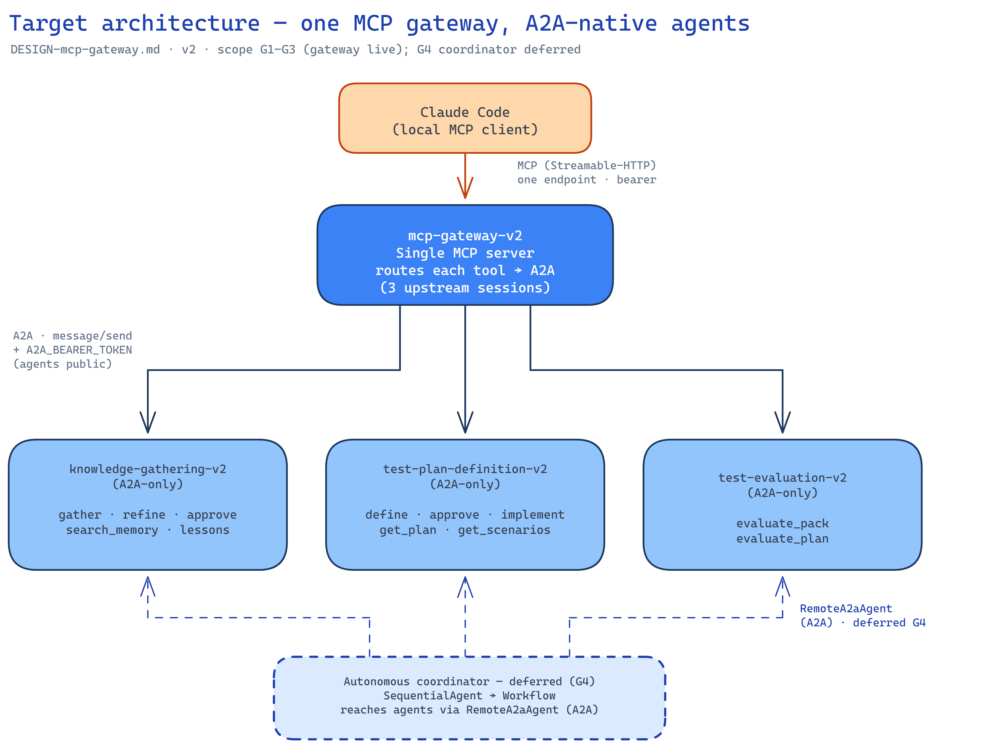

# test-agent-v2 — consolidated documentation

_Single-file merge of everything under `test-agent-v2/docs/` — the build guide, the gateway design, the decision record, the implementation plan, code skeletons, the deploy guide, and the ENHANCEMENT-* plans. The architecture diagram is kept alongside as `DESIGN-mcp-gateway-target.png` (source `DESIGN-mcp-gateway-target.excalidraw`)._

## Contents
1. [Build guide (README)](#doc-readme)
2. [Design — single MCP gateway + A2A-native comms](#doc-design-gateway)
3. [Decision record — v2 ADK build (E8)](#doc-decisions)
4. [Detailed implementation plan](#doc-impl-plan)
5. [Code skeletons — ADK stubs](#doc-code-skeletons)
6. [Deploying the v2 ADK agents](#doc-deploy)
7. [Enhancement — ADK-native cutover](#doc-enh-cutover)
8. [Enhancement — align with ADK-samples idioms](#doc-enh-idioms)
9. [Enhancement — explore steps as LlmAgents](#doc-enh-explore)
10. [Enhancement — TPD generators as LlmAgents](#doc-enh-tpd)
11. [Enhancement — evaluator ADK reuse](#doc-enh-tev)


---

<a id="doc-readme"></a>

## test-agent-v2 / docs — the build guide

The **executable implementation plan** for the ADK rebuild. Where the repo-root
[`../../docs/adk-transform/`](../../docs/adk-transform/) is the *design* (why each mapping, the two
plans, the risk register), these docs are the *build order* (what to create, in what sequence, with
which test gate).

Read in this order:

1. [`IMPLEMENTATION-PLAN.md`](#doc-impl-plan) — objective, the **7 invariants** CI must
   protect, the target directory layout, the engine-reuse strategy, and the **phased milestones**
   (M0 → A0 spike → A.0 foundation → A1 KGA → A2 TPD → B evaluator → D deploy), each with files,
   test gates, and done-criteria.
2. [`code-skeletons.md`](#doc-code-skeletons) — concrete ADK stubs the milestones fill in
   (`common/adk/{model,services,plugins,serve,interrogation}.py`, the KGA/TPD agents, the evaluator
   custom metrics), with the load-bearing gotchas inline.
3. [`DECISIONS.md`](#doc-decisions) — the decision record (D1–D9): where v2 deliberately diverges from
   the canonical ADK idioms, and why. Read before "fixing" a custom `BaseAgent`, the gated flow, or
   the Claude-via-LiteLlm default.
4. [`ENHANCEMENT-adk-idioms.md`](#doc-enh-idioms) — a follow-on proposal aligning v2 with
   the canonical `google/adk-samples` idioms (E1–E8): what to adopt (`agent.py`/`root_agent`+`adk web`,
   `Config`, plain-function tools, canonical `eval/`+`adk eval`, Agent-Engine deploy, an optional
   autonomous `AgentTool` coordinator) and what to consciously keep (custom `BaseAgent` routers,
   client-driven gating, Claude-via-LiteLlm), each with rationale.
5. [`ENHANCEMENT-adk-native-cutover.md`](#doc-enh-cutover) — the **next enhancement**
   (milestones C0–C6, decisions D10–D13): finish the migration by going ADK-native end to end — remove
   the a2a-sdk shells, drop the **Gemini** backend, and re-express model access as an extensible
   `ModelProvider` interface (Claude-on-Vertex the sole impl). Collapses serving to one `main:app`
   (`get_fast_api_app`) + one MCP gateway.

**Start here:** milestone **A0 — the HITL pause/resume spike** (de-risks the one real unknown before
any bulk porting). See `IMPLEMENTATION-PLAN.md` §4.

Traceability: every milestone maps back to a section of the design docs (`01`–`04`) and forward to
an invariant (I1–I7). Nothing in this plan changes `test-agent-v1/`.


---

<a id="doc-design-gateway"></a>

## DESIGN — single MCP gateway + A2A-native inter-agent comms (v2)

**Status:** proposed (for review before build). **Date:** 2026-09-08.

### Goal (from the ask)
1. **One MCP gateway** = the single endpoint local Claude connects to (not 3 separate MCP servers).
2. When an **agent/sub-agent talks to another agent, it does so natively over A2A** — no in-process
   cross-agent coupling.

### Current architecture (what we deployed)
- **3 Cloud Run services** — `knowledge-gathering-agent-v2`, `test-plan-definition-agent-v2`,
  `test-evaluation-agent-v2`. Each = **2 containers**:
  - `agent` — `uvicorn <pkg>.adk_app:app` (ADK `to_a2a`), A2A on `:8081`.
  - `bridge` — `python -m <pkg>.bridge` (MCP→A2A), Streamable-HTTP on `:8080`, bearer-gated.
- **3 MCP endpoints**; Claude registers all three (`install-mcp` → `/mcp` × 3).
- Each bridge (`<pkg>/bridge/mcp_server.py`) = one `MCPServer` + one `BridgeSession` (A2A client to
  that agent via `<PKG>_A2A_URL` + `A2A_BEARER_TOKEN`) + `@mcp.tool()` forwarders.
- Shared plumbing already exists in `common/bridge/`: `BridgeSession` (A2A client + multi-turn task
  map), `build_http_app(mcp, env_prefix)` (bearer gate + Streamable-HTTP).
- The gated pipeline is **Claude-orchestrated**: Claude calls each agent's tools with a shared
  `context_id`; the agents do **not** call each other. The **autonomous** path
  (`testing_agent/agent.py`) is an ADK **`SequentialAgent`** with KGA/TPD/TEV as **in-process
  sub-agents** — that's the deprecation warning (`SequentialAgent` → `Workflow`) and it's *not* A2A.

### Target architecture



*(source: `DESIGN-mcp-gateway-target.excalidraw`)*

```
Claude Code ──MCP(1 endpoint, bearer)──▶  MCP GATEWAY (new service)
                                             │  routes each tool call over A2A
                        ┌────────────────────┼────────────────────┐
                        ▼ A2A                 ▼ A2A                 ▼ A2A
              knowledge-gathering-v2   test-plan-definition-v2   test-evaluation-v2
              (A2A-only, no bridge)    (A2A-only)                (A2A-only)
                        ▲                                            
                        └── autonomous coordinator (optional) reaches agents via RemoteA2aAgent (A2A)
```

- **Gateway** = one `MCPServer("testing-agent-gateway")` holding **three `BridgeSession`s**
  (`KGA_A2A_URL`, `TPD_A2A_URL`, `TEV_A2A_URL`), exposing the **union** of all tools, each bound to
  its agent's session. Bearer-gated with a single `GATEWAY_BEARER_TOKEN`. This is exactly today's
  bridge pattern with 3 upstreams instead of 1 → heavy reuse of `common/bridge`.
- **Agents become A2A-only** (drop the `bridge` sidecar). They already serve A2A via `adk_app`.
- **Inter-agent = A2A**: the autonomous coordinator reaches KGA/TPD/TEV via ADK **`RemoteA2aAgent`**
  (A2A client) instead of in-process sub-agents.

### Design details

#### 1. Reuse — refactor `mcp_server.py` into a tool-registration factory
Each `<pkg>/bridge/mcp_server.py` currently binds tools to a module-level `mcp` + `_session`. Refactor to:
```python
def register_tools(mcp: MCPServer, session: BridgeSession) -> None:
    @mcp.tool()
    async def gather_knowledge(...): ...   # bound to the passed-in session
    ...
```
- **Standalone bridge** (kept working / for local stdio dev): `mcp = MCPServer(...); register_tools(mcp, BridgeSession(URL, TOKEN))`.
- **Gateway**: one `mcp`; call `kga.register_tools(mcp, kga_session)`, `tpd.register_tools(...)`,
  `tev.register_tools(...)`.

#### 2. Tool-name collisions
KGA + TPD + TEV each define `send_raw` and `agent_card`; KGA/TPD each define a `test` prompt.
Resolve in the gateway:
- Expose **one** `agent_card()` that returns all three cards; **one** `test` prompt (KGA's).
- Namespace the escape hatches: `send_raw_kga` / `send_raw_tpd` / `send_raw_tev` (or drop from the
  gateway — they're rarely used).
- All the *real* tools are already unique: `gather_knowledge, gather_codebase, refine, get_questions,
  get_understanding, search_memory, get_note, search_lessons, veto_lesson, approve` (KGA);
  `define_plan, approve_plan, implement_plan, get_plan, get_scenarios` (TPD);
  `evaluate_pack, evaluate_plan` (TEV). No conflicts.
- Merge the three `instructions` blocks into one gateway instruction (pipeline + confirm-gate rules).

#### 3. Deployment topology — RECOMMENDED: gateway as a 4th service
- **`mcp-gateway-v2`** service: 1 container (`python -m gateway` / `uvicorn`), Streamable-HTTP `/mcp`
  on `:8080`, public + `GATEWAY_BEARER_TOKEN`. Env: `KGA_A2A_URL`, `TPD_A2A_URL`, `TEV_A2A_URL`,
  `A2A_BEARER_TOKEN`.
- **3 agent services**: single-container (agent only), A2A on `:8080`. Keep them public +
  `A2A_BEARER_TOKEN` (simplest reachability) — the gateway calls them with the bearer. (Hardening
  option later: `ingress=internal` + Cloud Run ID-token auth so agents aren't publicly reachable.)
- **Alternative (merged):** one service, 4 containers (3 agents on localhost:8081/2/3 + gateway on
  8080). Simpler single deploy + localhost A2A, but couples scaling/lifecycle. *Not recommended* —
  loses the independent-service benefit the split was built for.

#### 4. `SequentialAgent` deprecation + autonomous coordinator
- The `SequentialAgent` in `testing_agent/agent.py` is the **root** (not an `LlmAgent` sub-agent), so
  the "Workflow cannot be an LlmAgent sub-agent" caveat doesn't block migrating it.
- Two coupled changes for the autonomous path:
  - **A2A-native:** replace the in-process KGA/TPD/TEV sub-agents with `RemoteA2aAgent(agent_card_url=<agent A2A>)`.
  - **Deprecation:** migrate the `SequentialAgent` root to `Workflow` *iff* `Workflow` accepts
    `RemoteA2aAgent` children on the pinned `google-adk` (verify in a 5-min spike). If not, keep
    `SequentialAgent` for now (warning is non-breaking) and revisit.
- Note: the autonomous coordinator is **not currently deployed** (only KGA/TPD/TEV are in terraform).
  So this refactor is independent of getting the gateway live — can be a later phase.

#### 5. Terraform changes (`deployments/test-agent-v2`)
- New `module "gateway"` (or a top-level service): image = same `test-agent-v2` image, command =
  gateway entrypoint; env `*_A2A_URL` = the three agents' own service URLs; `GATEWAY_BEARER_TOKEN`
  secret (`kga-v2-gateway-bearer-token`).
- Drop the `bridge` sidecar container from `module.kga/tpd/tev` (agents become single-container).
- Outputs: replace `bridge_url/tpd_bridge_url/tev_bridge_url` with a single `gateway_url`.
- `install-mcp.{sh,cmd}`: register **one** server (`testing-agent` → `$(terraform output -raw gateway_url)`).
- `deploy.sh`: unchanged in shape (already hardened: repo → build → apply); one more secret version.

### Migration phases

> **Status (2026-09-08): G1 + G2 implemented** (gateway code + `register_tools` refactor + subagents
> split + terraform: agents A2A-only, `mcp-gateway-v2` service, single `gateway_bearer` secret,
> `gateway_url` output, `install-mcp` → one endpoint; standalone per-agent bridges deleted). Tests +
> `terraform validate` green. **G3 = deploy** (`./deploy.sh` then `./install-mcp.sh`). **G4 deferred.**

- **G1** — gateway code: `register_tools` factory refactor in the 3 `mcp_server.py`; new `gateway`
  package composing them; offline tests (reuse the bridge tests' in-process A2A client injection).
- **G2** — terraform: add `mcp-gateway-v2`; make agents A2A-only; secret + outputs; `install-mcp`.
- **G3** — deploy (hardened `deploy.sh`), register the one endpoint, verify end-to-end via Claude.
- **G4** (independent) — autonomous coordinator → `RemoteA2aAgent`; `SequentialAgent`→`Workflow` spike.

### Risks / open questions
- **Auth between gateway and agents:** bearer (simple, public agents) vs Cloud Run internal + ID
  token (private agents, more setup). Proposal: bearer first, harden later.
- **Multi-turn task state:** `BridgeSession` keeps a `context_id→task_id` map per process. One gateway
  process now holds state for all three upstreams — fine (separate sessions), but confirm statefulness
  under `*_STATELESS` / multiple gateway instances (pin `min_instances`≥1 or run stateless + rely on
  A2A context_id, as today).
- **Single point of entry:** the gateway is now a SPOF for Claude access — acceptable (it's the ask);
  keep it thin (pure routing, no business logic).
- **`Workflow` viability** with `RemoteA2aAgent` children — needs a quick spike before committing G4.

### Decisions (RESOLVED 2026-09-08)
1. Topology: **4th gateway service** (`mcp-gateway-v2`) fronting the 3 A2A agents. ✅
2. Agent reachability: **public + A2A bearer** (harden to private later). ✅
3. Scope: **G1–G3 now** (gateway live); **G4** (RemoteA2aAgent coordinator + SequentialAgent→Workflow)
   deferred to a follow-up. ✅


---

<a id="doc-decisions"></a>

## Decision record — v2 ADK build (E8)

Load-bearing decisions where **v2 deliberately diverges from the canonical `adk-samples` idioms**, or
where an implementation choice is easy to mistake for an oversight. Read this before "fixing" any of
them. Each entry: *Decision · Why · Consequence · Status*. Invariants (I1–I7) are defined in
[`IMPLEMENTATION-PLAN.md`](#doc-impl-plan) §1; the sample idioms in
[`ENHANCEMENT-adk-idioms.md`](#doc-enh-idioms).

---

### D1 — Keep custom `BaseAgent` routers + engine wrappers + the HITL loop
- **Decision:** the KGA/TPD roots are custom `BaseAgent` text-dispatch routers; gather/implement wrap
  the reused engines in `BaseAgent`s; refine/define are a `BaseAgent` HITL loop. The samples use
  **zero** custom `BaseAgent` (they compose `SequentialAgent`/`LlmAgent`+`AgentTool`).
- **Why:** the MCP bridge speaks a **deterministic text-command protocol** (`gather`/`refine`/…), the
  pipeline is deterministic (B0–B6, one-LLM-call implement — I1), the engines are large imperative
  Python re-triggered not rewritten, and refine/define need **pause/resume across A2A turns** (proven
  in the A0 spike). ADK explicitly reserves custom `BaseAgent` for exactly this bespoke control flow.
- **Consequence:** more `BaseAgent` code than a Gemini chat agent, but determinism + the reused engine
  are preserved. **Do not** convert the routers to an `LlmAgent`+`AgentTool` coordinator on the default
  path — that makes dispatch LLM-driven (breaks I1), adds an LLM call/latency to every step, and breaks
  the bridge's text contract.
- **Status:** permanent.

### D2 — Orchestration is client-driven + gated, not in-agent
- **Decision:** the pipeline (gather→refine→approve→define→approve→implement) is orchestrated by the
  **client** (Claude Code), one A2A call per step, with a human confirm-gate before each. There is no
  in-agent coordinator on the default path.
- **Why:** the confirm-gates + human-in-the-loop are a **product requirement**, not a limitation. Each
  A2A call is therefore a single deterministic step — which is why the samples' "coordinator LlmAgent
  calls specialists" pattern doesn't map onto the default path.
- **Consequence:** per-call agents are single-purpose. Autonomy is available *opt-in* (see D3).
- **Status:** permanent for the gated path.

### D3 — The autonomous pipeline is a `SequentialAgent`, not an `LlmAgent`+`AgentTool` coordinator (E7)
- **Decision:** `testing_agent.root_agent = SequentialAgent([gather, refine, define, approve,
  implement])`. The original enhancement plan proposed an `LlmAgent`+`AgentTool` coordinator.
- **Why:** the step order is **fixed**, so the canonical + deterministic choice is a workflow agent
  (the `llm-auditor` idiom) — no LLM router needed, determinism preserved (I1). An LLM coordinator would
  only be warranted if it had to *decide* the order/steps, which it doesn't.
- **Consequence:** the headless sub-agents (`RefineAgent`/`DefineAgent`/`ApproveAgent`, one class per
  module under `testing_agent/subagents/`) wrap the reused `refine`/`define` drivers with
  `accept_recommendation`. Opt-in; the gated path is untouched. (`SequentialAgent` now emits a
  deprecation warning toward `Workflow`; migration is deferred — see D10.)
- **Status:** adopted (supersedes the plan's E7 sketch).

### D4 — Cross-cutting logic lives in a Runner `Plugin` (`before_run`), not per-agent callbacks (E4)
- **Decision:** `LearnDrainPlugin`/`LessonRecallPlugin` are Runner **Plugins** (`before_run_callback`),
  not per-agent `before_model`/`before_tool` callbacks.
- **Why:** v2's LLM calls happen **inside the reused engine**, not via ADK `LlmAgent`s, and its I/O is
  direct, not via ADK `tools=[...]`. So ADK's `before_model`/`before_tool` callbacks **have no attach
  point** — there's no ADK-mediated model/tool call to wrap. A Runner Plugin's `before_run` fires per
  invocation for every agent regardless.
- **Consequence:** `LessonRecallPlugin` is inert until/unless QuestionGen/etc. become real `LlmAgent`s;
  grounded recall runs in the engine (`_recall_into`) on the gated path today.
- **Status:** current; revisit only if agents are converted to `LlmAgent`s.

### D5 — Model = Claude via LiteLlm (swappable), not Gemini-native
- **Decision:** `agent_model()` returns `LiteLlm("vertex_ai/claude-sonnet-5")` by default; Gemini is a
  one-env-var switch (`TESTAGENT_MODEL_BACKEND`, E2). The samples are Gemini-first.
- **Why:** explicit user decision — preserve today's Claude Sonnet 5 behavior; the LiteLlm hop is the
  known cost.
- **Consequence:** the thinking-disabled + max_tokens gotchas must survive the LiteLlm hop (I5).
- **Status:** default, but configurable.

### D6 — Reuse the v1 engine (~70%) unchanged
- **Decision:** `common/{memory,learn,interrogate,llm,atlassian,codegraph,extract}` and the agents'
  engine subpackages are copied from v1 and reused; only the a2a-sdk shell is replaced.
- **Why:** the whole point of the migration is to re-host, not rewrite. Determinism + B0–B6 live in
  that engine.
- **Consequence:** `test-agent-v1` is the upstream during transition; engine fixes are cherry-picked.
- **Status:** permanent (until the engine is promoted to a shared installable package — a follow-up).

### D7 — Interrogation state reuses each session's bank persistence, not ADK session state
- **Decision:** `InterrogationAgent` drives `RefineSession`/`PlanSession`, which persist to (and
  rehydrate from) the **GCS bank** keyed by the context id (= the ADK `session_id`, held constant by
  the bridge). It does **not** re-port the loop state into ADK session `state`.
- **Why:** the bank persistence is already tested and carries insights/decisions/questions + B0–B6;
  re-implementing it in ADK state is risk for no gain. (The A0 spike proved the pause/resume *mechanic*;
  the real engine reuses its own store.)
- **Consequence:** ADK session state carries only a small activity marker. The "collapse two durability
  systems into one `DatabaseSessionService`" benefit is realized for the A2A task lifecycle, not the
  interrogation store.
- **Status:** current.

### D8 — Cloud Run + MCP bridge is the only deploy path; Agent Engine dropped (supersedes E6)
- **Decision:** removed the Vertex Agent Engine path (`deployment/deploy.py` deleted). The Cloud Run
  `to_a2a` + MCP bridge is the single runtime; `deployments/test-agent-v2/install-mcp.{sh,cmd}` registers
  the three bridges with Claude Code (deployed `/mcp` URLs resolved from `terraform output`).
- **Why:** ADK has **no native "expose an agent as an MCP server"** — its MCP support is `McpToolset`, a
  *consumer* of external MCP tools — so the A2A→MCP bridge IS Claude Code's native channel to the agents.
  Agent Engine changes the client contract and drops that bridge, the whole gated Testing-Agent UX (I4/D2).
  One well-supported native path beats two half-supported ones.
- **Consequence:** `deployment/deploy.py` and the Agent Engine option are gone; DEPLOY.md now lists three
  paths. `adk deploy agent_engine` still exists natively but is intentionally unused here.
- **Status:** current (supersedes the earlier "additional target" stance).

### D8b — v2 provisions its OWN Cloud SQL Postgres (`deploy_cloudsql` default ON)
- **Decision:** flipped `deploy_cloudsql` to default `true`; the v2 stack stands up a dedicated Cloud SQL
  Postgres instance and wires `DatabaseSessionService` (DB_* env → `common/db.get_engine`).
- **Why:** durable sessions/tasks for v2 without sharing v1's DB — isolation over the extra instance cost.
- **Consequence:** two Cloud SQL instances (v1 + v2). The DB password is terraform-generated
  (`random_password` → Secret Manager), no secret to supply. `deploy_cloudsql=false` reverts to in-memory
  sessions (the GCS memory bank stays durable regardless).
- **Status:** current.

### D9 — Freed the canonical `agent.py` name via an `a2a_card.py` rename, not by dropping v1 (E1)
- **Decision:** each agent's v1 A2A card moved to `a2a_card.py`; the ADK root took `agent.py` (so
  `adk web`/`adk run` discover `root_agent`), while the v1 shells + tests keep working.
- **Why:** a non-destructive way to get canonical discovery *now* without dropping the still-load-bearing
  v1 shells.
- **Consequence:** a `a2a_card.py` module per agent during the transition; retire it when the v1 shells
  are dropped at the deploy milestone.
- **Status:** transitional.

---

### D10–D13 — the ADK-native cutover (see [`ENHANCEMENT-adk-native-cutover.md`](#doc-enh-cutover))

Recorded from the cutover enhancement (drop the a2a-sdk shells + Gemini + the dual model plumbing).
Full rationale/milestones/gates live in that doc; the one-liners here keep the record coherent.

### D10 — Model access via a `ModelProvider` interface; Gemini removed
- **Decision:** model access goes through a small `common/adk/providers` interface;
  `VertexClaudeProvider` is the **sole** concrete impl; the `gemini` backend + `gemini_model` are deleted.
- **Why:** user decision — *abstract* Claude-on-Vertex behind an extension point, don't carry a second
  backend. A future `LocalClaudeProvider` (e.g. `ANTHROPIC_BASE_URL`) becomes a one-line registry entry.
- **Consequence:** the I5 thinking/max_tokens gotchas live in the provider (one place); the engine keeps
  its own `common/llm/vertex.py` transport (Option A) — routing the engine through the provider is a
  tracked follow-up (Option B). New invariant **I8** (model only via the provider).
- **Status:** planned (supersedes **D5**'s "one-env-var Gemini switch").

### D11 — One ADK-native entrypoint (`main:app`) + one MCP gateway
- **Decision:** `main.py` (`get_fast_api_app`, `a2a=True`) is the single server; `src/gateway` is local
  Claude's single MCP entry. Per-agent `adk_app.py` (`to_a2a`), `server.py`, `a2a_card.py`, and the
  standalone per-agent bridge launchers are dropped; each agent's `bridge/mcp_server.register_tools`
  (the MCP surface, I4) is kept and composed by the gateway.
- **Why:** "collapse to ADK-native" — one well-supported native surface over three overlapping ones.
- **Consequence:** the gateway, the **A2A-only agents**, and the deletion of the standalone per-agent
  bridge launchers **already landed in the G-milestones** (see [`DESIGN-mcp-gateway.md`](#doc-design-gateway));
  the remaining delta here is collapsing each per-agent `adk_app.py` (`to_a2a`) into `main:app` (C4).
  Rollback = restore the Dockerfile CMD to `<agent>.adk_app:app`.
- **Refined as-built (C4):** `main:app` = **`to_a2a(single agent selected by $AGENT)`, root-mounted at
  `/`** — NOT `get_fast_api_app`/`/a2a/<app>/`/`/list-apps`. The gateway topology runs three *separate*
  agent Cloud Run services, so each container serves exactly one agent; `services.tf` sets `AGENT` per
  service. See §12 of the enhancement doc.
- **Status:** **DONE (C4).** Extends/supersedes **D8**.

### D12 — Domain logic extracted from `executor/`; the a2a `*Executor` shells dropped
- **Decision:** the framework-neutral functions trapped in each `executor/` package (`run_gather`,
  `wants_refine`, `summarize_define`, `run_implement`, `golden_for`, …) move to neutral modules; the
  `*Executor` classes + the a2a `reply`/`now` seam are deleted.
- **Why:** the ADK agents already reuse those functions; extraction is the precondition for deleting the
  shells without regressing the equivalence suite.
- **Consequence:** completes the **D6/D9** transition; `build_bank` importers repoint to
  `common/memory/factory.py`; `now()` moves to `common/adk/util.py`.
- **Status:** **DONE (C2 + C3).** Neutral modules landed in C2; the `executor/` packages deleted in C3.

### D13 — Bearer auth is transport-neutral middleware on `main:app`; sessions subsume the task store
- **Decision:** `BearerAuthMiddleware` is relocated (not deleted) to `common/adk/auth.py` and wraps
  `main:app`; `DatabaseSessionService` (`SESSION_SERVICE_URI`) is the one durable store, retiring the
  a2a `DatabaseTaskStore`.
- **Why:** `get_fast_api_app` ships no auth and no separate task store — deleting the middleware outright
  would leave the A2A surface open.
- **Consequence:** verify `DatabaseSessionService` persists the A2A task lifecycle
  (`[verify @2.x]`, R-c in the enhancement doc).
- **Status:** **DONE (C3 + C4).** `common/adk/auth.py` in place, wrapped on `main:app` (`build_runner`
  builds the DatabaseSessionService-backed Runner); live task-lifecycle persistence stays R-c/`[verify @2.x]`.

### D14 — A2A cards left to ADK's auto-generation; hand-authored cards + `common/card.py` dropped
- **Decision (revised):** delete the three `src/<pkg>/a2a_card.py` **and** `common/card.py`; `main.build_app`
  calls `to_a2a(root, runner=…)` with **no** `agent_card=`, so ADK generates the A2A card. *(This reverses
  the interim "keep the rich card via `agent_card=`" call after review — user chose the leaner, fully
  ADK-native surface.)*
- **Why:** the hand-authored cards + `common/card.py` + the dynamic `_agent_card()` seam in `main.py` were
  ~4 files kept only to prettify an *internal* A2A surface. The rich, client-facing layer is the **MCP
  gateway's** tool descriptions (I4), which are unchanged; the A2A card is agent-to-agent + the gateway's
  `agent_cards` diagnostic, where ADK's generic card (`name="knowledge_gathering"`, `"An ADK Agent"`, auto
  skill ids) is acceptable. `to_a2a`'s `agent_card=` override still exists if a real card is wanted later.
- **Consequence:** `common/card.py` deleted (its only importers were the a2a_card files); `main.py` drops
  `_agent_card()`; `test_main` asserts the ADK card (`name="knowledge_gathering"`, skills non-empty).
- **Status:** **DONE (C4).**

### D15 — KGA explore leaf LLM steps are ADK `LlmAgent(output_schema=…)`, driven by `GatherAgent`, via the provider
- **Decision:** `hypothesize` + `ask_llm` (leads) become ADK `LlmAgent`s with a pydantic `output_schema`;
  `GatherAgent` runs them under its `ctx` behind `KGA_LLM_HYPOTHESIZE`/`KGA_LLM_LEADS` (default OFF) and
  feeds `terms=`/`leads=` into the unchanged deterministic `expansion_round`+`crawl`. Model via
  `agent_model()` — the provider's first live `LlmAgent` consumer (I8). Raw `complete()`+`_coerce_*` deleted.
- **Why/consequence:** realizes D10 "Option B" for the explore steps; deletes hand-rolled JSON coercion;
  keeps I1 (flags off → zero LLM calls, identical nodes). `output_schema` ⇒ no tools/transfer (fine, pure
  enumerators).
- **Status:** **DONE (P0–P3, P5).** P4 (ctx-less loop shim) deferred — the loop is inert under the ADK
  GatherAgent (A1). See [`ENHANCEMENT-explore-llmagent.md`](#doc-enh-explore).

### D16 — TPD implement generators are ADK `LlmAgent(output_schema=…)`, leaf-first, via the provider, preserving I3
- **Decision:** the implement generators (`scenarios` flagship + detail-gated `test_data`/`steps`) become
  ADK `LlmAgent`s with pydantic `output_schema`, driven by `ImplementAgent`; `implement_plan` is async
  (no `to_thread`). Model via `agent_model()` (I8); `complete()`+`loads_array` deleted from the implement
  `llm/*`. Heuristic fallback on invalid output preserved.
- **Why/consequence:** reuses ADK's agent machinery, deletes hand-parsers; **I3 preserved** — default
  implement = exactly 1 LLM call (scenarios), `test_data`/`steps` stay behind `detail`/`TPD_LLM_DETAIL`
  (locked by call-count tests: default=1, detail=3).
- **Status:** **DONE (T0–T5).** T6 (QuestionGen/brief via the shared `common/adk/interrogation.py`, KGA
  refine rides on it) deferred as a coordinated follow-up. See [`ENHANCEMENT-tpd-llmagent.md`](#doc-enh-tpd).

### D17 — TEV's judged tier runs through the provider + ADK-native judged metrics; the live scorer stays deterministic
- **Decision:** add a provider-sourced judge/embeddings factory (`eval/judge.py`, from `agent_model()`);
  route RAGAS through it (no silent OpenAI default — `ragas_judge.judge` raises on `None`); wire the
  defined-but-unwired `judge_semantic` as an opt-in judged rubric; wire ADK-native `JUDGED_METRICS` into
  `eval/config.py`+`runner.py`, creds-gated. The live `evaluate_pack`/`evaluate_plan` A2A path stays
  **deterministic + LLM-free** (asserted by a zero-LLM-call test).
- **Why/consequence:** the only genuine "reuse ADK more" for an evaluator is a provider-sourced judge (I8)
  + ADK's native judged harness — NOT agent-ifying deterministic scoring (that would destroy PQS/TPS
  reproducibility). Realizes the "Open: judged eval tier" item.
- **Status:** **DONE (V0–V4).** Live RAGAS tier needs `langchain-community`/`langchain-google-vertexai`
  in the `eval` extra (never imported offline; follow-up). See [`ENHANCEMENT-tev-adk-reuse.md`](#doc-enh-tev).

---

### Open (not yet decided / deferred to the deploy milestone)
- **Stable `context_id → session_id` mapping** across the gather→refine→… A2A calls when serving via
  `to_a2a` (the bridge must pass a stable ADK `session_id`, or `to_a2a` must derive it from the A2A
  `context_id`). Verified in tests with a fixed `session_id`; the production wiring is A1-d/A2-d.
- **Live `DatabaseSessionService`** (currently InMemory offline; DB path wired but unexercised).
- **Dropping the v1 shells** (server.py / executors / `a2a_card.py`) once v2 is deployed — unblocks the
  final cleanup.
- **Judged eval tier** (`hallucinations_v1` / `rubric_based_*`) with a judge model.

<!-- The single-MCP-gateway decision (built in the G-milestones: gateway + A2A-only agents, standalone
per-agent bridges deleted) is recorded under D11 below and in DESIGN-mcp-gateway.md — it is NOT a
separate D10 (that number is the ModelProvider decision above). -->


---

<a id="doc-impl-plan"></a>

## test-agent-v2 — detailed implementation plan

The executable build guide for the ADK rebuild. It turns the design in
[`../../docs/adk-transform/`](../../docs/adk-transform/) into concrete milestones — files to create,
code shapes, test gates, and done-criteria — for building **`test-agent-v2/`** from the
**`test-agent-v1/`** baseline.

- **Design rationale** (why each mapping): `../../docs/adk-transform/01-mapping.md`.
- **Per-agent target graphs**: `02-plan-testing-agents.md` (Plan A), `03-plan-test-evaluation.md` (Plan B).
- **Concrete code stubs referenced below**: [`code-skeletons.md`](#doc-code-skeletons).
- **Risks / rollback**: `../../docs/adk-transform/04-roadmap-risks.md`.

> Convention: paths are relative to `test-agent-v2/` unless prefixed. `[copy]` = lift verbatim from
> `test-agent-v1/`; `[new]` = write fresh; `[rewrite]` = ADK replacement of a v1 shell module.

---

### 0. Objective

Ship KGA + TPD as **ADK agent graphs** (Plan A) and the evaluator on **`adk eval`** (Plan B), such
that the MCP tools Claude Code calls behave identically to v1, on the same Cloud Run + Cloud SQL +
GCS runtime, with Claude Sonnet 5 via LiteLlm.

### 1. Invariants — the guardrails CI must protect

These are non-negotiable; every milestone's test gate exists to defend one of them. A change that
violates an invariant is a bug, not a tradeoff.

| # | Invariant | Enforced by |
|---|-----------|-------------|
| I1 | **Determinism** — Python drives control flow; the LLM is a leaf, never picks the next step | agent graphs use workflow/`BaseAgent`; no autonomous tool-loop; code review + trajectory eval |
| I2 | **B0–B6 de-bias gates intact** — run-scoped pack, IDF hub-penalty, structural grounding, `scope='shared'` semantic recall | reused engine modules unchanged; bleed-fixture leak test (`hard_negative_leak==0`) |
| I3 | **`implement` default = 1 LLM call**, whole thing off the event loop, within Cloud Run timeout | `TPD_LLM_DETAIL` gate preserved; call-count assertion test |
| I4 | **MCP surface + bridge unchanged** — same tool names/signatures, same `test` prompt | skill-parity test; bridge reused verbatim from v1 |
| I5 | **Claude via LiteLlm, thinking disabled, max_tokens honored** | centralized `claude_llm()`; a live "disabled-thinking + full-length JSON parses" test |
| I6 | **No cross-agent imports; `common` never imports an agent** | import-linter / a grep gate in CI (same rule as v1) |
| I7 | **Heuristic fallback everywhere the LLM is optional** — `vertex_config()` unset ⇒ fully deterministic | reused engine; a "Vertex-off" smoke run |

### 2. Target directory layout

```
test-agent-v2/
├─ pyproject.toml                 [rewrite]  + google-adk>=1.22, litellm ; scripts unchanged
├─ Dockerfile                     [rewrite]  agent CMD → the to_a2a app ; bridge CMD unchanged
├─ .env .dockerignore .gitignore  [copy]
├─ docs/                          [new]      this plan
├─ src/
│  ├─ common/                     [copy]  the framework-neutral engine — the ~70% reuse
│  │  ├─ memory/ learn/ interrogate/ llm/ atlassian/ codegraph/ extract/ models/   [copy verbatim]
│  │  ├─ db.py monitoring.py      [copy verbatim]
│  │  ├─ memory/factory.py        [new]   build_bank() lifted out of the a2a-importing executor.py
│  │  ├─ card.py taskstore.py executor.py ops.py middlewares/   [DROP — replaced by common/adk/*]
│  │  ├─ bridge/                  [copy]  client-side MCP↔A2A bridge — unchanged (I4)
│  │  └─ adk/                     [new]   the ADK substrate (see §4 A.0 + code-skeletons.md)
│  │     ├─ model.py services.py plugins.py serve.py tools.py interrogation.py
│  ├─ knowledge_gathering/
│  │  ├─ loop/ explore/ models/ monitoring.py   [copy verbatim]  the crawl/explore engine
│  │  ├─ bridge/                  [copy]  MCP bridge unchanged (I4)
│  │  ├─ agent.py                 [rewrite]  builds the ADK root agent (was: A2A AgentCard + skills)
│  │  ├─ adk_app.py               [new]   `app = serve(root_agent, REQUIRED_ENV)`  (was: server.py)
│  │  ├─ agents/                  [new]   gather_agent.py, refine_agent.py
│  │  └─ executor/                [DROP — replaced by agents/ + the ADK runner]
│  ├─ test_plan_definition/
│  │  ├─ define/ implement/ llm/ memory/ models/ render/ pack.py monitoring.py  [copy verbatim]
│  │  ├─ bridge/                  [copy]  unchanged (I4)
│  │  ├─ agent.py                 [rewrite]   ADK root agent
│  │  ├─ adk_app.py               [new]
│  │  ├─ agents/                  [new]   define_agent.py, implement_agent.py
│  │  └─ executor/                [DROP]
│  └─ test_evaluation/            [Plan B — see §4 B]
│     ├─ metrics/ golden/ golden_plans/ models.py golden.py   [copy verbatim]  the scoring math
│     ├─ engine.py plan_engine.py [copy]   still callable by the runtime MCP tool
│     ├─ eval/                    [new]   evalsets/*.evalset.json + test_config.json + custom metrics
│     └─ adk_app.py               [new]
└─ tests/                         [copy + extend]  v1 suite + ADK-equivalence + parity tests
```

### 3. Engine reuse strategy (the ~70%)

The neutral engine imports no framework, so it moves verbatim. **The only source edit** is I5-safe:
lift `build_bank()` out of the a2a-importing `common/executor.py` into `common/memory/factory.py`
(the rest of `executor.py` — the A2A `reply()`/`now()` — is dropped, replaced by ADK `Event`s).

- **Copy mechanism (M0):** `git mv`-style copy of `test-agent-v1/src/common/{memory,learn,interrogate,
  llm,atlassian,codegraph,extract,models,db.py,monitoring.py,bridge}` and the two agents'
  engine subpackages (listed in §2) into `test-agent-v2/src/…`.
- **Proof the copy is faithful:** the copied engine must pass v1's *neutral* unit tests unchanged
  (`test_memory`, `test_learn`, `test_interrogate*`, `test_atlassian*`, `test_codegraph`,
  `test_extract`, `test_pg_*`, `test_retrieve_facade`, `test_graph_index`, …). Run them in v2 as-is.
- **Sync during transition:** while both versions live, treat v1's engine as upstream; any v1 engine
  fix is cherry-picked into v2. (Post-cutover, promote the engine to a shared installable package —
  out of scope for this plan; tracked as a follow-up.)

---

### 4. Milestones

Each milestone is independently shippable behind the unchanged bridge. Format: **Goal · Files ·
Shapes · Gate · DoD**. Code shapes are stubbed in [`code-skeletons.md`](#doc-code-skeletons).

#### M0 — Project scaffold + engine copy
- **Goal:** a v2 project that installs, lints, and serves a trivial ADK agent over A2A behind the
  same bearer + health, with the copied engine passing its unit tests.
- **Files:** `pyproject.toml` [rewrite] (add `google-adk>=1.22`, `litellm`; keep `a2a-sdk` for
  `to_a2a`'s A2A layer + the bridge; keep the `bridge`/`dev`/`eval` extras), `Dockerfile` [rewrite],
  copy the engine (§3), `common/memory/factory.py` [new], a throwaway `hello_agent` + `adk_app.py`.
- **Gate:** `ruff` clean; copied-engine unit tests green; `curl /livez` 200, `/.well-known/agent-card.json`
  served by `to_a2a`; bearer 401 without token.
- **DoD:** `uvicorn knowledge_gathering.adk_app:app` boots; the v1 MCP bridge (pointed at it) lists tools.
- **Size:** M.

#### A0 — HITL pause/resume spike (de-risk — do before A.0)
- **Goal:** settle the one genuine unknown (R1 in the risk register): can a multi-round human-in-the-loop
  interrogation pause and resume cleanly on ADK? Prove **Option B** (custom `BaseAgent` that
  checkpoints loop state into ADK session `state`, emits the round, ends the invocation; next turn
  reads state back and advances) round-trips a 3-round dialogue with `DatabaseSessionService`.
- **Also:** a throwaway probe of **Option A** (`LongRunningFunctionTool` inside a `SequentialAgent`)
  to confirm/deny the known resume bugs (#3348/#5349/#3184/#5064) on the pinned `google-adk`.
- **Files:** `spikes/hitl_option_b.py`, `spikes/hitl_option_a.py` (throwaway, not shipped — **removed
  after verification**; the confirmed facts live in §9 and Option B ships as `common/adk/interrogation.py`).
- **Gate:** Option B: 3 rounds, state intact across simulated restarts, no re-execution of prior
  rounds. Decision recorded: default = Option B (adopt A only if the probe is clean).
- **DoD:** a one-paragraph decision note appended to `04-roadmap-risks.md`.
- **Size:** S. **Blocks A.0/A1/A2.**
- **✅ STATUS: DONE (2026-09-07).** Option B **passed** on `google-adk 2.8.0` (3 rounds paused/resumed
  in order, state survived a simulated `DatabaseSessionService` restart, no round re-executed) →
  RefineAgent/DefineAgent use Option B. Option A left model-gated (not needed). The spike dir was
  **removed post-verification**; the confirmed ADK-2.x API facts are retained in §9.

#### A.0 — `common/adk/` shared foundation
- **Goal:** the substrate every v2 agent uses. See [`code-skeletons.md`](#doc-code-skeletons) for full stubs.
- **Files [new]:**
  - `model.py` — `claude_llm()` → `LiteLlm("vertex_ai/claude-sonnet-5")` with **thinking disabled +
    max_tokens** wired one place (I5). Falls back to None when `vertex_config()` unset (I7).
  - `services.py` — `build_runner(agent)`: `DatabaseSessionService` on `common/db.py`'s engine
    (fallback `InMemorySessionService`), optional `GcsArtifactService`.
  - `plugins.py` — `LearnDrainPlugin` (`before_run_callback` = `learn.drain` + `maybe_drain_index`,
    off-path) and `LessonRecallPlugin` (`before_model_callback` = inject grounded lessons) (I2).
  - `serve.py` — `serve(root_agent, required_env)`: `to_a2a(root_agent)` → wrap with
    `BearerAuthMiddleware` + `make_health_routes` → uvicorn app. Replaces v1 `server.py`+`card.py`.
  - `tools.py` — reusable `FunctionTool`s: `search_memory`, `get_note`, `search_lessons`,
    `veto_lesson`, `recall_lessons`, `atlassian_*`, `build_codegraph`.
  - `interrogation.py` — the `InterrogationAgent(BaseAgent)` base (Option B) shared by refine + define.
- **Gate:** skill-parity test — the `to_a2a` card advertises the skill ids the bridge/tests expect (I4);
  `claude_llm()` disabled-thinking test parses a full-length questions array (I5).
- **DoD:** a hello agent using `serve()`+`build_runner()`+plugins runs end to end.
- **Size:** M.
- **✅ STATUS: DONE (2026-09-07).** `common/adk/{model,services,plugins,serve,tools,interrogation}.py`
  + `common/memory/factory.py` (build_bank lifted; `executor.py` re-exports) built on the copied v1
  engine. **379 passed, 13 skipped, ruff clean** — the copied engine suite is a faithful-copy proof,
  plus `tests/test_adk_foundation.py` (6 tests) exercises the foundation incl. the **InterrogationAgent
  driving the REAL refine engine** over a FakeBucket (pause→resume→finalize). Integration decisions
  proven: `to_a2a(...) -> Starlette` accepts a custom `runner=` + `agent_card=` (inject our
  DatabaseSessionService + plugins, keep skill parity); `DatabaseSessionService(db_engine=…)` reuses
  `common/db.py`'s engine directly; **InterrogationAgent reuses RefineSession's own bank persistence**
  (rehydrate-by-ctx) rather than re-porting loop state into ADK session state — lower risk, keeps
  B0–B6. `LessonRecallPlugin` is conservative (flag-gated no-op) pending A1 pack-ctx wiring.

#### A1 — knowledge-gathering (KGA)
- **Goal:** KGA as an ADK agent graph (target graph in `02` §A.1).
- **Files [new]:** `knowledge_gathering/agent.py` [rewrite] (root agent: skills gather/refine/reads),
  `agents/gather_agent.py` (`GatherAgent(BaseAgent)` wrapping `run_gather`→`crawl` via
  `asyncio.to_thread`, yields progress+summary Events — I1/I5), `agents/refine_agent.py`
  (`RefineAgent` = `InterrogationAgent` with rounds business/technical/qa + QuestionGen/Understanding
  `LlmAgent`s + heuristic fallback), `adk_app.py`.
- **Reuse:** `loop/*`, `explore/*` verbatim; read tools from `common/adk/tools.py`.
- **Gate:** offline harness (RecordedAtlassian + FakeBucket as ADK InMemory services) yields the same
  nodes/tiers/gaps as v1 on `eval_rich`/`eval_thin`/`eval_bleed`; refine produces the same
  questions/understanding shape; **no hard-negative leak** on the bleed fixture (I2);
  multi-turn refine survives a simulated restart via `DatabaseSessionService`.
- **DoD:** live gather→refine→approve for a real ticket through the real MCP bridge == v1 output.
- **Size:** L.
- **◑ STATUS: offline gates DONE (2026-09-08).** Built `agents/gather_agent.py` (`GatherAgent`
  re-triggers v1's crawl verbatim), `agents/refine_agent.py` (`RefineAgent` = `InterrogationAgent`),
  `adk_agent.py` (`KgaRouter` — deterministic text dispatch mirroring v1's executor; reads run inline,
  gather/refine delegate to sub-agents), `adk_app.py` (`serve(root, agent_card=AGENT_CARD)` for skill
  parity). **`tests/test_adk_kga.py`: GatherAgent persists the byte-identical node set to v1** for
  `eval_rich`/`eval_thin` (parity), and the router drives gather→refine (pause/resume→finalize)→reads.
  **382 passed, 13 skipped, ruff clean.** Notes: v1's `agent.py`/executors are kept during transition
  (dropped when the shell is removed); the **explore-loop path (KGA_EXPLORE_LOOP, default OFF) + the
  LessonRecall injection are A1 follow-ups**. Remaining for full A1: swap to `DatabaseSessionService`
  live (A1-c) + deploy behind the bridge (A1-d) — the latter must ensure the pipeline `context_id`
  maps to a **stable ADK `session_id`** across the gather→refine A2A calls (the bridge sends it, or
  to_a2a derives it from `context_id`) — see §5.

#### A2 — test-plan-definition (TPD)
- **Goal:** TPD as an ADK agent graph (target graph in `02` §A.2); reuse the `InterrogationAgent` base.
- **Files [new]:** `test_plan_definition/agent.py` [rewrite], `agents/define_agent.py`
  (`InterrogationAgent` with rounds methodology/scope/metrics + QuestionGen/Brief `LlmAgent`s),
  `agents/implement_agent.py` (`ImplementAgent(BaseAgent)` wrapping `implement_plan` via
  `asyncio.to_thread`; `ScenariosAgent` `LlmAgent` = the one default call; test-data+steps `LlmAgent`s
  **gated behind `detail`/`TPD_LLM_DETAIL`** — I3), `approve_plan` FunctionTool (deterministic),
  `adk_app.py`.
- **Reuse:** `define/*`, `implement/*`, `llm/*`, `render/*`, `pack.py` verbatim.
- **Gate:** define over `plan_*` fixtures → same brief/decisions; scope leak stays out (I2);
  `implement` default runs **exactly one** LLM call and stays within the Cloud Run timeout (I3);
  scenarios/steps/`.feature` byte-comparable to v1 for a fixture pack.
- **DoD:** live define→approve→implement→get_scenarios == v1.
- **Size:** M.
- **◑ STATUS: offline gates DONE (2026-09-08).** `agents/define_agent.py` (registers a **"plan"
  `SessionSpec`** so the shared `InterrogationAgent` drives TPD's `PlanSession` — one loop, two
  configs; `common` never imports TPD, I6), `agents/implement_agent.py` (`ImplementAgent` wraps
  `implement_plan` in `asyncio.to_thread`, **`TPD_LLM_DETAIL` 1-call default preserved** — I3),
  `adk_agent.py` (`TpdRouter`: reads → approve → define → implement, deterministic), `adk_app.py`
  (`serve(agent_card=AGENT_CARD)`). `InterrogationAgent` was generalized (SessionSpec registry) —
  KGA refine + TPD define now share one class; KGA tests stayed green. **`tests/test_adk_tpd.py`:
  define→approve→implement over the real `run-6f2a` pack completes (plan CONFIRMED, scenarios
  persisted), implement default is the deterministic heuristic path. 383 passed, 13 skipped, ruff
  clean.** Remaining for full A2: DB sessions live + deploy (A2-c), shared with A1-c/d.

#### B — evaluator on `adk eval` (Plan B)
- **Goal:** rebuild the evaluator on ADK's native eval framework; the domain math becomes ADK custom
  metrics (full design in `03`).
- **Files [new]:** `test_evaluation/eval/evalsets/*.evalset.json` (from `golden/*` + `golden_plans/*`,
  domain fields in `custom` metadata), `eval/test_config.json` (thresholds incl.
  `hard_negative_leak==0`, `pqs_score`/`tps_score` mins), `eval/metrics/*.py` (custom metrics wrapping
  the unchanged `metrics/*` fns: `retrieval_overlap`, `entities_recall`, `fabrication_rubrics`,
  `coverage_matrix`, `oracle_strength`, `fault_class_coverage`, `placeholder_leak`, `pqs_score`,
  `tps_score`), `adk_app.py` (the runtime `evaluate_pack`/`evaluate_plan` MCP-facing agent, calling
  the *same* metric code).
- **Reuse:** `metrics/*`, `golden*`, `models.py`, `engine.py`, `plan_engine.py` verbatim.
- **Gate:** `adk eval` reproduces v1's PQS/TPS on the three fixtures (± rounding); leak gate fails a
  bleed case; native `tool_trajectory_avg_score` matches E0/T0; the semantic-rubric catalog *runs*
  via `rubric_based_final_response_quality_v1` (nightly, judge = Claude-via-LiteLlm, skips if unset).
- **DoD:** `google-adk` is on-path; one metric codebase shared by CI `adk eval` + the runtime MCP tool.
- **Size:** M.
- **◑ STATUS: core DONE (2026-09-08).** Built `test_evaluation/eval/`: `adk_metrics.py` (domain
  metrics as ADK **custom-metric functions** — the exact `(EvalMetric, actual, expected, scenario) ->
  EvaluationResult` contract, loadable by dotted `custom_function_path`; they wrap the **unchanged v1
  engine** so numbers reproduce by construction), `evalset.py` (golden JSON → ADK `EvalSet`/`EvalCase`/
  `Invocation`), `config.py` (`EvalMetric` criteria + thresholds; the leak gate = threshold 1.0).
  **`tests/test_adk_eval.py`: PQS & TPS reproduce the v1 engine THROUGH google-adk's `EvaluationResult`
  types; the hard-negative leak gate PASSES clean / FAILS on a forbidden node; golden→EvalSet
  round-trips. 388 passed, 13 skipped, ruff clean.** `google-adk` is now genuinely imported + on-path
  (was a pin only). Installed the eval extra (pandas). **Remaining (follow-ups):** run under the full
  `AgentEvaluator`/`adk eval` CLI over the real agents; wire native `tool_trajectory_avg_score` +
  the judged tier (`hallucinations_v1`, `rubric_based_final_response_quality_v1` — the v1 semantic-
  rubric catalog finally runs) with a judge model; re-point the runtime `evaluate_pack`/`evaluate_plan`
  MCP tools to share this code; remaining domain metrics (coverage/oracle/fault as standalone ADK
  metrics — today folded into the pqs/tps composites).

#### D — deployment
- **Goal:** deploy the v2 agents on the unchanged Cloud Run sidecar topology.
- **Files:** copy `deployments/test-agent-v1/` → `deployments/test-agent-v2/` (own terraform state);
  edit the **agent container start command** → the `to_a2a` app (`uvicorn <pkg>.adk_app:app`, same
  `:8081`, same probes); **image name** split (`test-agent-v2`); `DatabaseSessionService` reuses the
  existing Cloud SQL env (repurpose the task-store env).
- **Gate:** parity smoke test through the deployed bridge; latency within the request timeout (I3).
- **DoD:** v2 reachable behind its bridge; v1 untouched; rollback = revert the one container start cmd.
- **Size:** M.

---

### 5. Session & state design (concrete)

- **`context_id` → ADK `session_id`.** One id across gather→refine→define→implement, as today.
- **Interrogation loop state** (pending rounds, deferred/carried Qs, answered set, insight ids, pass
  counter, `done`) lives in ADK **session `state`** (Option B), replacing v1's GCS `state.json` +
  `_sessions/*.json`. The pack is still recomputed each turn from the run-scoped GCS index (B0 — I2).
- **Pause/resume:** `InterrogationAgent` reads state → advances one round → if open questions, writes
  state + emits the rendered round as its response + ends the invocation. Next A2A turn = fresh
  invocation: read state, `ingest` the answer, advance. No LRO-in-Sequential (avoids R1).
- **Durability:** `DatabaseSessionService` subsumes the v1 A2A `DatabaseTaskStore` + the GCS state
  files into one store (see `01` §5).
- **Artifacts (optional):** register final `scenarios.md`/`.feature`/`plan-brief.md` with
  `GcsArtifactService` for the `adk web` UI; the GCS bank stays the authority.

### 6. Testing & CI strategy

- **Reuse the offline harness** (`tests/eval/harness*.py`: RecordedAtlassian + FakeBucket) as the
  ADK Runner's injected tools/`InMemorySessionService` — run the *real* graph, touch nothing external.
- **Equivalence suite:** for each fixture, assert v2 output == v1 (nodes/tiers/gaps; brief/decisions;
  scenarios/`.feature`). This is the primary "did the port regress?" gate.
- **Invariant gates** (§1) as explicit tests: leak==0 (I2), implement call-count==1 (I3), skill-parity
  (I4), disabled-thinking JSON parse (I5), no-cross-agent-import (I6), Vertex-off deterministic (I7).
- **Plan B is the judge:** `adk eval` PQS/TPS on v2 must match v1's numbers.

### 7. Sequencing, effort, rollback

```
M0 → A0(spike) → A.0(foundation) → A1(KGA) → A2(TPD) → B(evaluator) → D(deploy)
```
- KGA before TPD (A1 yields the reusable `InterrogationAgent` base A2 consumes). Evaluator last (it
  judges the migration). Deployment per-agent — 0..3 agents can be on ADK at any time.
- **Effort:** ~70% reuse (copy+wrap), ~30% new (`common/adk/`, agent graphs, state migration, evalsets).
- **Rollback:** per-agent — revert the one agent container's start command + image tag; v1, the bridge,
  the other agents, and all data are untouched. `VERTEX_*` unset forces the deterministic path (I7).
- **Full risk register:** `../../docs/adk-transform/04-roadmap-risks.md` (R1 HITL resume is the one to
  spike; R2 LiteLlm thinking/max_tokens; R3 blocking work on the event loop).

### 8. Definition of done

1. KGA + TPD served as ADK agent graphs via `to_a2a`, behind the unchanged bridge; MCP surface identical.
2. Equivalence suite green (v2 == v1 outputs on all fixtures); all seven invariant gates green.
3. `DatabaseSessionService` is the single durable session store (v1's task store + GCS state files retired).
4. Evaluator on `adk eval` with real `google-adk`; PQS/TPS reproduce v1; leak gate is a first-class fail.
5. `test-agent-v1` untouched and still deployable throughout; every `[verify @2.x]` ADK API resolved.

---

### 9. A0 spike findings — confirmed ADK facts (env: `google-adk 2.8.0`, python 3.12)

Established by running the A0 spike (since removed), not assumed. **The `>=1.22` pin resolves to 2.x — the
docs' `[verify @1.22]` markers should read `[verify @2.x]`, and the pin should become
`google-adk[db]>=2`.**

- **Decision:** RefineAgent/DefineAgent use **Option B** (custom `BaseAgent` + session-state
  checkpoint). Proven; avoids the LRO-in-Sequential resume bugs (R1) entirely.
- **`DatabaseSessionService` needs `google-adk[db]` + an async driver** — it calls
  `create_async_engine`, so `common/adk/services.py` must dial **`postgresql+asyncpg://…`** in prod
  (the same asyncpg `common/db.py` already uses); a plain `postgresql://`/`sqlite://` URL fails.
- **Checkpoint pattern:** persist loop state by yielding `Event(actions=EventActions(state_delta={…}))`
  — mutating `ctx.session.state` alone does not persist. Keep the agent **stateless** (no pydantic
  fields); all state lives in session state so any instance resumes any session.
- **Verified-on-2.8.0 APIs:** `BaseAgent._run_async_impl(self, ctx)` yielding `Event`;
  `EventActions(state_delta=…)`; `Runner.run_async(user_id=, session_id=, new_message=types.Content(…))`;
  `await session_service.{create,get}_session(app_name=, user_id=, session_id=)`.
- **Still to verify @2.x during A.0/B:** `to_a2a` import path + card generation; `LiteLlm` thinking/
  max_tokens kwargs; the eval-metric registry (`tool_trajectory_avg_score`, `hallucinations_v1`,
  `rubric_based_*`, custom metrics).


---

<a id="doc-code-skeletons"></a>

## code-skeletons — ADK stubs for test-agent-v2

Concrete stubs the [`IMPLEMENTATION-PLAN.md`](#doc-impl-plan) milestones fill in. These show
the *shape* (imports, signatures, wiring, the load-bearing gotchas) — not full implementations. ADK
imports marked **[verify @1.22]** may move across `google-adk` minors; confirm against the pin.

---

### A.0 — `common/adk/model.py` — Claude via LiteLlm (I5)

```python
"""One place to build the Claude-on-Vertex model, with the v1 gotchas preserved."""
from __future__ import annotations
import os
from google.adk.models.lite_llm import LiteLlm          # [verify @1.22]
from common.llm.vertex import vertex_config              # reused: (PROJECT, LOCATION, MODEL) | None

def claude_llm(*, max_tokens: int = 6000) -> LiteLlm | None:
    cfg = vertex_config()
    if cfg is None:                # I7: no Vertex → caller uses the heuristic path
        return None
    project, location, model = cfg
    # I5: thinking MUST stay disabled so the whole max_tokens budget is output (tight JSON contracts);
    # LiteLLM passes provider kwargs through. VERIFY a disabled-thinking request actually reaches Vertex.
    return LiteLlm(
        model=f"vertex_ai/{model}",
        vertex_project=project, vertex_location=location,
        max_tokens=max_tokens,
        thinking={"type": "disabled"},   # [verify @1.22] — exact kwarg name for the LiteLLM/Anthropic path
    )
```

### A.0 — `common/adk/services.py` — Runner + durable sessions

```python
from google.adk.runners import Runner                                   # [verify @1.22]
from google.adk.sessions import DatabaseSessionService, InMemorySessionService
from google.adk.artifacts import GcsArtifactService, InMemoryArtifactService
from common.db import get_engine          # reused: shared Cloud SQL engine (also backs pgvector)

def build_session_service():
    eng = get_engine()
    # DatabaseSessionService subsumes v1's A2A DatabaseTaskStore + the GCS state.json rehydration.
    return DatabaseSessionService(db_url=eng.url) if eng else InMemorySessionService()  # [verify ctor]

def build_runner(agent, *, app_name: str):
    return Runner(
        agent=agent, app_name=app_name,
        session_service=build_session_service(),
        artifact_service=_artifacts(),
        plugins=[LearnDrainPlugin(), LessonRecallPlugin()],   # §plugins
    )
```

### A.0 — `common/adk/plugins.py` — cross-cutting hooks (I2)

```python
from google.adk.plugins import BasePlugin                    # [verify @1.22]
from common import learn
from common.memory.pg.project import maybe_drain_index
from common.memory.factory import build_bank

class LearnDrainPlugin(BasePlugin):
    """v1's head-of-request work, now global (was copy-pasted in each executor)."""
    async def before_run_callback(self, *, invocation_context, **_):
        bank = build_bank()
        if learn.capture_enabled(_agent_prefix(invocation_context)):
            await asyncio.to_thread(learn.drain, bank, now=_now())   # off-path (I3)
        await maybe_drain_index(bank)                                # no-op under MEMORY_BACKEND=gcs

class LessonRecallPlugin(BasePlugin):
    """Inject grounded, scope='shared' lessons before the model call (B4/B5 — I2)."""
    async def before_model_callback(self, *, callback_context, llm_request, **_):
        ...  # recall_lessons(bank, seed_refs) → prepend under "don't re-learn these"
```

### A.0 — `common/adk/serve.py` — A2A exposure (replaces v1 server.py + card.py)

```python
from google.adk.a2a.utils.agent_to_a2a import to_a2a        # [verify @1.22] path
from common.middlewares import BearerAuthMiddleware          # reused verbatim
from common.ops import make_health_routes                    # reused verbatim

def serve(root_agent, required_env: tuple[str, ...], *, port: int = 8081):
    app = to_a2a(root_agent, port=port)          # auto-generates the AgentCard from the agent (I4)
    for r in make_health_routes(root_agent.name, "0.2.0", required_env):
        app.router.routes.append(r)              # /livez /readyz  ([verify] app type Starlette/FastAPI)
    app.add_middleware(BearerAuthMiddleware)     # same opaque-bearer scheme
    return app
```

### A.0 — `common/adk/interrogation.py` — the HITL base (Option B — I1, avoids R1)

Shared by KGA refine and TPD define. Checkpoints to session `state`; pauses by ending the invocation.

```python
from google.adk.agents import BaseAgent
from common.interrogate.loop import RefineSession          # reused engine
from common.interrogate.present import render_questions, extract_ctx

class InterrogationAgent(BaseAgent):
    def __init__(self, name, rounds, gen_agent, understand_agent, *, agent_prefix):
        super().__init__(name=name)
        self.rounds, self.gen, self.und, self.prefix = rounds, gen_agent, understand_agent, agent_prefix

    async def _run_async_impl(self, ctx):
        state = ctx.session.state
        bank = build_bank()
        sess = RefineSession.rehydrate_from(state, bank) if state.get("io_started") else \
               RefineSession.begin(bank, extract_ctx(_user_text(ctx)), self.rounds)
        if answer := _user_answer(ctx):                     # continuation turn
            await sess.submit(answer)                       # ingest → insights (reused, deterministic)
        rnd = await asyncio.to_thread(sess.next_questions)  # 1 LLM call/round via gen_agent, or heuristic
        _save(state, sess)                                  # checkpoint loop state into session.state
        if rnd is None:
            result = await asyncio.to_thread(sess.finalize) # understanding brief (1 LLM call or heuristic)
            yield _event(ctx, summarize(result)); return    # invocation ends → "completed"
        yield _event(ctx, render_questions(rnd))            # invocation ends → next turn resumes (I1)
```

> The QuestionGen / Understanding / Brief / Scenarios `LlmAgent`s are thin: `LlmAgent(model=claude_llm(...),
> instruction=<the reused prompt from common/llm/prompts.py>, output_schema=<Questions|Understanding|…>)`
> with a heuristic fallback if the model yields zero parseable items (I5/I7).

---

### A1 — `knowledge_gathering/agents/gather_agent.py` (I1/I3/I5)

```python
from google.adk.agents import BaseAgent
from knowledge_gathering.executor.gather import run_gather   # reused crawl entrypoint (unchanged)

class GatherAgent(BaseAgent):
    async def _run_async_impl(self, ctx):
        # Re-trigger the v1 engine verbatim; offload the blocking BFS/codegraph work (I3 — Cloud Run /livez).
        summary = await asyncio.to_thread(run_gather_core, _seed_args(ctx), build_bank())
        yield _event(ctx, summary)     # crawl loop, budgets, fetchers, B0–B6, GCS upserts all unchanged (I1/I2)
```

### A1 — `knowledge_gathering/agent.py` (root) + `adk_app.py`

```python
# agent.py  [rewrite]
from google.adk.agents import BaseAgent          # a thin router, OR expose skills on one card
from .agents.gather_agent import GatherAgent
from .agents.refine_agent import build_refine_agent
from common.adk.tools import search_memory, get_note, search_lessons, veto_lesson

root_agent = KgaRoot(                              # name="knowledge-gathering"
    gather=GatherAgent(name="gather"),
    refine=build_refine_agent(),                   # InterrogationAgent(rounds=business/technical/qa,…)
    tools=[search_memory, get_note, search_lessons, veto_lesson],
)

# adk_app.py  [new]  (was server.py)
from common.adk.serve import serve
from .agent import root_agent
REQUIRED_ENV = ("ATLASSIAN_BASE_URL","ATLASSIAN_EMAIL","ATLASSIAN_API_TOKEN","GCS_BUCKET")
app = serve(root_agent, REQUIRED_ENV)
```

### A2 — `test_plan_definition/agents/implement_agent.py` (I3 — the detail gate)

```python
from google.adk.agents import BaseAgent
from test_plan_definition.implement.generate import implement_plan   # reused (unchanged)

class ImplementAgent(BaseAgent):
    async def _run_async_impl(self, ctx):
        detail = _wants_detail(ctx) or os.environ.get("TPD_LLM_DETAIL")   # I3: default OFF
        # Whole implement runs off the event loop; scenarios = the ONE default LLM call; test-data+steps
        # heuristic unless `detail`. Do NOT turn those LlmAgents on by default (re-creates ERROR_TIMEOUT).
        out = await asyncio.to_thread(implement_plan, build_bank(), _ctx_id(ctx), _run_id(ctx), _now(), detail)
        yield _event(ctx, summarize_implement(out))
```

`define_agent.py` = `build_refine_agent`'s sibling: `InterrogationAgent(rounds=("methodology","scope",
"metrics"), gen_agent=QuestionGen, understand_agent=Brief, agent_prefix="TPD")`. `approve_plan` is a
plain `FunctionTool` (deterministic status flip).

---

### B — `test_evaluation/eval/metrics/` — domain math as ADK custom metrics

```python
# one custom metric per v1 metric fn; ADK invokes it per EvalCase alongside the built-ins.
from google.adk.evaluation import Evaluator            # [verify @1.22] base/registry name
from test_evaluation.metrics import node_overlap, pqs  # reused math (unchanged)

class HardNegativeLeak(Evaluator):                     # threshold 0 in test_config.json — a real fail
    def evaluate(self, eval_case, invocation):
        gt = eval_case.custom                           # relevant/ must_not_retrieve etc. ride in `custom`
        s = node_overlap.retrieval_scores(_retrieved(invocation), gt["relevant_node_ids"],
                                          gt["must_not_retrieve_ids"])
        return _metric(len(s.leaked))                   # 0 == pass

class PqsScore(Evaluator): ...   # assembles the 5 components; `trajectory` now from native metric
```

```jsonc
// test_config.json  (criteria + thresholds)
{ "criteria": {
    "tool_trajectory_avg_score": 1.0,
    "hard_negative_leak": 0,
    "pqs_score": 0.70, "tps_score": 0.70,
    "hallucinations_v1": 0.8,                       // nightly, judge = Claude via LiteLlm
    "rubric_based_final_response_quality_v1": 0.7  // the semantic-rubric catalog finally runs
} }
```

Golden `golden/*.json` / `golden_plans/*.json` → `evalsets/*.evalset.json` (EvalCase: user_content +
expected tool-trajectory + reference; domain fields in `custom`). The runtime `evaluate_pack`/
`evaluate_plan` MCP tools call the **same** metric implementations (one codebase, two entry points).

---

### pyproject.toml — dependency delta (M0)

```toml
dependencies = [
  # ... all v1 runtime deps (a2a-sdk kept: to_a2a's A2A layer + the reused bridge) ...
  "google-adk>=1.22",
  "litellm>=1.0",          # LiteLlm model routing for Claude on Vertex
]
# extras unchanged: [bridge] mcp ; [dev] pytest/ruff ; [eval] ragas/pandas/datasets/google-adk
```

### Dockerfile — the only change (M0/D)

```dockerfile
# bridge CMD unchanged. Agent CMD:
# v1:  uvicorn knowledge_gathering.server:app  --host 0.0.0.0 --port ${PORT}
# v2:  uvicorn knowledge_gathering.adk_app:app --host 0.0.0.0 --port ${PORT}
```


---

<a id="doc-deploy"></a>

## Deploying the v2 ADK agents — the real options

How ADK agents are *actually* deployed (confirmed against the installed `adk` CLI 2.8.0 and the
official docs at <https://adk.dev/deploy/>), and how each maps onto this repo. There are **three**
paths; pick by what the consumer needs.

Prereq for the ADK-native paths: each agent is a package under `src/` with `agent.py:root_agent` and
an `__init__.py` that imports it — which is exactly the E1 layout (`adk` discovers all four:
`knowledge_gathering`, `test_plan_definition`, `test_evaluation`, `testing_agent`).

---

### 1. `adk deploy cloud_run` — the canonical Cloud Run path (ADK-native)

ADK packages the agent, generates a container that runs its **own FastAPI API server**
(`get_fast_api_app`), and `gcloud run deploy`s it:

```bash
adk deploy cloud_run \
  --project=$GOOGLE_CLOUD_PROJECT --region=$GOOGLE_CLOUD_LOCATION \
  --service_name=testing-agent-v2 --with_ui \
  src/testing_agent            # or any agent package dir
```

Serves the **ADK REST/SSE API**: `POST /run`, `POST /run_sse`, `GET /list-apps`, and the session /
artifact endpoints (`/apps/{app}/users/{user}/sessions/…`); `--with_ui` adds the `adk web` dev UI
(dev only). Durable stores via `--session_service_uri` / `--artifact_service_uri` /
`--memory_service_uri`. This is **not** A2A and **not** the MCP bridge — clients call ADK's HTTP API.

### 2. Manual Cloud Run container — same server, your Dockerfile ([`../main.py`](../main.py))

Identical server, but you own the container (this repo ships it): `main.py` calls
`get_fast_api_app(agents_dir="src", a2a=True, …)` — serving the ADK REST API **and** A2A for all four
agents — and the `Dockerfile` runs `uvicorn main:app`. Deploy with:

```bash
gcloud run deploy testing-agent-v2 --source . --region $REGION --project $PROJECT \
  --set-env-vars="GOOGLE_GENAI_USE_VERTEXAI=1,VERTEX_PROJECT=$PROJECT,VERTEX_LOCATION=$LOC,VERTEX_MODEL=claude-sonnet-5,GCS_BUCKET=$BUCKET,ARTIFACT_SERVICE_URI=gs://$BUCKET"
```

Set `SESSION_SERVICE_URI=postgresql+asyncpg://…` for durable `DatabaseSessionService`; `ADK_WEB=1`
for the UI. Run locally the same way: `uvicorn main:app --port 8080`, then `adk web src` for the UI.

### 3. The hand-rolled Terraform ([`../../deployments/test-agent-v2`](../../deployments/test-agent-v2)) — A2A-only, **keeps the MCP bridge**

This is a **deliberate divergence** from paths 1–2. The agent sidecar runs `uvicorn <pkg>.adk_app:app`
where `adk_app.py` = `to_a2a(root_agent)` — serving **only the A2A protocol** (JSON-RPC `message/send`)
at `/`, behind the existing client-side **MCP bridge** (bridge :8080 → agent :8081). We use it because
the whole Testing-Agent UX is the MCP bridge + human confirm-gates (invariants I4/D2), and ADK's
native `/run` API is **not** what the bridge speaks. `adk deploy cloud_run` would serve the wrong API
and break the bridge — hence the custom Terraform.

Deploy, then point Claude Code at it (the native local ↔ agent channel is the MCP bridge — ADK has no
native MCP server, only `McpToolset` for *consuming* MCP tools):

```bash
cd ../../deployments/test-agent-v2
./deploy.sh                 # provision infra (incl. its OWN Cloud SQL Postgres) + build + deploy
./install-mcp.sh            # register the 3 MCP servers with Claude Code (URLs from `terraform output`)
#   Windows:  install-mcp.cmd
```

`deploy_cloudsql` defaults **on** for v2: the stack stands up its **own** Cloud SQL Postgres instance
(durable `DatabaseSessionService`), isolated from v1 (extra cost). Set it `false` for in-memory
sessions — the GCS memory bank stays durable regardless.

---

### Which to use

| Consumer | Path |
|----------|------|
| **The existing MCP bridge / Claude Code** (gated KGA/TPD/evaluator) | **3 — the Terraform** (`to_a2a`, A2A) + `install-mcp`. Required to keep the bridge (I4). |
| A standalone HTTP/`adk web` client, or a quick demo | **1 or 2** — `adk deploy cloud_run` / the `main.py` container (ADK REST API + optional UI). |
| The **autonomous `testing_agent`**, standalone/no bridge | **1 or 2** — the ADK REST API (`/run_sse`) over the SequentialAgent. |
| Any-of-the-above but also want A2A from the ADK server | path **2** with `a2a=True` (already set in `main.py`). |

Vertex AI **Agent Engine** (`adk deploy agent_engine` / `AdkApp`) is intentionally **not** wired here:
it changes the client contract and drops the MCP bridge — the whole gated Testing-Agent UX (I4/D2).

**Bottom line:** paths 1–2 are the *canonical* ADK deploys (`adk deploy …` / `get_fast_api_app`); path 3
is the custom A2A-over-Cloud-Run deploy that preserves the MCP bridge — Claude Code's native channel to
the agents. Both are real and both are here.


---

<a id="doc-enh-cutover"></a>

## Enhancement — the ADK-native cutover (drop the a2a-sdk shells, Gemini, and the dual model plumbing)

The **executable plan** for the "next enhancement": finish the migration by making `test-agent-v2`
**ADK-native end to end** — remove every module that only exists to serve the old a2a-sdk shell,
remove the **Gemini** backend, and re-express model access as a small **`ModelProvider` interface**
(Claude-on-Vertex the sole impl today, pluggable for future models). Nothing here touches
`test-agent-v1`.

> **Status: design/plan only.** This document is the deliverable. No code is changed by it. Each
> milestone below (C0–C6) is the unit of work when execution is authorized.

Cross-refs: invariants **I1–I8** (§1 of [`IMPLEMENTATION-PLAN.md`](#doc-impl-plan), I8 added
here), decisions **D1–D9** ([`DECISIONS.md`](#doc-decisions), extended with **D10–D13** here), sample
idioms **E1–E8** ([`ENHANCEMENT-adk-idioms.md`](#doc-enh-idioms)).

---

### 0. Objective & the three locked decisions

Ship KGA + TPD + the evaluator running **only** on the ADK-native surface, reachable by **local
Claude** through **one MCP gateway**, with the model reached through an extensible interface — and
delete everything the a2a-sdk shell required that the ADK-native path does not.

Three decisions were confirmed with the user before writing this plan; they set the target shape:

| # | Question | Decision |
|---|----------|----------|
| 1 | What is "local Claude" for the model layer? | **Keep Claude-on-Vertex, just abstract it.** `VertexClaudeProvider` is the only concrete provider today; the point is the **interface** so a future `LocalClaudeProvider` (e.g. `ANTHROPIC_BASE_URL` → a local endpoint) drops in without touching agents. **Gemini removed.** |
| 2 | Which serving surface survives? | **Collapse to ADK-native + gateway.** `main.py` (`get_fast_api_app`, `a2a=True`) is the one server; the **MCP gateway** (`src/gateway`) is local Claude's single entry. **Drop** per-agent `adk_app.py` (`to_a2a`), `server.py` (a2a-sdk shell), `a2a_card.py`, and the standalone per-agent bridge launchers. |
| 3 | Deliverable now? | **Implementation-plan docs only.** This file (+ the D10–D13 delta in `DECISIONS.md` and the index line in `docs/README.md`). |

Target runtime after the cutover:

```
local Claude ──MCP──▶ gateway (python -m gateway, ONE MCP server)
                         │  composes each agent's bridge.mcp_server.register_tools  (I4: same tools)
                         └──A2A──▶ main:app  (get_fast_api_app, a2a=True, one FastAPI app)
                                     ├─ knowledge_gathering.agent:root_agent
                                     ├─ test_plan_definition.agent:root_agent
                                     └─ test_evaluation.agent:root_agent
                                   model calls ──▶ common/adk/providers → VertexClaudeProvider
                                   sessions ──▶ DatabaseSessionService (SESSION_SERVICE_URI)
```

---

### 1. Current state (grounded inventory)

The ADK rebuild (M0 → A0 → A.0 → A1 → A2 → B) is **done offline**. What remains is that the **v1
a2a-sdk shells still live beside the ADK code and are still partly load-bearing**, and the model
layer still carries a **Gemini branch** plus a **second, separate model plumbing** for the engine.

> **Already landed in the G-milestones (since this was drafted):** the single MCP gateway
> (`src/gateway`) is built, the three agents are **A2A-only** (single container each), and the
> **standalone per-agent bridge launchers** (`<agent>/bridge/__main__.py`) + each `bridge/mcp_server.py`'s
> standalone `mcp`/`http_app`/`agent_card`/`send_raw`/`test` were **deleted** — every `mcp_server.py` is
> now *just* `register_tools`. So in the delete-lists below those launchers are already gone; the
> remaining cutover delta is the **model layer (C1)**, the **executor extraction (C2)**, the a2a-sdk
> shells incl. per-agent `adk_app.py`/`serve.py`/`server.py`/`a2a_card.py` (**C3**), and the **`main:app`
> collapse (C4)**. See [`DESIGN-mcp-gateway.md`](#doc-design-gateway).

#### 1a. Two model plumbings (both Claude-on-Vertex today)

| Seam | File | What it does | Gemini? |
|------|------|--------------|---------|
| **ADK `LlmAgent` model** | `common/adk/model.py` (`agent_model`, `claude_llm`) + `common/adk/config.py` (`model_backend`, `gemini_model`) | Returns a `LiteLlm("vertex_ai/claude-sonnet-5")` **or a Gemini model-id string** | **Yes — the branch to delete** |
| **Engine text calls** | `common/llm/vertex.py` (`vertex_config`, `complete`, `agenerate`) | The **live** LLM path: questions / understanding / distill call this directly (`AnthropicVertex`) | No |

Key fact established while scoping: **`agent_model()`/`claude_llm()` are currently only *re-exported*
from `common/adk/__init__.py` and referenced by tests** — no live `LlmAgent` consumes them yet (per
**D4**, the engine still owns its own Vertex calls). So removing the Gemini branch is **low-risk**:
it deletes an unused code path.

#### 1b. The a2a-sdk shells still present (and their live couplings)

`grep 'from a2a'` in `src/` returns 17 files. They fall into two groups:

**Group A — pure a2a-sdk shells, no ADK-native need → DELETE:**
- `common/card.py`, `common/taskstore.py`, `common/ops.py`, `common/executor.py`, `common/middlewares/*`
- `common/adk/serve.py` (the `to_a2a` custom serve; imports `ops` + `middlewares`)
- per agent: `<agent>/server.py`, `<agent>/a2a_card.py`, `<agent>/adk_app.py`
- per agent: `<agent>/executor/base.py` (`*Executor` classes) + `<agent>/executor/common.py` (`reply`/`now` a2a seam)

**Group B — domain logic that *lives inside* the executor packages and is reused by the ADK agents
→ EXTRACT FIRST, then the shell above can go:**

| Reused by | Imports from the executor shell |
|-----------|--------------------------------|
| `knowledge_gathering/agents/gather_agent.py` | `executor.common.build_client`, `executor.gather.{run_gather, summarize…}` |
| `knowledge_gathering/agent.py` (root) | `executor.refine.wants_refine` |
| `test_plan_definition/agents/define_agent.py` | `executor.define.summarize_define` |
| `test_plan_definition/agents/implement_agent.py` | `executor.implement.{_capture_implement, summarize_implement}` |
| `test_plan_definition/agent.py` (root) | `executor.define.wants_define` |
| `test_evaluation/agent.py` (root) + `eval/adk_metrics.py` | `executor.base.{golden_for, golden_plan_for}` |
| `common/llm/pg/backfill.py`, `loop/fetch/codegraph.py` | `common.executor.build_bank` (already lifted to `common/memory/factory.py`; these still import the old path) |

**Keep regardless:** the whole framework-neutral engine (`common/{memory,learn,interrogate,llm,
atlassian,codegraph,extract,models,db.py,monitoring.py}`, each agent's `loop/explore/define/implement/
llm/render/memory/models/pack.py`), **`common/bridge/`** (the gateway uses it), each agent's
**`bridge/mcp_server.py:register_tools`** (the gateway composes them — this **is** the MCP surface, I4),
`main.py`, `src/gateway/`, `src/testing_agent/` (the E7 `SequentialAgent`).

---

### 2. Part 1 — the model interface layer (and Gemini removal)

#### 2.1 Target abstraction

A tiny provider interface under `common/adk/providers/`, the **one documented extension point** for
"which model, reached how". Acyclic: `common/adk/*` may import `common/llm/*`, never the reverse.

```python
# common/adk/providers/base.py                                   [new]
from typing import Protocol

class ModelProvider(Protocol):
    name: str
    def is_configured(self) -> bool: ...                 # replaces the raw vertex_config() gate (I7)
    def llm_agent_model(self, *, max_tokens: int | None = None): ...  # ADK LlmAgent model (LiteLlm) or None
    # engine text calls (optional to route now — see 2.3 Option A vs B):
    def complete(self, prompt: str, *, max_tokens: int) -> str: ...
    async def agenerate(self, prompt: str, *, max_tokens: int) -> str: ...
```

```python
# common/adk/providers/vertex_claude.py                          [new]
class VertexClaudeProvider:
    name = "claude"                                      # (== Claude-on-Vertex)
    def is_configured(self) -> bool:
        return vertex_config() is not None               # from common.llm.vertex
    def llm_agent_model(self, *, max_tokens=None):
        # the old claude_llm() body, verbatim: LiteLlm("vertex_ai/<model>", thinking=disabled,
        # max_tokens=…, vertex_project/location) — the I5 gotchas stay here, one place.
        ...
    def complete(self, prompt, *, max_tokens):           # delegates to common.llm.vertex.complete
        ...
    async def agenerate(self, prompt, *, max_tokens):    # delegates to common.llm.vertex.agenerate
        ...
```

```python
# common/adk/providers/__init__.py                               [new]
_REGISTRY = {"claude": VertexClaudeProvider}             # add "local"/"anthropic"/… here later — nothing else changes
def get_provider() -> ModelProvider:
    return _REGISTRY[get_config().model_backend]()       # default "claude"; unknown name → clear KeyError
```

#### 2.2 Edits to the existing model files

- **`common/adk/config.py`** — **drop** `gemini_model`; change `model_backend: Literal["claude","gemini"]`
  → `model_backend: str = "claude"` (validated against the registry, open for future names).
- **`common/adk/model.py`** — `agent_model()` → `return get_provider().llm_agent_model(max_tokens=…)`;
  **delete** the `if cfg.model_backend == "gemini"` branch. Keep `claude_llm()` as a thin deprecated
  alias to `VertexClaudeProvider().llm_agent_model()` (or delete once tests are repointed).
- **`common/adk/__init__.py`** — export `get_provider` alongside/instead of `agent_model`/`claude_llm`.

#### 2.3 The engine seam — Option A (recommended) vs B

The engine (`interrogate/questions.py`, `interrogate/understanding.py`, `llm/distill/factory.py`,
`llm/{questions,understanding}.py`, `llm/distill/claude.py`) calls `vertex_config()`/`complete()`
**directly**. Two ways to relate that to the new interface:

- **Option A (recommended — minimal, honours D6 "reuse engine unchanged"):** leave the engine's
  direct `common/llm/vertex.py` calls as they are — they are *already* Claude-on-Vertex, Gemini-free.
  Declare `common/llm/vertex.py` **"the `VertexClaudeProvider`'s transport"** in a module docstring,
  and make the `ModelProvider` interface authoritative for **ADK `LlmAgent` model selection** + the
  documented extension recipe. A future provider swaps the transport behind the same
  `is_configured()` env signal. **No engine files edited.**
- **Option B (fuller unification, later):** route the engine's `complete`/`agenerate` through
  `get_provider()` too (≈6 engine modules change their import from `common.llm.vertex` to
  `common.adk.providers`). Cleaner "one seam", but edits the reused engine and risks a
  `common/llm → common/adk` import cycle — do it only after the engine is promoted to its own package.

**This plan adopts Option A.** The interface is real at the ADK layer and is the single place new
models are registered; the engine keeps its tested path. Option B is a tracked follow-up.

#### 2.4 Gemini scrubbing (whole tree)

Delete every Gemini reference so `grep -ri gemini src/` returns nothing:
- `common/adk/config.py` — the field + Literal (2.2).
- `common/adk/model.py` — the branch (2.2).
- `knowledge_gathering/explore/ask_llm.py` — the "Gemini is a TODO" comment (§17-18): reword to
  "a different provider via `ModelProvider` is a TODO".
- `test_evaluation/eval/config.py` — the "Claude-via-LiteLlm or Gemini" judge comment: drop "or Gemini".
- `.env.example` — remove `TESTAGENT_GEMINI_MODEL` and `GOOGLE_GENAI_USE_VERTEXAI` (the Gemini/`adk web`
  native-genai switch); keep `VERTEX_*` (the Claude path).

#### 2.5 Part-1 gates

- **I5** — a live "thinking disabled + full-length JSON parses" test now runs through
  `VertexClaudeProvider.llm_agent_model()` (was `claude_llm()`); same assertion.
- **I7** — a "provider unconfigured → engine takes the heuristic path" test: `get_provider().is_configured()`
  is `False` when `VERTEX_*` unset ⇒ deterministic output (unchanged behaviour, new gate point).
- **I8 (new)** — model access is *only* through `ModelProvider`/`common.llm.vertex`; a grep gate that
  `google.adk.models` and `LiteLlm(...)` appear **only** inside `common/adk/providers/`.
- `grep -ri gemini src/` empty; `tests/test_adk_config.py` updated (no `gemini` case, add a
  provider-registry case).

---

### 3. Part 2 — un-couple the domain logic from the executor shells

Before any a2a shell is deleted, the Group-B domain functions (§1b) move into framework-neutral
modules, and their importers are repointed. This is the load-bearing step; do it as its own milestone
(**C2**) with the ADK-router tests as the gate.

| Move | From (deleted after) | To (new/neutral) |
|------|----------------------|------------------|
| `run_gather`, gather summaries | `knowledge_gathering/executor/gather.py` | `knowledge_gathering/gather.py` [new] |
| `wants_refine`, refine summaries | `knowledge_gathering/executor/refine.py` | `knowledge_gathering/refine.py` [new] |
| memory read helpers | `knowledge_gathering/executor/memory.py` | fold into `knowledge_gathering/reads.py` [new] |
| `build_client` | `knowledge_gathering/executor/common.py` | `knowledge_gathering/atlassian_client.py` [new] |
| `wants_define`, `summarize_define`, `extract_ctx` | `test_plan_definition/executor/define.py` | `test_plan_definition/define_ops.py` [new] |
| `run_implement`, `summarize_implement`, `_capture_implement` | `test_plan_definition/executor/implement.py` | `test_plan_definition/implement_ops.py` [new] |
| `golden_for`, `golden_plan_for` | `test_evaluation/executor/base.py` | `test_evaluation/golden.py` (exists) |
| `now()` (plain `datetime`) | `common/executor.py` | `common/adk/util.py` [new] (or inline) |
| `build_bank` importers | `common/executor` path in `codegraph.py`, `pg/backfill.py` | repoint to `common/memory/factory.py` (already the real home) |

**Dropped, not moved:** `reply()` (a2a `TaskUpdater`/`EventQueue` — no ADK meaning; the ADK agents
already `yield Event(...)`), and the `*Executor` classes in each `executor/base.py`.

Repoint importers: `agents/gather_agent.py`, `agents/define_agent.py`, `agents/implement_agent.py`,
each root `agent.py`, and `eval/adk_metrics.py` switch their imports from `…executor.*` to the new
neutral modules. **Gate:** `tests/test_adk_kga.py`, `test_adk_tpd.py`, `test_adk_eval.py`,
`test_adk_autonomous.py` stay green with **byte-identical** node/brief/scenario output (the existing
equivalence assertions); no `import …executor` remains except in the files queued for deletion in C3.

---

### 4. Part 3 — delete the a2a-sdk shells & relocate what's transport-neutral

Once C2 lands, Group-A (§1b) deletes cleanly. Two pieces are **relocated, not deleted**, because they
are transport-neutral and still needed by the ADK-native app:

- **`BearerAuthMiddleware`** (`common/middlewares/auth.py`) → **`common/adk/auth.py`** [new]. It is a
  plain ASGI middleware; it wraps `main:app` (see C4). `get_fast_api_app` ships **no** auth of its own —
  deleting the middleware outright would leave the A2A endpoints open (**gap flagged**, see R-b).
- **health routes** — `get_fast_api_app` exposes ADK's own endpoints; if Cloud Run's existing
  `/livez`/`/readyz` probe paths must stay, add a 3-line route to `main.py` (or repoint the probes to
  ADK's health path). Verify which ADK 2.x serves before deleting `common/ops.py`. `[verify @2.x]`

**Delete list (C3):**
```
common/card.py  common/taskstore.py  common/ops.py  common/executor.py  common/middlewares/*
common/adk/serve.py
knowledge_gathering/{server.py, a2a_card.py, adk_app.py, executor/*}
test_plan_definition/{server.py, a2a_card.py, adk_app.py, executor/*}
test_evaluation/{server.py, a2a_card.py, adk_app.py, executor/*}
```
**Gates:** `grep -rl 'from a2a' src/` returns **only** files inside code that `get_fast_api_app(a2a=True)`
itself needs (ideally none in our packages); the **I6** no-cross-agent-import gate still passes; the
**DatabaseSessionService** (`SESSION_SERVICE_URI`) is confirmed to subsume the retired a2a
`DatabaseTaskStore` for task durability `[verify @2.x]`.

---

### 5. Part 4 — one entrypoint + one gateway

- **`main.py`** becomes THE app. Wrap the `get_fast_api_app(...)` result with `common/adk/auth.py`'s
  `BearerAuthMiddleware` (bearer for the A2A/REST surface). Keep the `SESSION_SERVICE_URI` /
  `ARTIFACT_SERVICE_URI` wiring it already has.
- **`Dockerfile`** — agent CMD `knowledge_gathering.adk_app:app` → **`main:app`**; the bridge CMD
  (`python -m knowledge_gathering.bridge`) → **`python -m gateway`** (the one MCP server).
- **`src/gateway/`** — unchanged in shape; it composes `register_tools` from each agent's
  `bridge/mcp_server.py` (kept). Confirm the gateway's `BridgeSession` calls the A2A message endpoint
  at the path `get_fast_api_app(a2a=True)` serves per agent. `[verify @2.x]`
- **`pyproject.toml`** — drop the three `*-bridge` scripts; add one `gateway = "gateway.__main__:main"`
  (or keep `python -m gateway`). Keep `a2a-sdk` (get_fast_api_app's `a2a=True` needs it) and the
  `[bridge]` extra (`mcp`, the gateway). Prune the `DatabaseTaskStore` note.
- **`.env.example`** — Gemini vars removed (§2.4); document `SESSION_SERVICE_URI`
  (`postgresql+asyncpg://…`), `ARTIFACT_SERVICE_URI` (`gs://…`), and the gateway envs
  (`KGA_A2A_URL`/`TPD_A2A_URL`/`TEV_A2A_URL`, `A2A_BEARER_TOKEN`, `GATEWAY_BEARER_TOKEN`).

**Gates:** `uvicorn main:app` boots; `/list-apps` lists the 3 agents; `python -m gateway` lists the
**same MCP tool names** as before (I4 skill-parity → tool-parity test via `tests/test_gateway.py`);
bearer 401 without token on the A2A surface.

---

### 6. Milestones

Format: **Goal · Gate · DoD · Size.** Sequence is strict — each milestone's gate is the next one's
safety net.

> **Progress: C1–C6 ✅ ALL DONE & DEPLOYED (2026-09-08).** C1 (`common/adk/providers/*`, Gemini
> scrubbed) + C2 (neutral modules) committed (`b16402c`, `c45cac4`); **C3+C5+C4 committed (`7339955`)** —
> a2a shells deleted, `BearerAuthMiddleware`→`common/adk/auth.py`, `main:app` = `to_a2a(agent by
> $AGENT)` root-mounted (D11 refined — not `get_fast_api_app`), all a2a-shell tests dropped/rewritten.
> Full offline suite **382 passed, 14 skipped**. **C6 deployed to klara-nonprod** (image
> `test-agent-v2:7339955`): 3 A2A-only agents (`main:app`) + `mcp-gateway-v2`, v2 Cloud SQL. Verified
> live: agent `/livez`=200, `/readyz`=ready, gateway `/mcp`=401 (bearer enforced, invoker IAM intact).
> See §12 for the as-built deltas (D11 refined, D14 auto-card, offline-Vertex fixture). Also landed
> beyond-plan: `common/` dead-code cleanup, inline of `atlassian_client`/`refine`, `SeedProbe`→`models/`.
> **Cutover complete. Remaining: register the gateway with local Claude (`install-mcp`).**

| # | Milestone | Gate | Size |
|---|-----------|------|------|
| **C0** | **Pre-flight/freeze** — confirm the full v2 suite is green as the baseline; log the `[verify @2.x]` unknowns (get_fast_api_app A2A card + message path, its auth story, task durability). | current suite green; unknowns listed in this doc §8 | S |
| **C1** | **Model interface + Gemini removal** (§2) — `common/adk/providers/*`, edit `model.py`/`config.py`/`__init__.py`, scrub Gemini, update `.env.example`. | I5/I7/I8 gates; `grep -ri gemini src/` empty; `test_adk_config` updated | M |
| **C2** | **Un-couple domain logic** (§3) — extract Group-B funcs to neutral modules; repoint agents + `adk_metrics`. | `test_adk_{kga,tpd,eval,autonomous}` green, byte-identical outputs; no live `import …executor` | L |
| **C3** | **Delete a2a shells** (§4) — relocate `BearerAuthMiddleware`→`common/adk/auth.py`; delete the Group-A list. | I6 import gate; `from a2a` gone from our packages; suite green minus dropped a2a tests | M |
| **C4** | **One entrypoint + gateway** (§5) — `main:app` (+auth), Dockerfile, pyproject, gateway front. | boot + `/list-apps` = 3; gateway tool-parity (I4); bearer enforced | M |
| **C5** | **Test reconciliation** (§7) — drop/rewrite the a2a-shell tests; keep equivalence + all invariant gates. | full suite green; MCP surface covered via `test_gateway` | M |
| **C6** | **Deploy** — `deployments/test-agent-v2` (repo root): container start cmd → `main:app`; one gateway service; `SESSION_SERVICE_URI` from the existing Cloud SQL; parity smoke through the gateway. | deployed parity smoke; v1 untouched | M |

```
C0 → C1 → C2 → C3 → C4 → C5 → C6
      (C1 independent of C2; C3 depends on C2; C4 on C3)
```

---

### 7. Testing & CI impact

- **Drop / rewrite (a2a-shell tests):** `test_executor_a2a.py`, `test_auth.py` (→ an
  auth-middleware-wraps-`main:app` test), `test_memory_read_a2a.py`, `test_plan_a2a.py`,
  `test_refine_a2a.py`, `test_plan_scaffold.py`. Their *behaviour* is already covered on the ADK path
  by `test_adk_kga.py` / `test_adk_tpd.py` / `test_adk_foundation.py` — confirm the assertions carried
  over before deleting.
- **Keep unchanged (the value gates):** the equivalence suite (v2 == v1 nodes/brief/scenarios), the
  copied-engine unit tests, `test_adk_eval*` (PQS/TPS + leak gate), `test_gateway.py` (MCP surface).
- **New:** provider-registry test (`get_provider()` maps the env → `VertexClaudeProvider`; unknown →
  error), the I8 grep gate, a `main:app`-boots smoke test.
- **CI:** the `[bridge]`/`[dev]`/`[eval]` extras are unchanged; the deterministic PR gate needs no
  judge model (as today).

---

### 8. Risks, open `[verify @2.x]` items, rollback

- **R-a — get_fast_api_app A2A parity.** The hand-built `a2a_card.py` skills/message endpoint are
  replaced by whatever `get_fast_api_app(a2a=True)` generates. **Verify** the gateway's `BridgeSession`
  reaches the per-agent message endpoint at the served path, and that the MCP tool names (from
  `register_tools`, unchanged) still satisfy I4. *Mitigation:* tool-parity test in C4; the tool names
  come from `register_tools`, not from A2A skills, so parity is structurally preserved.
- **R-b — auth under get_fast_api_app.** It ships no bearer. *Mitigation:* relocate (don't delete)
  `BearerAuthMiddleware` and wrap `main:app` (C3/C4); the gateway also gates inbound with
  `GATEWAY_BEARER_TOKEN`. Do **not** delete the middleware in C3 without the wrap in place.
- **R-c — task durability.** The a2a `DatabaseTaskStore` is retired; **verify** `DatabaseSessionService`
  (`SESSION_SERVICE_URI`) persists the A2A task lifecycle under get_fast_api_app, or that the gateway
  no longer relies on server-side task persistence.
- **R-d — stable `context_id → session_id`.** Still the open item from `DECISIONS.md` — the bridge/gateway
  must pass a stable ADK `session_id` across gather→refine→define→implement. Applies unchanged.
- **Rollback.** Docs-only now → trivial. Post-execution: v1 is untouched; revert the cutover commits +
  restore the Dockerfile CMD to `<agent>.adk_app:app`. `VERTEX_*` unset still forces the deterministic
  path (I7).

---

### 9. Decision-record delta (D10–D13) — mirrored into `DECISIONS.md`

- **D10 — Model access via a `ModelProvider` interface; `VertexClaudeProvider` the sole impl; Gemini
  removed.** *Supersedes D5's "one-env-var Gemini switch".* Why: user decision — abstract, don't
  multiply backends; the interface is the future-model extension point. Consequence: I5 gotchas live in
  the provider; a `LocalClaudeProvider` is a registry entry away.
- **D11 — One ADK-native entrypoint (`main:app` = `get_fast_api_app`) + one MCP gateway.** *Extends/
  supersedes D8* (which kept per-agent `to_a2a` + per-agent bridges). Why: "collapse to ADK-native".
  Consequence: per-agent `adk_app.py`/`server.py`/`a2a_card.py` + standalone bridge launchers dropped;
  `register_tools` kept (the MCP surface).
- **D12 — Domain logic extracted from `executor/` into neutral modules; the `*Executor` a2a shells
  dropped.** *Completes the D6/D9 transition.* Why: the ADK agents reused functions trapped inside the
  a2a-coupled packages; extraction is the precondition for deleting the shells.
- **D13 — Bearer auth is a transport-neutral ASGI middleware wrapping `main:app`; `DatabaseSessionService`
  subsumes the a2a `DatabaseTaskStore`.** Why: get_fast_api_app has no auth and no separate task store.
  Consequence: `common/adk/auth.py` (relocated from `common/middlewares`); `SESSION_SERVICE_URI` is the
  one durable store.

---

### 10. Definition of done

1. `grep -ri gemini src/` empty; model reached only via `ModelProvider` (I8); `VertexClaudeProvider`
   the sole provider, registry pluggable.
2. No a2a-sdk shell in our packages: `card/taskstore/ops/executor.py/middlewares/serve.py` +
   per-agent `server.py/a2a_card.py/adk_app.py/executor/*` gone; domain logic in neutral modules.
3. `main:app` (get_fast_api_app, a2a=True, bearer-wrapped) is the one server; `python -m gateway` is
   local Claude's one MCP entry with the **same tool names** (I4).
4. Full suite green: equivalence (v2==v1), all invariant gates I1–I8, PQS/TPS + leak gate; the
   a2a-shell tests retired with coverage carried to the ADK path.
5. `test-agent-v1` untouched; every `[verify @2.x]` item in §8 resolved during execution.
```
```

---

### 11. C3+C5+C4 execution checklist (grounded, from the Plan pass)

Order keeps the tree import-consistent; delete (step 5) only after tests are repointed.

**Step 1 — relocate (done):** `common/adk/auth.py` = BearerAuthMiddleware (open-paths broadened to allow `/a2a/*/.well-known/`); drop `serve` re-export from `common/adk/__init__.py`.

**Step 2 — harness linchpin:** rewrite `tests/eval/harness.py` a2a-free — drop `_app`/`_send`/`_all_text` + the `a2a`/`a2a_card`/`executor` imports; drive the ADK KGA router via an in-process `Runner` (patch `knowledge_gathering.agents.gather_agent.{build_client,build_bank}`, `knowledge_gathering.agent.build_bank`, `common.adk.interrogation.build_bank`, `common.adk.tools.build_bank`), reply = joined event text. Keep RecordedAtlassianClient/recorded_client/env/derive_tiers/RunTrace/run_refine_offline.

**Step 3 — conftest fixtures:** add `adk_a2a_app(build_root_agent)` = `to_a2a(root, runner=Runner(InMemorySessionService))` (RPC `/`, card `/.well-known/agent-card.json`) as the drop-in for deleted `_app`; + `patch_bank`/`patch_client` helpers.

**Step 4 — repoint/rewrite tests** (see §3 table): DROP test_executor_a2a, test_refine_a2a, test_plan_a2a. REWRITE test_memory_read_a2a, test_auth, test_plan_scaffold, test_explore, test_hypothesize, test_ground_leads, eval/test_engine, eval/test_plan_engine, test_gateway (backend→adk_a2a_app; relax exact-question-id), test_common_bridge (backend swap + card). MINOR repoint: test_adk_eval (golden→test_evaluation.golden), test_adk_idioms (drop a2a_card lines), test_atlassian_search + test_loop (executor.gather→gather). `run_gather(ex,ctx,queue,text)` has NO neutral home → test the units (hypothesize_terms/ground_leads/expansion_round) directly or via GatherAgent.

**Step 5 — delete (§1 list):** common/{card,taskstore,ops,executor}.py, common/middlewares/, common/adk/serve.py; per agent server.py + a2a_card.py + adk_app.py + executor/; AND testing_agent/adk_app.py (4th adk_app).

**Step 6 — C4 wiring:** main.py += `app.add_middleware(BearerAuthMiddleware)`; Dockerfile CMD→`uvicorn main:app` + **`COPY main.py ./`**; pyproject drop the 3 `*-bridge` scripts (already broken) + add `testing-agent-gateway="gateway.__main__:main"` (wheel `packages` unchanged); services.tf agent `command`→`uvicorn main:app` + per-service `AGENT` env. **Correction (as-built §12):** A2A is root-mounted (`/`), NOT `/a2a/<pkg>/` — the gateway agent URLs are each service root; no `.env.example` URL change was needed.

**Gates:** `uvicorn main:app` boots, `/list-apps`=agents; `python -m gateway` same tool names; bearer 401; full suite green (minus DROP set); `grep -ri gemini src/` empty. **R-a** deployed A2A mount = `/a2a/<app_name>/` (httpx concatenates base+path; trailing slash required) — verify card filename `agent-card.json` `[verify @2.x]`. **R-c** confirm DatabaseSessionService subsumes the retired a2a DatabaseTaskStore `[verify @2.x]`. Keep `GOOGLE_GENAI_USE_VERTEXAI` bootstrap (test_adk_idioms asserts it).

---

### 12. As-built — C3+C5+C4 outcome (executed)

Executed as one combined pass. Two deliberate deviations from the plan above, both recorded here.

- **D11 refined — `main:app` = `to_a2a(single agent selected by $AGENT)`, root-mounted at `/`; NOT
  `get_fast_api_app`/`/a2a/<app>/`/`/list-apps`.** The gateway topology deploys three *separate*
  agent Cloud Run services (+ the gateway), so each container serves exactly one agent over A2A at
  `/`. `to_a2a` (the same seam `serve()` used pre-gateway) is the natural single-agent server; the
  gateway's `KGA/TPD/TEV_A2A_URL` point at each service root. DoD item 3's "`get_fast_api_app`,
  `/list-apps`" and the R-a `/a2a/<app_name>/` mount are **superseded** by this. `AGENT` env
  (`knowledge_gathering`|`test_plan_definition`|`test_evaluation`|`testing_agent`) selects the agent;
  services.tf sets it per service; the Dockerfile CMD defaults it to `knowledge_gathering`.
- **D14 — A2A cards left to ADK auto-generation; hand-authored cards dropped.** *(Revised — an interim
  step kept the rich cards via `to_a2a(agent_card=…)`; on review the user chose the leaner, fully
  ADK-native surface.)* Deleted the 3 `src/<pkg>/a2a_card.py` **and** `common/card.py` (their only
  importers), and dropped `main._agent_card()`; `main.build_app` calls `to_a2a(root, runner=…)` with no
  `agent_card=`. The A2A card is now ADK's generic one (`name="knowledge_gathering"`, `"An ADK Agent"`,
  auto skill ids) — fine for the internal agent-to-agent surface; the rich client-facing layer is the
  gateway's MCP tool descriptions (I4), unchanged. `to_a2a(agent_card=…)` remains available if a real
  card is wanted later. Everything else on the C3 delete list was removed.

**A2A routing gotcha (test infra):** `to_a2a` attaches its routes (`POST /`, card) on ASGI *lifespan
startup*; `httpx.ASGITransport` never fires lifespan, so in-process round-trips wrap calls in
`async with app.router.lifespan_context(app)`. Pure routing tests inject a recording fake via
`session.set_client()` instead. (conftest `adk_a2a_app`/`drive_adk`; `test_gateway`, `test_main`.)

**A1 gap kept & fenced:** the KGA explore loop is not ported to the ADK `GatherAgent` (it warns +
single-passes). `test_explore.test_explore_loop_flag_is_inert_in_adk_gather` is the canary that flips
when the loop lands. **R-d** (stable `context_id → session_id` for gateway multi-turn) stays open.

**Test reconciliation:** DROPPED test_executor_a2a/refine_a2a/plan_a2a; test_memory_read_a2a →
`test_memory_read` (direct ADK read-tool unit tests). Wiring tests retargeted to the shared
`expansion_round` (hypothesize/ground_leads) and to `drive_adk`/`adk_a2a_app` (gateway/eval/main).
Added `test_main`. `main:app`, gateway tool-parity, bearer 401, and `grep -ri gemini src/` empty all
hold; full suite green.


---

<a id="doc-enh-idioms"></a>

## Enhancement plan — align v2 with the canonical ADK-samples idioms

A proposed enhancement layer for `test-agent-v2/`, grounded in the official
[`google/adk-samples`](https://github.com/google/adk-samples) `contrib/python/` agents (read in full:
`llm-auditor`, `financial-advisor`, `market-research-agent`, and `python/agents/customer-service`).
The goal is to adopt the sample idioms **where they add real value**, and to **consciously diverge —
with documented rationale — where v2's constraints differ**. This is a design proposal (docs only);
each milestone below is independently executable.

> Reading order: this builds on [`IMPLEMENTATION-PLAN.md`](#doc-impl-plan) (M0→B, all offline
> gates green) and the design in [`../../docs/adk-transform/`](../../docs/adk-transform/).

> **Progress (2026-09-08):** ✅ **E3, E2, E5, E7, E1, E4 DONE** (offline). **398 passed, 14 skipped,
> ruff clean.**
> - **E3** — `common/adk/tools.py` bare typed functions (Google docstrings; `memory_tools()` returns
>   callables ADK auto-wraps).
> - **E2** — `common/adk/config.py` (pydantic-settings `Config`; `agent_model()` switches
>   Claude-via-LiteLlm ↔ Gemini via `TESTAGENT_MODEL_BACKEND`) + `.env.example` + `pydantic-settings` dep.
> - **E5** — `test_evaluation/eval/{evalset.write_eval_data,runner.run_agent_eval}` emit canonical
>   `data/*.evalset.json` + `test_config.json` (committed) + the creds-gated `AgentEvaluator` harness.
> - **E7** — `src/testing_agent/` (a THIRD package composing KGA + TPD): `agent.py` exports
>   `root_agent = SequentialAgent([gather, refine_auto, define_auto, approve_auto, implement])` — the
>   opt-in autonomous "test LUZ-xxx" one-shot. **Refined the plan: since the order is fixed, this is a
>   `SequentialAgent` (llm-auditor idiom), NOT an `LlmAgent`+`AgentTool` coordinator** — no LLM router,
>   determinism preserved (I1). The headless auto-agents wrap the reused `refine`/`define` drivers with
>   `accept_recommendation`. Verified end-to-end offline (`tests/test_adk_autonomous.py`).
> - **E1 (FULL)** — done the `agent.py` rename without dropping the v1 shell: each agent's v1 A2A card
>   moved to **`a2a_card.py`** and the ADK root promoted to the canonical **`agent.py:root_agent`**; the
>   evaluator got a new `agent.py` (`EvaluatorAgent`). `__init__.py` bootstrap (`load_dotenv` +
>   `GOOGLE_GENAI_USE_VERTEXAI` + best-effort `google.auth.default()` + `from . import agent`);
>   `python-dotenv` dep; `.env.example`. **Gate met:** ADK's own `AgentLoader(agents_dir="src")` (what
>   `adk web`/`adk run` use) discovers all four — `knowledge_gathering`, `test_plan_definition`,
>   `test_evaluation`, `testing_agent`. All import sites redirected; 398 pass, ruff clean.
> - **E4** — verified the cross-cutting `LearnDrainPlugin.before_run_callback` fires + drains. **Finding:
>   v2's LLM calls happen inside the reused engine (not via ADK `LlmAgent`s), so ADK's per-agent
>   `before_model`/`before_tool` callbacks have no attach point — cross-cutting logic correctly lives in
>   a Runner `Plugin` (`before_run`). Per-agent model callbacks become relevant only if QuestionGen/etc.
>   are ever converted to real `LlmAgent`s.** `LessonRecallPlugin` stays inert until then; grounded
>   recall runs in the engine (`_recall_into`) on the gated path.
>
> - **E6** — `deployment/deploy.py`: deploys a v2 ADK agent to Vertex **Agent Engine**
>   (`AdkApp(enable_tracing=True)` + `agent_engines.create(requirements=[pinned], extra_packages=["./src"])`,
>   `--create/--delete/--list`, default target `testing_agent`). `vertexai` imported lazily so it parses
>   offline; `tests/test_adk_deploy.py` verifies the CLI + agent resolution. An **additional** target —
>   Cloud Run `to_a2a` + the MCP bridge stay primary.
> - **E8** — [`DECISIONS.md`](#doc-decisions): the decision record (D1–D9 + open items) for the conscious
>   divergences, so they aren't "fixed" by mistake.
>
> ✅ **All E1–E8 done.** **400 passed, 14 skipped, ruff clean.** Remaining is the deploy milestone
> (outside the E-series): live `DatabaseSessionService`, the stable `context_id → session_id` mapping,
> and retiring the v1 shells (`server.py`/executors/`a2a_card.py`).

---

### 1. The canonical baseline (what the samples do)

Verified from the sample source:

- **Structure:** each agent is a package with **`agent.py` that assigns a module-level `root_agent`**
  variable — the hard contract the `adk web`/`adk run`/`adk eval` CLIs discover. `__init__.py`
  bootstraps env/auth (`load_dotenv()` → `google.auth.default()` → set `GOOGLE_GENAI_USE_VERTEXAI`)
  **before** importing `agent`. Sub-agents in `sub_agents/<name>/agent.py`. Prompts in a `prompt.py`
  of UPPER_SNAKE constants. Top-level `eval/`, `deployment/`, `tests/`, `.env.example`, `pyproject.toml`.
- **Three orchestration shapes — and no custom `BaseAgent` anywhere:**
  1. **Fixed pipeline → `SequentialAgent(sub_agents=[...])`** (llm-auditor: `critic → reviser`).
  2. **Dynamic multi-specialist → one `LlmAgent` with `tools=[AgentTool(agent=child), …]`** and
     inter-agent state via `output_key` + prompt references (financial-advisor, market-research). Even
     "parallel" is done by *prompting* the coordinator to emit all tool calls at once — not `ParallelAgent`.
  3. **Single `LlmAgent` + many function tools** (customer-service), with all custom logic in **callbacks**.
- **Tools = plain typed functions** passed bare in `tools=[...]` (ADK auto-builds the schema from
  type hints + Google-style docstrings); they return `dict`/JSON and **do not** take `ToolContext`.
  State/guardrails live in **callbacks**, not tools.
- **Callbacks carry the custom logic:** `before_agent` (seed session state), `before_model`
  (rate-limit; patch empty `LlmRequest` parts — a real gotcha), `before_tool` (**return a dict to
  short-circuit** a tool = a deterministic guardrail), `after_tool`/`after_model` (post-process).
- **Config:** env-only (`os.getenv("MODEL_NAME")` + `.env`) or a **pydantic-settings `Config`** class
  (customer-service). `.env.example` ships `GOOGLE_GENAI_USE_VERTEXAI`, `GOOGLE_CLOUD_PROJECT/LOCATION`.
- **Eval:** `eval/test_eval.py` calls `AgentEvaluator.evaluate("<agent>", data_dir, num_runs=…)` under
  pytest; `eval/data/*.test.json` (or `*.evalset.json`) + `test_config.json`
  (`{"criteria": {"tool_trajectory_avg_score": 1.0, "response_match_score": 0.35}}`).
- **Deployment:** `deployment/deploy.py` wraps `AdkApp(agent=root_agent, enable_tracing=True)` and
  calls `vertexai … agent_engines.create(…, requirements=[pinned], extra_packages=["./<pkg>"], env_vars=…)`
  — **Vertex Agent Engine**. `to_a2a`/Cloud Run is *not* in these samples.
- **Imports/pins:** `from google.adk import Agent` (== `LlmAgent`), `from google.adk.agents import
  SequentialAgent`, `from google.adk.tools.agent_tool import AgentTool`; `google-adk>=1.31` (newest
  sample), companions `google-cloud-aiplatform[adk,agent_engines]`, `google-genai`, `pydantic`,
  `python-dotenv`. No `Runner` appears — samples rely on `adk web`/`AgentEvaluator`/`AdkApp`.

---

### 2. Gap analysis — v2 vs. canonical

| # | Idiom | Canonical | v2 today | Verdict |
|---|-------|-----------|----------|---------|
| G1 | `root_agent` in **`agent.py`**; `__init__` env bootstrap | yes (CLI-discoverable) | `root_agent` in `adk_agent.py` (v1's `agent.py` holds the A2A card) | **Adopt** once v1 shell drops |
| G2 | Deterministic flow = `SequentialAgent`/workflow | yes | custom `BaseAgent` routers + engine wrappers | **Keep — documented divergence** (bespoke control flow; ADK sanctions BaseAgent for it) |
| G3 | Dynamic orchestration = `LlmAgent` + `AgentTool` | yes | client-driven gated steps (no in-agent orchestration) | **Adopt-adapted** — add an *optional* autonomous coordinator; keep the gated path |
| G4 | Sub-agents in `sub_agents/<name>/agent.py` | yes | `agents/<name>.py` | **Adopt** (cosmetic re-layout) |
| G5 | Tools = plain typed functions (no `FunctionTool(...)`) | yes | `FunctionTool(func=…)` in `tools.py` | **Adopt** (simplify) |
| G6 | Custom logic in **callbacks** | per-agent callbacks | cross-cutting **Plugins** (`before_run`/`before_model`) | **Keep + extend** — Plugins are the newer cross-cutting form; add per-agent callbacks where sample-idiomatic |
| G7 | `Config` (pydantic-settings) + `.env.example` | yes | scattered `os.getenv` via `common/llm/vertex` | **Adopt** — a `common/adk/config.py` |
| G8 | Canonical `eval/` + `AgentEvaluator.evaluate` under pytest | yes | programmatic custom-metric functions (Plan B) | **Adopt** — emit real evalset + `test_config.json`; this is Plan B's follow-up |
| G9 | `deployment/deploy.py` → **Agent Engine** | yes | `to_a2a` + Cloud Run sidecar | **Adopt as an option** alongside Cloud Run |
| G10 | Model = Gemini via env | yes | Claude via **LiteLlm** | **Keep — documented divergence** (explicit user decision); make it configurable |
| G11 | `prompt.py` UPPER_SNAKE constants | yes | reuse `common/llm/prompts` | **Keep** (already centralized; expose per-agent modules only if it helps) |

**The load-bearing insight (why v2 legitimately differs):** the samples orchestrate a *multi-step*
flow **inside one agent** (a coordinator LLM calls specialists). v2's orchestration is **external and
client-driven** — Claude Code drives `gather → refine → approve → define → approve → implement` as
separate MCP calls with a human confirm-gate before each (a product requirement + the HITL design,
invariant-adjacent). So each v2 A2A call is a **single deterministic step**, and the
"coordinator-LlmAgent-plus-AgentTool-specialists" pattern doesn't map onto the gated path. That is why
v2 has command-routers (custom `BaseAgent`) instead of an `AgentTool` coordinator — and ADK explicitly
reserves custom `BaseAgent` for exactly this "bespoke control flow." The enhancement therefore adopts
the **structural / CLI / eval / deploy / tools** idioms (real modernization) and **adds** the AgentTool
coordinator as an *optional autonomous mode*, without disturbing the deterministic gated path.

---

### 3. Enhancement milestones

Each is independently shippable; none regresses the offline gates (M0→B).

#### E1 — CLI-discoverable structure (`agent.py` + `root_agent` + `__init__` bootstrap)
- **Why:** unlock `adk web` / `adk run` (dev ergonomics, visual trace) and `adk eval` for all three agents.
- **Do:** when the v1 shell is dropped (deploy milestone), rename `adk_agent.py → agent.py` (keeps the
  `root_agent` export). Add each package's `__init__.py` bootstrap: `load_dotenv()`, best-effort
  `google.auth.default()`, `os.environ.setdefault("GOOGLE_GENAI_USE_VERTEXAI", …)`, then `from . import agent`.
  Add `.env.example`.
- **Gate:** `adk web` lists knowledge_gathering / test_plan_definition / test_evaluation and renders a trace.
- **Size:** S (blocked on dropping the v1 `agent.py` that currently owns the name).

#### E2 — `common/adk/config.py` (pydantic-settings, model-backend configurable)
- **Why:** replace scattered `os.getenv`; make the Claude-via-LiteLlm ↔ Gemini choice a single switch (G10).
- **Do:** a `Config(BaseSettings)` (env_prefix, `.env`) with `model_backend` (`"claude"` default →
  `LiteLlm("vertex_ai/claude-sonnet-5")`, or `"gemini"` → a Gemini id), project/location, feature flags.
  `claude_llm()` reads it. Ship `.env.example`.
- **Gate:** `MODEL_BACKEND=gemini` swaps the model with no code change; default unchanged.
- **Size:** S.

#### E3 — Tools as plain typed functions (drop `FunctionTool(...)`)
- **Why:** match the canonical auto-schema idiom; less boilerplate (G5).
- **Do:** in `common/adk/tools.py`, pass the bare functions in `tools=[…]` (ADK wraps them); ensure
  Google-style docstrings + full type hints; return `dict`/JSON. Keep the router's *inline* command
  handlers as-is (they're not LLM tools).
- **Gate:** the memory-read tools still resolve; skill-parity + read tests green.
- **Size:** S.

#### E4 — Callback alignment (keep Plugins, add the idiomatic per-agent hooks)
- **Why:** the samples encode real gotchas as callbacks (G6).
- **Do:** keep `LearnDrainPlugin`/`LessonRecallPlugin` (cross-cutting, newer form). Add, where it
  applies: a `before_model` that **patches empty `LlmRequest` parts** (the customer-service rate-limit
  gotcha) if we hit it under LiteLlm; finish `LessonRecallPlugin`'s grounded injection (the A1
  follow-up) as a `before_model` callback. Document the Plugin↔callback mapping.
- **Gate:** no behavior change on the offline suite; recall injection unit-tested.
- **Size:** S–M.

#### E5 — Canonical `eval/` (real evalset + `test_config.json` + `AgentEvaluator`)
- **Why:** the sample eval harness + `adk eval` CLI; completes Plan B's follow-ups.
- **Do:** emit `test_evaluation/eval/data/*.evalset.json` (or `*.test.json`) from the golden JSON
  (extend `evalset.py`), a `test_config.json` (`criteria`: `tool_trajectory_avg_score`,
  `response_match_score`, plus our custom `pqs_score`/`tps_score`/`hard_negative_leak` via
  `custom_function_path`), and an `eval/test_eval.py` that runs `AgentEvaluator.evaluate(...)` under
  pytest against the KGA/TPD agents over the offline fixtures. Wire the judged tier
  (`hallucinations_v1`, `rubric_based_final_response_quality_v1`) with a judge model, skipping when unset.
- **Gate:** `pytest test_evaluation/eval` + `adk eval` reproduce PQS/TPS; leak gate fails a bleed case;
  judged tier runs when a judge model is configured, skips otherwise.
- **Size:** M. (Builds directly on the Plan B code already in `test_evaluation/eval/`.)

#### E6 — `deployment/deploy.py` (Agent Engine option, alongside Cloud Run)
> **⚠️ Superseded / removed** (see DECISIONS **D8**): `deployment/deploy.py` and its test were deleted.
> ADK has no native MCP-server, so the A2A→MCP bridge is Claude Code's native channel; Agent Engine drops
> that bridge. The single deploy path is Cloud Run `to_a2a` + the bridge, registered via
> `deployments/test-agent-v2/install-mcp.{sh,cmd}`. `adk deploy agent_engine` still exists natively but is
> unused here. The rest of this section is retained as the original proposal.
- **Why:** the canonical managed-runtime deploy; a lower-ops alternative to the Cloud Run sidecar (G9).
- **Do:** a `deployment/deploy.py` per agent: `AdkApp(agent=root_agent, enable_tracing=True)` +
  `agent_engines.create(requirements=[pinned], extra_packages=["./src/<pkg>"], env_vars=…)`, flags
  `--create/--delete/--list`. Keep the Cloud Run `to_a2a` path (the bridge/MCP surface depends on it) —
  Agent Engine is an *additional* target, chosen per environment.
- **Note:** Agent Engine changes the client contract (no A2A/MCP bridge) — so it suits an autonomous/
  `adk web` consumer, not the existing MCP bridge. Document the trade-off; don't replace Cloud Run.
- **Gate:** `deploy.py --create` validates against a staging project (or a dry-run/plan).
- **Size:** M.

#### E7 — Optional autonomous coordinator (the `AgentTool` idiom, where it fits)
- **Why:** the one place the canonical dynamic-orchestration pattern genuinely adds value — an
  autonomous "test LUZ-xxx" one-shot for users who don't want the gated step-by-step.
- **Do:** a `TestingCoordinator = LlmAgent(model=claude_llm(), instruction=…, tools=[AgentTool(gather),
  AgentTool(refine), AgentTool(define), AgentTool(implement)])` that drives the pipeline end-to-end,
  with inter-step state via `output_key`. The wrapped sub-agents **stay deterministic** (unchanged
  BaseAgents); only the coordinator is LLM-driven, and it is **opt-in** (a separate root / a
  `COORDINATOR` mode). The gated, client-driven path is untouched.
- **Gate:** an autonomous run over a recorded fixture reaches an implemented plan; the gated path is
  unaffected; B0–B6 hold (sub-agents unchanged).
- **Size:** M. **Explicitly does not** replace the gated path (invariant I1 for the sub-agents; the
  human confirm-gates remain the default product experience).

#### E8 — Documented conscious divergences (no code — a decision record)
Keep, with rationale, and record in the plan so future contributors don't "fix" them:
- **Custom `BaseAgent` routers + engine wrappers + the HITL interrogation loop** — ADK sanctions
  `BaseAgent` for bespoke control flow; v2's text-command protocol, deterministic reused engines
  (crawl/implement), and A0-proven pause/resume are exactly that. (Invariant I1.)
- **Client-driven gated orchestration** — the confirm-gates + HITL are a product requirement, not a
  limitation; that is why there is no in-agent coordinator on the default path.
- **Claude via LiteLlm** — explicit user decision (E2 makes it swappable, not removed).
- **Keeping the reused v1 engine** — the ~70% reuse is the whole point of the migration.

---

### 4. Sequencing, effort, risk

```
E2 (config) ─▶ E3 (tools) ─▶ E4 (callbacks)      … low-risk cleanups, any order
E5 (eval)   ─── builds on Plan B                 … highest value (adk eval)
E1 (agent.py+adk web) ─── after v1 shell drop    … coupled to the deploy milestone
E6 (Agent Engine) / E7 (coordinator) ─── optional, independent, opt-in
E8 ─── decision record, write once
```
- **Effort:** E1–E4 are S (cleanups); E5–E7 are M. Total ≈ one focused iteration on top of the current
  offline-green state.
- **Risk:** all E-milestones are additive/idiomatic and guarded by the existing offline suite (388
  passing). The only behavior-sensitive ones are E4 (callback rewrites — unit-test) and E7 (introduces
  an LLM-driven path — opt-in, fixture-gated).

### 5. Anti-goals (what this plan deliberately does **not** do)

- **Do not** convert the command-routers into an `LlmAgent + AgentTool` coordinator on the default
  path — it would make dispatch LLM-driven (breaks determinism I1), add an LLM call + latency +
  nondeterminism to every step, and break the text-command contract the MCP bridge speaks.
- **Do not** force Gemini (E2 keeps Claude-via-LiteLlm the default, just swappable).
- **Do not** replace Cloud Run + the MCP bridge with Agent Engine (E6 is an *additional* target; the
  bridge/MCP surface — invariant I4 — depends on the A2A `to_a2a` path).
- **Do not** rewrite the reused engines into `LlmAgent`s — they are deterministic Python by design.

---

### 6. One-paragraph recommendation

Adopt the **structural and tooling idioms** (E1 `agent.py`/`root_agent`/`adk web`, E2 `Config`, E3
plain-function tools, E5 canonical `eval/` + `adk eval`, E6 Agent-Engine deploy option) — these are
low-risk modernizations that make v2 look and run like a first-class ADK app and unlock the ADK CLI +
managed runtime. Add **E7 (optional autonomous coordinator)** as the one place the canonical
LLM-driven `AgentTool` orchestration earns its place, without touching the deterministic gated path.
**Consciously keep** the custom `BaseAgent` routers/engine-wrappers/HITL loop and Claude-via-LiteLlm
(E8) — these are justified by v2's constraints, and ADK's own guidance sanctions `BaseAgent` for
bespoke control flow. Net: v2 becomes idiomatic where it counts, while preserving the determinism,
the reused engine, and the human-in-the-loop product design the migration set out to protect.


---

<a id="doc-enh-explore"></a>

## Enhancement — the explore LLM steps as ADK `LlmAgent`s (give the `ModelProvider` its first live consumer)

The **executable plan** for the "reuse ADK more, on the agent aspect" enhancement in
`knowledge_gathering` (KGA). Today KGA is **100% custom `BaseAgent` + raw Vertex**: it uses *none* of
ADK's agent-reasoning primitives (`LlmAgent`, `output_schema`, `AgentTool`, `tools=`). This document
converts the two — and only two — LLM leaf-steps in the gather path (**hypothesize** and **external
leads**) into real ADK `LlmAgent`s, driven by the existing `GatherAgent`, with model access routed
through the `ModelProvider`. Nothing here touches `test-agent-v1`, the routers (D1), or the
interrogation store (D7).

> **Status: IMPLEMENTED 2026-09-08 (D15) — P0–P3 + P5.** `explore/schemas.py` + `hypothesize`/`ask_llm`
> as `LlmAgent(output_schema=…)` driven by `GatherAgent` via `agent_model()`; raw `complete()`/`_coerce_*`
> gone (`grep llm.vertex src/knowledge_gathering/explore` empty). **P4 deferred** (ctx-less loop shim; the
> loop is inert under the ADK GatherAgent — canary holds). Full integrated suite: 388 passed, 14 skipped.

Cross-refs: decisions **D1, D4, D5, D7, D10** ([`DECISIONS.md`](#doc-decisions)); invariants **I1, I5,
I8** (§1 of [`IMPLEMENTATION-PLAN.md`](#doc-impl-plan), I8 in the cutover doc); the model
provider from [`ENHANCEMENT-adk-native-cutover.md`](#doc-enh-cutover) (C1/D10). This
enhancement **realizes D10's "Option B" for the explore steps** — the tracked follow-up of routing an
engine LLM call through the provider — and is the concrete trigger D4 anticipated
("`LessonRecallPlugin` is inert until/unless QuestionGen/etc. become real `LlmAgent`s").

---

### 0. Objective & the decision it turns on

Make KGA's two speculative-planning LLM calls **first-class ADK `LlmAgent`s** so that:

1. Model access goes through **`common/adk/providers` → `agent_model()`** (I8), giving the provider
   its **first live `LlmAgent` consumer** (today `agent_model()`/`claude_llm()` have **zero callers**
   in `src` — confirmed by grep; the cutover doc §1a records the same).
2. The bespoke **JSON-fence stripping + `_coerce_*` parsers** are deleted in favour of ADK
   `output_schema` (a pydantic `BaseModel`), which validates the structured output for us.
3. The `asyncio.to_thread(...)` offloads disappear — an `LlmAgent` is already async, so the two
   blocking `complete()` calls stop needing a thread hop (this is the same class of event-loop hazard
   that bit TPD implement; see the "serial Vertex calls → Cloud Run timeout" lesson).

**The turn-on decision (D15, proposed below):** convert **only the leaf enumerators**, keep
`GatherAgent` as the deterministic custom `BaseAgent` orchestrator that *drives* them, and keep the
whole thing **behind the existing opt-in flags** so the default gather path stays LLM-free and
deterministic (**I1**).

Non-negotiable boundary: this is **not** a router conversion (D1) and **not** a HITL-state migration
(D7). See §11.

---

### 1. Current state (grounded inventory)

The only LLM work in the entire KGA gather path is two files, both calling the raw Vertex transport
`common.llm.vertex.complete()` directly — bypassing ADK and the provider:

| Step | File | Flag (default) | Shape today | Consumed by |
|------|------|----------------|-------------|-------------|
| **Hypothesize** (G2) | `explore/hypothesize.py` | `KGA_LLM_HYPOTHESIZE` (**off**) | `hypothesize_terms(title, description, labels) -> str` (space-joined). Prompt → `complete()` → `_coerce_terms` flattens `{key_phrases, entities, subsystems}` | `explore/expand.py::expansion_round` via `asyncio.to_thread` |
| **External leads** (G4) | `explore/ask_llm.py` | `KGA_LLM_LEADS` (**off**) | `ask_llm_leads(title, description, labels) -> list[str]`. Prompt → `complete()` → `_coerce_leads` parses a JSON array | `expansion_round` via `asyncio.to_thread`, then **`ground_leads`** (deterministic, no LLM) |

Everything else in the fan-out is deterministic and stays deterministic: `ground_leads.py`,
`atlassian_search.py`, `self_seed.py`, `index.py`, `loop/crawl.py`, `loop/fetch/*`. The
`GatherAgent._run_async_impl` flow is: `_seed_probe` → `expansion_round` → `crawl` → summarize.

Two facts that shape the design:

- **`expansion_round` has a second caller** — `explore/loop.py` (the G5/A1 self-exploration loop),
  which is **opt-in and currently inert under the ADK `GatherAgent`** (the agent warns *"KGA_EXPLORE_LOOP
  is on but the explore-loop path is not yet ported to ADK (A1 follow-up); running the single-pass
  fan-out"*). The loop runs as plain async code with **no ADK `InvocationContext`**. This is why the
  planners can't simply live *inside* `expansion_round` as `LlmAgent`s — an `LlmAgent` needs a ctx to
  run under. See §5 and the P4 fallback.
- **`agent_model()` is unused.** No live `LlmAgent` exists anywhere in `src` (`grep -rn "LlmAgent("`
  → none). So this enhancement is additive: it introduces the first ones, on an opt-in path.

---

### 2. Target shape

`GatherAgent` (custom `BaseAgent`, unchanged role per D1) becomes the **orchestrator** that runs the
two planner `LlmAgent`s through its own `ctx`, reads their validated output from `session.state`, and
feeds the results into the **unchanged deterministic** `expansion_round` + `crawl`:

```
GatherAgent._run_async_impl(ctx)                         [custom BaseAgent — D1, unchanged role]
  seed, depth, repo = parse_input(text)
  probe = await _seed_probe(client, seed)                [deterministic]

  # NEW: opt-in ADK planners, run under the SAME ctx
  if KGA_LLM_HYPOTHESIZE and probe.title:
      ctx.session.state["kga_plan_in"] = {title, description, labels}
      async for _ in self.hypothesize_agent.run_async(ctx): pass
      terms = Hypothesis(**state["kga_hypothesis"]).as_terms() or probe.terms
  if KGA_LLM_LEADS and probe.title:
      async for _ in self.leads_agent.run_async(ctx): pass
      leads = Leads(**state["kga_leads"]).phrases

  new_seeds, md = await expansion_round(bank, client, seed=seed, terms=terms,
                                        leads=leads, allow_hypothesize=False, allow_leads=False, ...)
  result = await crawl(client, bank, seed, extra_seeds=new_seeds, ...)   [deterministic BFS — unchanged]

hypothesize_agent = LlmAgent(model=agent_model(max_tokens=400),          [NEW — ADK]
    output_schema=Hypothesis, output_key="kga_hypothesis",
    instruction=<the hypothesize prompt, templated from state>)
leads_agent       = LlmAgent(model=agent_model(max_tokens=400),          [NEW — ADK]
    output_schema=Leads, output_key="kga_leads",
    instruction=<the leads prompt, templated from state>)
```

`expansion_round` is refactored to **accept** `terms`/`leads` rather than calling the LLM itself; its
deterministic grounding (`ground_leads`, `atlassian_search_seeds`, `memory_self_seed`,
`semantic_self_seed`) is byte-for-byte the same. `hypothesize.py`/`ask_llm.py` shrink to: the pydantic
schema + the `LlmAgent` factory + the flag predicate; the prompt text moves verbatim into the
`LlmAgent.instruction`.

---

### 3. Decisions & reconciliations

#### D15 (proposed) — Explore leaf LLM steps become `LlmAgent(output_schema=…)`, driven by `GatherAgent`, via the provider
- **Decision:** `hypothesize` and `ask_llm` become ADK `LlmAgent`s with a pydantic `output_schema`;
  `GatherAgent` runs them through `ctx` and reads `output_key` from `session.state`. Model =
  `agent_model()` (LiteLlm Claude). Raw `complete()` + `_coerce_*` + `_prompt` are deleted from these
  two files. The opt-in flags (`KGA_LLM_HYPOTHESIZE`, `KGA_LLM_LEADS`) are **unchanged and stay
  default-off**.
- **Why:** it is the smallest change that reuses ADK's *agent* machinery (not just its transport),
  gives the provider its first consumer (I8), and deletes hand-rolled JSON coercion. It is exactly the
  evolution D4 flagged and D10 tracked as "Option B".
- **Consequence:** with these two agents live under the Runner, `LessonRecallPlugin.before_model_callback`
  finally has an attach point for the explore prompts (grounded-lesson injection into planning becomes
  possible — a *follow-up*, not part of P0–P5). `output_schema` imposes ADK's "no tools / no transfer"
  constraint on these agents (fine — they are pure enumerators; see §5).
- **Status:** proposed; mirror into `DECISIONS.md` on adoption.

#### Reconciliations (do not "fix" these)
- **D1 (routers stay deterministic `BaseAgent`s):** *upheld.* `KgaRouter` and `GatherAgent`'s
  orchestration are untouched as control flow — `GatherAgent` merely *drives* two leaf `LlmAgent`s. We
  are **not** converting a router to an `LlmAgent`+`AgentTool` coordinator, and dispatch stays
  deterministic.
- **D4 (cross-cutting logic in a Runner Plugin):** *upheld and advanced.* D4 says the recall/drain
  plugins are inert "until/unless … become real `LlmAgent`s". This is that moment for the explore
  path; the plugins keep working (they are `before_run`/`before_model` on the same Runner).
- **D5 → D10 (model via provider, Gemini removed):** *upheld.* The agents take `agent_model()`; no new
  model plumbing, no Gemini.
- **D7 (interrogation state stays in the bank, not ADK session state):** *upheld.* This enhancement
  only writes the planners' **transient** structured output to `session.state` under `output_key`
  (a scratch value re-derived every gather). It does **not** move any refine/define loop state into
  ADK state. See §11.

---

### 4. Invariants

- **I1 (determinism / one-LLM-call implement; default path is LLM-free):** *preserved by construction.*
  Both planners remain behind the existing default-off flags. With the flags off, the gather path makes
  **zero** LLM calls, exactly as today. The `crawl` BFS remains fully deterministic.
- **I5 (thinking-disabled + `max_tokens` survive the LiteLlm hop):** the planners set
  `agent_model(max_tokens=400)` (the current `_MAX_TOKENS`); the I5 gotchas live in the provider
  (D10), so they are inherited, not re-implemented.
- **I8 (model access only via the provider):** *this enhancement is a step toward completing I8* — it
  removes two of the raw-`complete()` call sites in favour of the provider. (The remaining engine
  callers — questions/understanding/distill — are out of scope; tracked separately as D10 Option B.)

---

### 5. ADK mechanics & gotchas

1. **`output_schema` ⇒ no tools, no transfer.** An ADK `LlmAgent` with `output_schema` set *cannot*
   also declare `tools=` and *cannot* transfer to other agents — it is a structured-reply leaf. This
   is exactly what the two enumerators are, so it costs nothing here, but it means these agents can
   never later gain tools without splitting the schema off. Document it so it isn't "fixed" later.
2. **Input via `session.state` + templated instruction.** The planners need the ticket `title`,
   `description`, `labels`. Put them in `ctx.session.state` before running, and use ADK instruction
   templating (`{key}` placeholders are filled from `session.state`) — or an `InstructionProvider`
   callable — so the prompt is assembled the ADK-native way rather than by f-string concatenation at a
   call site. Keep the prompt wording **verbatim** from today's `_prompt()` to preserve behaviour.
3. **Reading the result.** After `async for _ in agent.run_async(ctx): pass`, the validated object is
   in `ctx.session.state["kga_hypothesis"]` (a dict/JSON per `output_key`); re-wrap with the pydantic
   model to get typed access. Do **not** parse the event text.
4. **The loop caller has no ctx.** `explore/loop.py` runs outside a Runner, so it cannot call
   `agent.run_async(ctx)`. Since that path is opt-in **and** already inert under the ADK `GatherAgent`
   (A1), P4 keeps it working via a tiny provider-routed structured shim (Approach B, below) — no
   regression, no new agent needed there until A1 ports the loop into a real `BaseAgent`.
5. **LiteLlm + `output_schema` is prompt-enforced, not Gemini controlled-generation.** ADK realizes
   `output_schema` for non-Gemini models by instructing JSON + validating the reply. Keep
   `max_tokens` generous enough for the JSON (400 matched the old cap; bump if validation retries
   appear) and keep the "return ONLY JSON" wording.

> **Approach A vs B (recorded so the choice is legible):** *A* = the planners are real `LlmAgent`s
> driven by `GatherAgent` via ctx (this doc's recommendation — maximal agent-aspect, works wherever
> there is a ctx). *B* = route the existing imperative `complete()` calls through a
> `provider.generate_structured(prompt, schema)` helper (less "agent", but works even without a ctx,
> e.g. the loop). We adopt **A for the gather single-pass path** and use a **minimal B shim only for
> the ctx-less loop path** until A1 ports the loop.

---

### 6. Milestones (P0–P5)

- **P0 — Schemas.** Add `Hypothesis` and `Leads` pydantic `BaseModel`s (see §7). New file
  `knowledge_gathering/explore/schemas.py` (pydantic, unlike the stdlib-dataclass house style, because
  ADK `output_schema` requires a `BaseModel` — note this in the module docstring).
- **P1 — Planner agents.** In `hypothesize.py`/`ask_llm.py`, replace the `complete()` body with an
  `LlmAgent` factory (`build_hypothesize_agent()` / `build_leads_agent()`) using
  `agent_model(max_tokens=400)`, `output_schema`, `output_key`, and the **verbatim** prompt as
  `instruction` (templated from state). Delete `_coerce_*`, `_prompt`, and the `complete`/`vertex_config`
  imports. Keep `hypothesize_enabled()`/`leads_enabled()`.
- **P2 — `expansion_round` refactor.** Change the signature to accept `terms`/`leads` (pre-computed)
  and remove the internal `asyncio.to_thread(hypothesize_terms/ask_llm_leads, …)` calls; the
  deterministic grounding stays identical. `allow_hypothesize`/`allow_leads` become no-ops on this
  path (kept for the loop caller — P4).
- **P3 — `GatherAgent` orchestration.** Build the two agents once in `build_root_agent`/`GatherAgent`
  (as `sub_agents` for correct parent wiring), seed `session.state`, run them under `ctx` behind the
  flags, wrap the results with the schemas, and pass `terms=`/`leads=` into `expansion_round`.
- **P4 — Loop path (no regression).** Add the `provider.generate_structured(prompt, schema)` shim
  (Approach B) and have `explore/loop.py` use it where it previously relied on `expansion_round`'s
  inline hypothesize (only reachable with `KGA_EXPLORE_LOOP=1`, itself inert under the ADK gather
  today). Alternatively, gate the inline planning off in the loop until A1 — pick during execution and
  record it.
- **P5 — Tests & docs.** Repoint the unit tests (§10); add `test_planner_agents` (schema validation +
  fake-model wiring); update this doc's status and add D15 to `DECISIONS.md`.

---

### 7. Output schemas (sketch)

```python
# knowledge_gathering/explore/schemas.py  — pydantic (ADK output_schema requires BaseModel)
from __future__ import annotations
from pydantic import BaseModel, Field

class Hypothesis(BaseModel):
    """G2: the most distinctive search terms — key phrases, entities, subsystems (no ids/URLs)."""
    key_phrases: list[str] = Field(default_factory=list)
    entities:    list[str] = Field(default_factory=list)
    subsystems:  list[str] = Field(default_factory=list)

    def as_terms(self, cap: int = 8) -> str:
        seen: list[str] = []
        for s in (*self.key_phrases, *self.entities, *self.subsystems):
            s = (s or "").strip()
            if s and s not in seen:
                seen.append(s)
        return " ".join(seen[:cap])          # mirrors _coerce_terms + _MAX_TERMS

class Leads(BaseModel):
    """G4: at most ~6 speculative search phrases for related work elsewhere (no ids/URLs)."""
    phrases: list[str] = Field(default_factory=list, max_length=6)   # mirrors _MAX_LEADS
```

The `as_terms()` / dedup logic that used to live in `_coerce_terms`/`_coerce_leads` moves onto the
schema, so the LLM-parsing surface is a single validated model instead of tolerant hand-parsing.

---

### 8. Verification gates

- **[verify @P1] Provider is the model path.** `grep -rn "llm.vertex" src/knowledge_gathering/explore`
  returns **nothing** after P1 (both raw callers gone); the agents build with `agent_model()`.
- **[verify @P3] Default path unchanged (I1).** With both flags off, a gather makes **zero** LLM calls
  and produces the same nodes/inventory as `master` for a fixed seed (equivalence test).
- **[verify @P3] Flag-on parity.** With `KGA_LLM_HYPOTHESIZE=1`, a recorded/fake model returning the
  same JSON yields the **same promoted seeds** as the old `hypothesize_terms` path (behavioural parity,
  not just "it runs").
- **[verify @P5] No live-model tests.** All planner tests inject a fake ADK model (no network), same as
  the existing offline suite (Starlette TestClient + recorded Atlassian + FakeBucket).
- **[verify @P5] Schema rejects junk.** A malformed model reply fails `output_schema` validation and
  degrades to `probe.terms` / `[]` (best-effort contract preserved — the old code returned `""`/`[]`
  on bad JSON).

---

### 9. Rollback

Single-file-scoped and reversible: restore `hypothesize.py`/`ask_llm.py` to the `complete()` bodies
and revert the `expansion_round` signature. Because the feature sits behind default-off flags, a bad
deploy has **no effect on the default gather path** — the blast radius is only `KGA_LLM_*=1` runs.

---

### 10. Test repoint

Existing tests that touch these units (per the cutover doc §Step-4 test map): `test_hypothesize`,
`test_ground_leads`, `test_atlassian_search`, `test_explore`, `test_loop`. Changes:

- `test_hypothesize` — assert against the `Hypothesis` schema + a fake ADK model returning the JSON,
  instead of monkeypatching `complete`. Keep the "no usable terms → keeps probe terms" case.
- `test_ground_leads` — **unchanged** (it never called the LLM; it grounds a supplied `leads` list).
- `test_explore` — the `test_explore_loop_flag_is_inert_in_adk_gather` canary must still pass (A1
  fence intact); add coverage for the P4 shim if Approach B is used there.
- New `test_planner_agents` — schema validation + `GatherAgent` reads `output_key` from state.

---

### 11. Non-goals & tracked follow-ups

- **Do NOT move interrogation/HITL state to ADK `session.state`.** Rejected by **D7** (the bank
  persistence carries insights/decisions/questions + B0–B6 and is already tested; re-porting is risk
  for no gain). This enhancement's only use of `session.state` is the planners' transient `output_key`
  scratch value.
- **Do NOT convert `KgaRouter`/`GatherAgent` orchestration to an `LlmAgent` coordinator.** Rejected by
  **D1** (breaks I1 + the bridge's deterministic text contract).
- **Do NOT agent-ify `crawl`/`fetch_node`.** Deterministic bounded I/O; an LLM here forfeits the
  `max_nodes`/`max_seconds` guarantees.
- **Follow-up — read tools as `FunctionTool`s.** The read-only memory tools in `common/adk/tools.py`
  are already ADK-shaped functions but are dispatched by string parsing in `KgaRouter._read_tool`.
  Exposing them as `FunctionTool`s on an `LlmAgent` is only worthwhile if NL memory access is a
  product goal (it inserts an LLM into a currently-deterministic command). Deferred.
- **Follow-up — grounded-lesson injection into planning.** Once the planners are live `LlmAgent`s,
  `LessonRecallPlugin.before_model_callback` can inject recalled lessons into the hypothesize/leads
  prompt (D4). Deferred.
- **Adjacent — A1 explore-loop port.** Porting `explore/loop.py` into an ADK `BaseAgent` is separate
  (loop control, not an `LlmAgent` conversion) and is tracked as the A1 follow-up; when it lands, the
  same planner `LlmAgent`s from P1 drive it and the P4 shim retires.


---

<a id="doc-enh-tpd"></a>

## Enhancement — the TPD generators as ADK `LlmAgent`s (make the `ModelProvider` authoritative for define/implement generation)

The **executable plan** for the "reuse ADK more, on the agent aspect" enhancement in
`test_plan_definition` (TPD). Like KGA (see [`ENHANCEMENT-explore-llmagent.md`](#doc-enh-explore)),
TPD today is **100% custom `BaseAgent` + raw Vertex**: it uses *none* of ADK's agent-reasoning
primitives. But TPD is a **richer** target — it has **five** structured LLM generators (define
questions, brief, implement test-data/scenarios/steps), each calling `common.llm.vertex.complete()`
and hand-parsing the reply with `loads_array`/`coerce_str`. This document converts them to ADK
`LlmAgent`s with `output_schema`, driven by the existing `DefineAgent`/`ImplementAgent`, with model
access routed through the `ModelProvider` — **without** breaking the I3 one-call implement budget,
D1 (routers stay deterministic), D6 (reuse the engine), or D7 (interrogation store stays in the bank).

> **Status: IMPLEMENTED 2026-09-08 (D16) — T0–T5.** Implement generators (`scenarios` + detail-gated
> `test_data`/`steps`) as `LlmAgent(output_schema=…)` via `agent_model()`; `implement_plan` async; raw
> `complete()`/`loads_array` gone from the implement `llm/*`. **I3 preserved** — default implement = 1
> LLM call, `detail` = 3 (call-count tests lock it). **T6 deferred** (QuestionGen/brief via the shared
> `common/adk/interrogation.py` — coordinated with KGA; a follow-up). Full suite: 388 passed, 14 skipped.

Cross-refs: decisions **D1, D4, D6, D7, D10** ([`DECISIONS.md`](#doc-decisions)); invariants **I1
(determinism), I3 (implement = 1 LLM call, off the event loop), I5 (thinking/max_tokens survive
LiteLlm), I8 (model only via the provider)** (§1 of [`IMPLEMENTATION-PLAN.md`](#doc-impl-plan));
the model provider (C1/D10, [`ENHANCEMENT-adk-native-cutover.md`](#doc-enh-cutover)).
This enhancement is the concrete execution of what **IMPLEMENTATION-PLAN §refine_agent** and **D4**
already named — *"QuestionGen/Understanding/Scenario `LlmAgent`s + heuristic fallback"* — which the
as-built code never realized (the generation stayed in the reused v1 engine as raw Vertex).

---

### 0. Objective & the decision it turns on

Make TPD's define/implement generators **first-class ADK `LlmAgent`s** so that:

1. Model access goes through **`common/adk/providers` → `agent_model()`** (I8) — giving the provider
   its **first live consumer in TPD** (today `agent_model()`/`claude_llm()` have **zero callers** in
   `src/test_plan_definition`, confirmed by grep).
2. The five copies of `loads_array(...)` + per-field `it.get(k)` coercion are replaced by ADK
   `output_schema` (pydantic `BaseModel`s), which validate + type the structured output for us.
3. The generators become **async**, so the `asyncio.to_thread(implement_plan, …)` hop in
   `ImplementAgent` (and the blocking `complete()` inside it) stop being an event-loop hazard — the
   exact class of bug behind the "implement serial Vertex calls → Cloud Run timeout" incident that
   **I3** exists to prevent.

**The turn-on decision (D16, proposed below):** convert the generators to `LlmAgent`s **leaf-first**,
keep `DefineAgent`/`ImplementAgent`/`TpdRouter` as deterministic custom `BaseAgent`s that *drive*
them, and — critically — **preserve the I3 budget**: the default implement path still makes **exactly
one** LLM call (scenarios), with test-data/steps LLM generation staying behind `detail`/
`TPD_LLM_DETAIL`.

---

### 1. Current state (grounded inventory)

Every LLM call in TPD is a raw `common.llm.vertex.complete()` that returns text, parsed with
`common/llm/parse.py::loads_array` (the TPD counterpart of KGA's `_coerce_*`). Five generators:

| # | Generator | File | Stage / trigger | `max_tokens` | Parse → type |
|---|-----------|------|-----------------|--------------|--------------|
| 1 | `claude_plan_questions` | `llm/questions.py` | **define**, per round; on when `vertex_config()` set (heuristic fallback) | 6000 | `loads_array`+`coerce_str` → `Question` |
| 2 | `claude_brief` | `llm/plan.py` | **define**, finalize (the `restater`) | 700 | plain text → brief string |
| 3 | `claude_test_data` | `llm/testdata.py` | **implement**; gated `detail or TPD_LLM_DETAIL` | 6000 | `loads_array` → `TestData` |
| 4 | `claude_scenarios` | `llm/scenarios.py` | **implement**; on when `vertex_config()` set = **the I3 "one call"** | 6000 | `loads_array` → `TestScenario` |
| 5 | `claude_steps` | `llm/steps.py` | **implement**; gated `detail or TPD_LLM_DETAIL`; **batched** (`_STEP_BATCH=8`) | 8000 | `loads_array` → `TestStep` |

Call-site depth (this is what makes TPD harder than KGA):

- **Define generators (1, 2)** are buried in the **reused v1 engine**: `claude_plan_questions` is
  wrapped by `define/questions.py::make_generator` into a sync `Callable[[Pack, str], list[Question]]`
  and invoked by `PlanSession.next_questions` → `common.interrogate.questions.generate_round`;
  `claude_brief` is the `restater` in `PlanSession.finalize`. **`PlanSession` is driven by the shared
  `common/adk/interrogation.py::InterrogationAgent`, which KGA refine also uses** — so touching the
  generator seam is a *common-level* change affecting both agents.
- **Implement generators (3, 4, 5)** are called inside `implement/generate.py::implement_plan` (a
  **sync** orchestrator that interleaves LLM calls with `store.write_*` + index updates), which
  `ImplementAgent` runs via `asyncio.to_thread`.

Two facts shape the design (identical to KGA): **`agent_model()` has no consumer** (this adds the
first), and **`InterrogationAgent` already emits `state_delta`** but the pause/resume state lives in
the **bank**, not ADK state (D7 — do not change).

---

### 2. Target shape

Leaf-first. `ImplementAgent`/`DefineAgent` stay deterministic custom `BaseAgent`s (D1) and *drive*
the generator `LlmAgent`s through their `ctx`, reading validated output from `session.state`:

```
ImplementAgent._run_async_impl(ctx)                         [custom BaseAgent — D1]
  plan = store.read_plan(bank, ctx_id)                      [deterministic]
  # test-data: heuristic by default (I3); LlmAgent only under detail/TPD_LLM_DETAIL
  test_data = detail ? await run(testdata_agent, ctx) : heuristic_test_data(...)
  # scenarios: THE one default LLM call (I3) — now an LlmAgent
  scenarios = await run(scenario_agent, ctx) or heuristic_scenarios(...)   [fallback on invalid]
  # steps: heuristic by default (I3); LlmAgent only under detail
  steps = detail ? await run(steps_agent, ctx, batched) : heuristic_steps(...)
  store.write_*(...) ; export_features(...) ; index updates        [deterministic — unchanged]

scenario_agent = LlmAgent(model=agent_model(max_tokens=6000),           [NEW — ADK, flagship]
    output_schema=Scenarios, output_key="tpd_scenarios",
    instruction=<scenarios_prompt, templated from state>)
# testdata_agent / steps_agent — same shape, DETAIL-gated so I3's default 1-call budget holds
```

`implement_plan` is refactored from sync to **async** (it already lives behind an `await` in
`ImplementAgent`); the deterministic store/index work stays synchronous. The `llm/*.py` modules
shrink to: the pydantic schema + the `LlmAgent` factory + the prompt-as-`instruction`; `loads_array`
usage in TPD is deleted.

The **define generators (1, 2)** are the cross-cutting stretch (T6): converting `claude_plan_questions`
to a QuestionGen `LlmAgent` means the shared `InterrogationAgent` runs it through `ctx` and feeds the
result into `generate_round` — the D4-named "QuestionGen becomes a real `LlmAgent`" move, which also
activates `LessonRecallPlugin.before_model_callback` for interrogation. Because it touches
`common/`, it is scoped **after** the TPD-local implement conversions and coordinated with KGA refine.

---

### 3. Decisions & reconciliations

#### D16 (proposed) — TPD generators become `LlmAgent(output_schema=…)`, leaf-first, via the provider, preserving I3
- **Decision:** the implement generators (`scenarios` flagship; `test_data`/`steps` detail-gated)
  become ADK `LlmAgent`s with pydantic `output_schema`, driven by `ImplementAgent` through `ctx`.
  Model = `agent_model()`. Raw `complete()` + `loads_array` are deleted from the TPD `llm/*` modules.
  The **define** generators (`claude_plan_questions`, `claude_brief`) are converted in the same style
  but as a **cross-cutting** step (T6) because they run inside the shared `InterrogationAgent`.
- **Why:** smallest change that reuses ADK's *agent* machinery, gives the provider its first TPD
  consumer (I8), and deletes five hand-parsers — while honouring the reused-engine boundary (D6) by
  only lifting the LLM *leaf*, not the orchestration.
- **Consequence:** `output_schema` imposes ADK's "no tools / no transfer" on these agents (fine — they
  are pure generators). With the generators live, `LessonRecallPlugin` gains a real attach point
  (D4). **I3 is explicitly preserved:** default implement = 1 LLM call; detail-gated generators do not
  run by default.
- **Status:** proposed; mirror into `DECISIONS.md` on adoption. Parallels KGA's **D15**.

#### Reconciliations (do not "fix" these)
- **D1 (routers stay deterministic):** *upheld.* `TpdRouter`/`DefineAgent`/`ImplementAgent` keep their
  deterministic control flow; they only *drive* leaf `LlmAgent`s. No `LlmAgent` coordinator.
- **D4 (cross-cutting logic in a Runner Plugin):** *upheld and advanced.* This is the "QuestionGen/
  Scenario become real `LlmAgent`s" trigger D4 named; the plugins keep working on the same Runner.
- **D6 (reuse the v1 engine ~unchanged):** *honoured.* Only the LLM leaf is lifted out; `PlanSession`,
  `implement_plan`'s store/index logic, the heuristics, `render/`, `pack.py`, `memory/` are untouched.
- **D7 (interrogation state stays in the bank):** *upheld.* Nothing moves `PlanSession` state into ADK
  `session.state`; the only state use is the generators' transient `output_key` scratch value.
- **D10/I8 (model via provider, Gemini gone):** *upheld.* Generators take `agent_model()`; no new
  plumbing.

---

### 4. Invariants

- **I3 (implement default = 1 LLM call, off the event loop, within Cloud Run timeout):** *the
  load-bearing constraint here.* Preserved by construction — only `scenarios` runs by default;
  `test_data`/`steps` `LlmAgent`s stay behind `detail`/`TPD_LLM_DETAIL`. A **call-count assertion
  test** (already mandated by I3) guards it. Making the pipeline async *helps* the "off the event
  loop" clause — an `LlmAgent` `await` never blocks the loop the way the thread-wrapped `complete()`
  did.
- **I1 (determinism):** *preserved.* The LLM stays a leaf; Python drives step order; no autonomous
  tool-loop.
- **I5 (thinking-disabled + `max_tokens` survive LiteLlm):** each generator sets its current
  `max_tokens` (6000/8000/700) via `agent_model(max_tokens=…)`; the I5 gotchas live in the provider.
- **I8 (model only via the provider):** advanced — five raw-`complete()` sites removed. (The
  remaining common engine callers are tracked as D10 Option B.)

---

### 5. ADK mechanics & gotchas

1. **`output_schema` ⇒ no tools, no transfer.** Same constraint as KGA: an `LlmAgent` with
   `output_schema` is a structured-reply leaf — it cannot use `tools=` or transfer. Fine for pure
   generators (identical constraint to the KGA planners, §5.1 of the KGA doc).
2. **JSON *array* vs object.** Four of the five generators return a JSON **array** of records
   (`Question`/`TestData`/`TestScenario`/`TestStep`). ADK `output_schema` wants a `BaseModel`, so wrap
   the list: `class Scenarios(BaseModel): items: list[ScenarioItem]` and read `.items`. This mirrors
   what `loads_array` did, but validated.
3. **Heuristic fallback must survive.** Every TPD generator falls back to a heuristic on empty/invalid
   output. Keep that: on `output_schema` validation failure, degrade to `heuristic_scenarios` /
   `heuristic_test_data` / `generate_steps` — do **not** raise. This preserves the current best-effort
   contract and the coverage-matrix behaviour.
4. **Batched steps.** `claude_steps` runs in `_STEP_BATCH=8` chunks. Keep the batching: run the steps
   `LlmAgent` once per chunk (still only under `detail`), or pass the batch in state and let one run
   return all — but do not collapse batching in a way that blows `max_tokens=8000`.
5. **Input via `session.state` + templated instruction.** Put the plan/pack summary/test-data into
   `ctx.session.state`; use ADK `{key}` instruction templating (or an `InstructionProvider`) so the
   existing `prompts.py` text becomes the `instruction` verbatim. After
   `async for _ in agent.run_async(ctx): pass`, read `ctx.session.state[output_key]` and re-wrap with
   the schema — do not parse event text.
6. **The shared `InterrogationAgent` seam (T6).** `generate_round(pack, rnd, generator=…)` expects a
   **sync** `Callable`. Converting `claude_plan_questions` to an `LlmAgent` means `InterrogationAgent`
   must run it through `ctx` *before* `generate_round` and pass the questions in — a change in
   `common/adk/interrogation.py` that **KGA refine also rides on**. Do T6 as a joint common change with
   a parity test for both agents, after the TPD-local T1–T4.

---

### 6. Milestones (T0–T6)

- **T0 — Schemas.** Add `test_plan_definition/llm/schemas.py` (pydantic): `Scenarios`, `TestDataList`,
  `StepsList`, and (T6) `PlanQuestions`. Note in the docstring that pydantic is required by ADK
  `output_schema` (the rest of TPD is stdlib dataclasses).
- **T1 — ScenarioGen `LlmAgent` (flagship).** Replace `claude_scenarios`' `complete()` body with
  `build_scenario_agent()` (`agent_model(max_tokens=6000)`, `output_schema=Scenarios`,
  `output_key="tpd_scenarios"`, verbatim `scenarios_prompt` as `instruction`). Delete its `loads_array`.
- **T2 — Async implement pipeline.** Make `implement_plan` async; have `ImplementAgent` `await` it
  directly (drop the `asyncio.to_thread` wrapper) and run the scenario agent via `ctx`. Keep all
  `store.write_*`/index/`export_features` calls synchronous. **Add/keep the I3 call-count test.**
- **T3 — Detail-gated test-data + steps agents.** Convert `claude_test_data` and `claude_steps` to
  `LlmAgent`s that run **only** under `detail`/`TPD_LLM_DETAIL` (preserve the batching for steps).
  Verify the default path still makes exactly one LLM call.
- **T4 — Delete the raw seam (TPD-local).** Remove `common.llm.vertex` imports from the implement
  `llm/*` modules; `grep` proves no raw `complete()` in the implement path.
- **T5 — Tests & docs (implement side).** Repoint `test_plan_llm.py`/`test_plan_implement.py`/
  `test_adk_tpd.py` to fake-model wiring; add `test_scenario_agent`; record D16 in `DECISIONS.md`.
- **T6 — (cross-cutting stretch) QuestionGen + brief as `LlmAgent`s.** Convert `claude_plan_questions`
  (and optionally `claude_brief`) via the shared `InterrogationAgent` seam (§5.6); add the KGA-refine
  parity test; this activates `LessonRecallPlugin` for interrogation. Coordinate with KGA's D15 work.

---

### 7. Output schemas (sketch)

```python
# test_plan_definition/llm/schemas.py — pydantic (ADK output_schema requires BaseModel)
from __future__ import annotations
from pydantic import BaseModel, Field

class ScenarioItem(BaseModel):
    id: str = ""; title: str = ""; kind: str = ""; methodology: str = ""
    description: str = ""; rationale: str = ""
    preconditions: list[str] = Field(default_factory=list)
    data_refs: list[str] = Field(default_factory=list)
    source_refs: list[str] = Field(default_factory=list)

class Scenarios(BaseModel):
    items: list[ScenarioItem] = Field(default_factory=list)   # replaces loads_array + _FIELDS pick

class TestDataItem(BaseModel):
    id: str; kind: str; spec: dict = Field(default_factory=dict)
    source_refs: list[str] = Field(default_factory=list)

class TestDataList(BaseModel):
    items: list[TestDataItem] = Field(default_factory=list)

class StepItem(BaseModel):
    scenario_id: str
    steps: list[dict] = Field(default_factory=list)           # {order, keyword, action, expected}

class StepsList(BaseModel):
    items: list[StepItem] = Field(default_factory=list)
```

The per-field `it.get(k)` mapping + `setdefault`/`coerce_str` logic (created_at, plan_id, default
kind/methodology) moves into a small typed `.to_models(plan, now)` adapter on each schema, so the
LLM-parsing surface is one validated model instead of five tolerant hand-parsers.

---

### 8. Verification gates

- **[verify @T2] I3 preserved.** A default `implement` (no `detail`, no `TPD_LLM_DETAIL`) makes
  **exactly one** LLM call (the scenario agent); a call-count assertion test locks it. Detail on →
  three calls (test-data + scenarios + steps-per-batch).
- **[verify @T4] Provider is the model path.** `grep -rn "llm.vertex" src/test_plan_definition/llm`
  is empty for the implement generators; agents build with `agent_model()`.
- **[verify @T3] Fallback intact.** A fake model returning invalid JSON degrades to the heuristic
  scenarios/test-data/steps (best-effort contract), not an exception.
- **[verify @T5] Offline.** All generator tests inject a fake ADK model — no network (Starlette
  TestClient + FakeBucket, as today).
- **[verify @T6] Interrogation parity.** With QuestionGen as an `LlmAgent`, both TPD define and KGA
  refine produce the same rounds/questions as `master` for a fixed pack (shared-seam parity).

---

### 9. Rollback

Scoped and reversible. T1–T4 are TPD-local: restore the `llm/*` `complete()` bodies and revert
`implement_plan` to sync. Because the risky generators (test-data/steps) stay behind default-off
gates and the scenario agent falls back to the heuristic, a bad deploy cannot break the default
implement path. T6 (common seam) rolls back independently by restoring the sync `generator` callable.

---

### 10. Test repoint

- `test_plan_llm.py` — the main target: assert against the schemas + a fake ADK model instead of
  monkeypatching `complete`. Keep the "unparseable → heuristic fallback" cases.
- `test_plan_implement.py` — add the **I3 call-count** assertion (default = 1); exercise `detail` = 3.
- `test_adk_tpd.py` — `ImplementAgent` reads `output_key` from state; async pipeline.
- `test_plan_define_loop.py` / `test_refine_questions.py` — only touched by T6 (QuestionGen seam);
  add the cross-agent parity test there.
- `test_plan_scaffold.py` / `test_plan_gherkin.py` — unchanged (heuristic/render paths).

---

### 11. Non-goals & tracked follow-ups

- **Do NOT move `PlanSession` state to ADK `session.state`.** Rejected by **D7**; the bank persistence
  carries decisions/questions/gaps + B0–B6 and is tested. Only the generators' transient `output_key`
  touches ADK state.
- **Do NOT convert `TpdRouter`/`DefineAgent`/`ImplementAgent` to an `LlmAgent` coordinator.** Rejected
  by **D1** (breaks I1 + the bridge's deterministic text contract).
- **Do NOT run the detail generators by default.** Rejected by **I3** — it is the whole point of the
  `TPD_LLM_DETAIL` gate (see the "serial Vertex calls → Cloud Run timeout" lesson).
- **Do NOT agent-ify** the heuristics, `render/gherkin.py`, `pack.py`, `memory/writers.py`, or the
  index projection — deterministic by design.
- **Follow-up — `claude_brief` as an `LlmAgent`.** Returns free text (no `output_schema`); low value,
  bundle with T6 or leave provider-routed.
- **Follow-up — grounded-lesson injection.** Once QuestionGen/ScenarioGen are live `LlmAgent`s,
  `LessonRecallPlugin.before_model_callback` can inject recalled lessons into their prompts (D4).
- **Coordinate with KGA.** T6 shares `common/adk/interrogation.py` with KGA refine; sequence it with
  the KGA planner work (D15 / [`ENHANCEMENT-explore-llmagent.md`](#doc-enh-explore)).


---

<a id="doc-enh-tev"></a>

## Enhancement — ADK reuse for the evaluator (`test_evaluation`): provider-sourced judge + the native judged tier

The **executable plan** for the "reuse ADK more, on the agent aspect" review of `test_evaluation`
(TEV). **The headline finding is a negative one:** the KGA/TPD pattern from
[`ENHANCEMENT-explore-llmagent.md`](#doc-enh-explore) /
[`ENHANCEMENT-tpd-llmagent.md`](#doc-enh-tpd) — "convert raw-Vertex generators into
`LlmAgent`s" — **does not apply here and must not be applied.** TEV has **no raw-Vertex generators**
(grep for `llm.vertex`/`complete(` in `src/test_evaluation` → none), its live scorer is **deliberately
deterministic**, and it is already the agent that reuses ADK the *most* (native `adk eval`). What is
left is a **smaller, different** surface: route the *judge* model through the provider (I8) and realize
the **ADK-native judged tier** that the code already names but leaves unwired.

> **Status: IMPLEMENTED 2026-09-08 (D17) — V0–V4.** Provider-sourced judge factory (`eval/judge.py`);
> RAGAS routed through it (no OpenAI default); `judge_semantic` wired as an opt-in judged rubric;
> ADK-native `JUDGED_METRICS` in `eval/config.py`+`runner.py`, creds-gated. **Live scorer stays
> deterministic + LLM-free** (zero-LLM-call assertion). Live RAGAS tier needs `langchain-community`/
> `langchain-google-vertexai` in the `eval` extra (never imported offline; follow-up). Full suite:
> 388 passed, 14 skipped.

Cross-refs: decisions **D1, D7, D10** and the recorded **"Open: Judged eval tier
(`hallucinations_v1`/`rubric_based_*`) with a judge model"** ([`DECISIONS.md`](#doc-decisions));
invariants **I1 (determinism), I8 (model only via the provider)**
([`IMPLEMENTATION-PLAN.md`](#doc-impl-plan)); the model provider (C1/D10).

---

### 0. Objective & the key finding

A scorer's value is **reproducibility**: PQS/TPS must be deterministic, read-only, and fast so the same
pack/plan always scores the same. So the objective here is **not** to make the evaluator "more agentic"
— it is to (a) make any LLM the evaluator *does* use come from the one configured provider (I8), and
(b) reuse ADK's **native judged-metric harness** for the judged tier instead of a bespoke path — while
keeping the **default live scoring path LLM-free and deterministic**.

**Do not agent-ify the scoring.** That is the load-bearing non-goal (see §8).

---

### 1. Current state (grounded inventory)

TEV has three distinct layers; only one touches an LLM, and it is injected + offline:

#### 1a. The live scorer — fully deterministic (and must stay so)
`EvaluatorAgent` (custom `BaseAgent`) dispatches `evaluate_pack` / `evaluate_plan` via
`asyncio.to_thread`. Both engines score with **deterministic** metrics only:

- retrieval `node_overlap` (precision/recall + hard-negative leak gate), `coverage`, `mutation`
  (fault-class), `oracle`, `placeholders`, `entities`, `topic`, `noise`, `gherkin_lint`.
- the wired rubrics `cites_only_real_ids` / `no_invented_urls` are **regex** (`_JIRA_KEY`, `_URL`) —
  **not** LLM. The deployed A2A scoring path makes **zero** model calls.

#### 1b. The LLM-judged parts — injected + offline-only (not in the live path)
- `metrics/ragas_judge.py::judge(…, llm=None, embeddings=None)` — RAGAS Faithfulness + Answer
  Relevancy. The model is **injected**; it is called **only** from the out-of-band pytest harness
  (`tests/eval/test_eval_judged.py`, `test_eval_tpd_judged.py`) and **skips** when the `ragas` extra is
  absent. RAGAS defaults to **OpenAI** if no `llm` is passed — i.e. *not* the configured Claude.
- `metrics/rubrics.py::judge_semantic(understanding, judge)` — two semantic rubrics
  (`names_the_ac`, `declares_gaps_honestly`) via an **injected** `judge(question, text) -> bool`.
  **`judge_semantic` is defined but called nowhere in `src`** — an unwired seam.

#### 1c. The eval framework — already ADK-native (`adk eval`, "Plan B")
This is where TEV *already* reuses ADK heavily:
- `eval/adk_metrics.py` wraps the deterministic engines as ADK **custom-metric functions**
  (`EvalMetric`, `EvaluationResult`, `PerInvocationResult`, `EvalStatus`): `pqs_score`,
  `hard_negative_leak`, `tps_score`, `must_not_scope_leak`.
- `eval/evalset.py` builds ADK `EvalSet`/`EvalCase`/`Invocation` from `golden/`.
- `eval/runner.py` runs ADK's `AgentEvaluator.evaluate(...)`.
- `eval/config.py` declares the metric criteria **and names the native judged tier**:
  `JUDGED_METRICS = ("hallucinations_v1", "rubric_based_final_response_quality_v1",
  "final_response_match_v2")` — **ADK's built-in LLM-judged metrics, listed but not wired.**

Same as KGA/TPD: `agent_model()` has **zero callers** in `src/test_evaluation`.

---

### 2. Where ADK can be reused more (the real, smaller surface)

Ranked; both items are **opt-in / offline** and never touch the deterministic default path.

**① Provider-sourced judge + embeddings (I8) — closest analog to the KGA/TPD win.**
When RAGAS (`ragas_judge.judge`) or `judge_semantic` runs, the `llm`/`embeddings`/`judge` should be
built from **`agent_model()` / the `ModelProvider`** (Claude-on-Vertex), not RAGAS's default OpenAI or
an ad-hoc client injected only by tests. Add a small `test_evaluation/eval/judge.py` factory —
`build_judge()` / `build_ragas_llm()` — that sources the model from the provider, so every LLM-judged
metric uses the one configured model. This gives the provider its first TEV consumer without adding any
call to the live scorer.

**② Realize the ADK-native judged tier (`JUDGED_METRICS`) — "reuse ADK more" proper.**
`eval/config.py` already names ADK's native judged metrics. Wire them into `eval/config.py` +
`eval/runner.py` so the judged tier runs through **ADK's own LLM-judged evaluators** rather than a
hand-maintained RAGAS path. The two `SEMANTIC_RUBRICS` map naturally onto ADK's
`rubric_based_final_response_quality_v1` (pass the rubric prompts as its criteria);
`hallucinations_v1` subsumes the fabrication intent behind `cites_only_real_ids`/`no_invented_urls`
at the semantic level. This operationalizes the recorded **"Open: Judged eval tier"** decision.

**③ Wire `judge_semantic` as an opt-in judged rubric (not the live default).**
The defined-but-unwired `judge_semantic` becomes reachable **only** in the judged tier (V-gated /
offline), driven by the provider-sourced judge from ①. It must never enter `evaluate_pack`'s default.

---

### 3. Decision & reconciliations

#### D17 (proposed) — TEV's judged tier runs through the provider + ADK-native judged metrics; the live scorer stays deterministic
- **Decision:** add a provider-sourced judge/embeddings factory (`agent_model()`); source RAGAS and
  `judge_semantic` from it; wire ADK's native `JUDGED_METRICS` into the eval config/runner as an
  **opt-in judged tier**. The live `evaluate_pack`/`evaluate_plan` A2A path stays **deterministic and
  LLM-free**.
- **Why:** the only genuine "reuse ADK more" moves for an evaluator are (a) making its judge the one
  configured model (I8) and (b) using ADK's native judged harness instead of a bespoke one — not
  agent-ifying deterministic scoring, which would destroy reproducibility.
- **Consequence:** RAGAS stops silently defaulting to OpenAI; the judged tier is ADK-native and
  provider-backed; PQS/TPS stay reproducible. Realizes the "Open: Judged eval tier" item.
- **Status:** proposed; mirror into `DECISIONS.md` on adoption. Parallels KGA **D15** / TPD **D16**.

#### Reconciliations
- **D1 (routers stay deterministic):** *upheld.* `EvaluatorAgent` is untouched.
- **D7 (state in the bank):** *upheld / N/A.* TEV is read-only; no interrogation state.
- **I1 (determinism):** *upheld and central.* The scorer's determinism is the product property; the
  judged tier is explicitly separate and opt-in.
- **I8 (model only via the provider):** *advanced.* The judge/embeddings now come from the provider
  instead of RAGAS's default or a test-injected client.

---

### 4. Invariants

- **Scorer determinism + read-only (product property, ≈ TPD's I3 in spirit):** the default
  `evaluate_pack`/`evaluate_plan` path makes **zero** LLM calls and is reproducible. The judged tier
  is a *separate*, opt-in, offline path — never merged into the default.
- **I8 (model via provider):** the judged tier's model is `agent_model()`; no OpenAI default, no
  ad-hoc client.
- **`eval` extra stays optional:** RAGAS remains behind the `eval` extra and skips cleanly when absent
  (unchanged); the ADK-native judged tier degrades to a skip when no `GOOGLE_CLOUD_PROJECT`/
  `VERTEX_PROJECT` (mirror `eval/runner.py::creds_available`).

---

### 5. ADK mechanics & gotchas

1. **ADK ships native judged metrics.** `hallucinations_v1`, `rubric_based_final_response_quality_v1`,
   `final_response_match_v2` are built-in LLM-judged evaluators in ADK's evaluation package — declaring
   them in the `EvalMetric` set (as `eval/config.py` already anticipates) is the ADK-native path; no
   RAGAS needed for those.
2. **The judge model is configured separately from the agent model.** ADK's judged metrics use a judge
   LLM (Vertex/GenAI-backed). Point it at the provider's Claude-on-Vertex so the judged tier and the
   agents share one model config (I8).
3. **RAGAS `llm=`/`embeddings=` injection.** `ragas_judge.judge` already accepts `llm`/`embeddings`;
   the fix is to *always* pass provider-sourced ones (wrap the provider's model in RAGAS's
   `LangchainLLMWrapper`/equivalent). Do not rely on the RAGAS default.
4. **Custom-metric functions are the reuse point, not `LlmAgent`.** For an evaluator, the ADK primitive
   to reuse is the **custom `EvalMetric` function** (`eval/adk_metrics.py`) — not `LlmAgent`. This is
   the structural reason the KGA/TPD conversion pattern does not transfer.

---

### 6. Milestones (V0–V4)

- **V0 — Judge factory.** Add `test_evaluation/eval/judge.py`: `build_ragas_llm()` /
  `build_ragas_embeddings()` / `build_semantic_judge()` sourced from `agent_model()` / the provider,
  with a clean skip when creds/extra are absent.
- **V1 — Route RAGAS through the provider.** Have the judged tests + any judged-tier entry pass the
  V0 judge into `ragas_judge.judge`, removing the silent OpenAI default.
- **V2 — Wire `judge_semantic`.** Make `judge_semantic` reachable via the V0 semantic judge in the
  judged tier only; add a report field. **Not** added to `evaluate_pack` default.
- **V3 — ADK-native judged metrics.** Add the `JUDGED_METRICS` to `eval/config.py` +
  `eval/runner.py` as an opt-in judged eval; map `SEMANTIC_RUBRICS` onto
  `rubric_based_final_response_quality_v1`. Gate on `creds_available()`.
- **V4 — Tests & docs.** Extend `tests/test_adk_eval.py` + `tests/eval/*` for the provider-sourced
  judge (mock model); assert the **default scorer still makes zero LLM calls**; record D17.

---

### 7. Verification gates

- **[verify @V1] No OpenAI default.** With the `eval` extra present, the judged tests use the
  provider-sourced judge; RAGAS is never called without an explicit `llm=`.
- **[verify @V2/V4] Determinism preserved.** `evaluate_pack`/`evaluate_plan` make **zero** model calls
  (call-count assertion) — the judged tier is separate and opt-in.
- **[verify @V3] ADK-native tier runs (creds only).** The `JUDGED_METRICS` eval executes under
  `AgentEvaluator` when `GOOGLE_CLOUD_PROJECT`/`VERTEX_PROJECT` is set, and skips otherwise.
- **[verify @V0] Offline default.** With no creds and no `eval` extra, the whole judged surface skips
  cleanly (no import error, no network).

---

### 8. Non-goals

- **Do NOT agent-ify the scoring engines.** `evaluate_pack`/`evaluate_plan` and every metric in
  `metrics/*` stay deterministic. Converting them to `LlmAgent`s would destroy PQS/TPS reproducibility
  — the opposite of what a scorer is for. **This is the whole reason TEV differs from KGA/TPD.**
- **Do NOT convert `EvaluatorAgent`** to an `LlmAgent`/coordinator (D1).
- **Do NOT add an LLM call to the live/default scoring path.** The judged tier is opt-in + offline.
- **Do NOT drop RAGAS** — it stays behind the `eval` extra as one judged option alongside the
  ADK-native metrics; V-work only changes *which model* it uses.

---

### 9. Test repoint

- `tests/eval/test_eval_judged.py`, `tests/eval/test_eval_tpd_judged.py` — pass the V0
  provider-sourced judge instead of relying on RAGAS defaults; keep the `ragas.available()` skip.
- `tests/test_adk_eval.py` — add the ADK-native judged-metric wiring (creds-gated) + the
  **zero-LLM-call** assertion on the default scorer.
- `tests/eval/test_metrics.py` — unchanged (regex rubrics + deterministic metrics).
