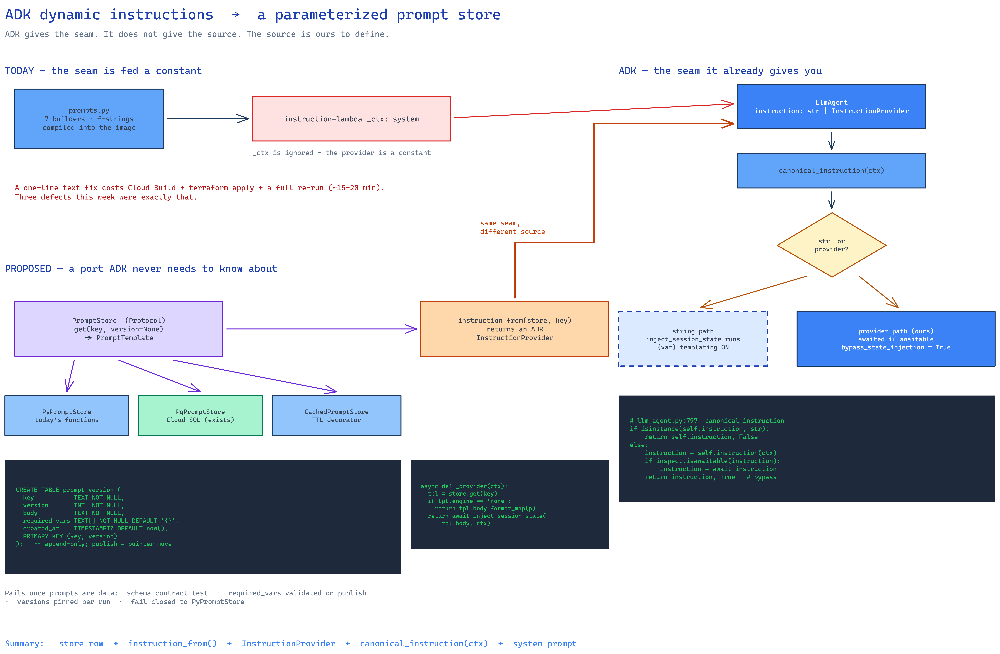

# ADK dynamic instructions → a parameterized prompt store

**Status:** IMPLEMENTED (P0-P4) — see §8 for what shipped and how it deviates from the design · **Date:** 2026-09-17 · **Repo:** `test-agent-v2`

**Question:** does ADK already support dynamic prompt loading, and if so can we reuse it to move
prompts out of Python and into a database behind a decoupled interface?

**Short answer:** Yes — ADK has a first-class dynamic-instruction seam (`InstructionProvider`), and
**we are already using it, but as a constant closure**. The plumbing is in place; what is missing is
the *source* of the prompt (today: hardcoded Python) and a port that lets us swap it.



---

## 1. What ADK actually provides (verified against the installed SDK)

All references are to the pinned `google-adk` in `.venv/Lib/site-packages/google/adk`.

### 1.1 `InstructionProvider` — the dynamic seam

```python
# google/adk/utils/instructions_utils.py:37
InstructionProvider: TypeAlias = Callable[
    [ReadonlyContext], Union[str, Awaitable[str]]
]
```

`LlmAgent` accepts it on two fields (`google/adk/agents/llm_agent.py`):

| Field | Line | Type | Notes |
|---|---|---|---|
| `instruction` | 309 | `Union[str, InstructionProvider]` | per-agent instruction |
| `global_instruction` | 323 | `Union[str, InstructionProvider]` | root-agent-wide (deprecated in this build) |
| `static_instruction` | 336 | `Optional[types.ContentUnion]` | **not** a provider — literal, never templated |

Resolution happens in `canonical_instruction(ctx)` (`llm_agent.py:797`), and it is **sync-or-async
tolerant** — it awaits the result if the callable returns an awaitable:

```python
if isinstance(self.instruction, str):
    return self.instruction, False
else:
    instruction = self.instruction(ctx)
    if inspect.isawaitable(instruction):
        instruction = await instruction
    return instruction, True          # <- bypass_state_injection
```

That async tolerance is what makes a database-backed provider legal at all: a provider may perform
I/O, and ADK will await it.

### 1.2 The trap: passing a callable disables ADK's `{var}` templating

The second return value is the part that matters for us. When `instruction` is a **string**, ADK runs
`inject_session_state` over it, so `{user_name}` / `{artifact.foo}` placeholders resolve from session
state. When `instruction` is a **provider**, `bypass_state_injection=True` — ADK assumes the callable
did its own rendering and **does not template the result**.

This is by design, and ADK documents the intended pattern (`instructions_utils.py:49-62`): a provider
that wants templating calls the helper itself.

```python
from google.adk.utils.instructions_utils import inject_session_state

async def build_instruction(readonly_context: ReadonlyContext) -> str:
    return await inject_session_state(template, readonly_context, use_jinja2=False)
```

So: **provider = full control, and full responsibility for rendering.** There is no middle mode where
you get both a callable and automatic `{var}` substitution.

### 1.3 `static_instruction` — the caching lever, and a positional side effect

`static_instruction` is literal content, never processed or substituted, emitted first as system
instruction for context-cache reuse. Its documented side effect is the one to watch
(`llm_agent.py:344-347`):

- `static_instruction is None` → `instruction` becomes **system_instruction**
- `static_instruction` is set → `instruction` is demoted to **user content**, after the static block

The docstring is also explicit that setting it **does not enable caching by itself** — that needs
`context_cache_config` at App level (Gemini/Vertex context cache). This is a *different* mechanism
from the Anthropic `cache_control` breakpoint we already inject via LiteLlm, so the two should not be
conflated.

---

## 2. What we do today

`build_generator_agent` (`src/common/testplan/llm/adk.py:37-47`) already passes a provider:

```python
return LlmAgent(name=name, model=model, output_schema=output_schema, output_key=output_key,
                instruction=lambda _ctx: system, disallow_transfer_to_parent=True,
                disallow_transfer_to_peers=True)
```

Two observations:

1. **We reuse ADK's seam correctly.** The closure form is deliberate — it makes literal `{…}` braces
   in the context pack pass through untouched (JSON examples in our prompts would otherwise be eaten
   by `inject_session_state`). The docstring says exactly this.
2. **But `_ctx` is ignored.** The prompt is rendered *eagerly*, by hand, before the agent is built.
   `system` is a plain string produced by `pack_block(summary)`. The provider is a constant function.

The prompts themselves are Python string-concatenation functions in three modules:

| Module | Builders |
|---|---|
| `common/testplan/llm/prompts.py` | `question_prompt`, `brief_prompt`, `scope_classify_prompt`, `scenarios_prompt`, `testdata_prompt`, `judge_scenarios_prompt`, `steps_prompt` (+ `pack_block`, `_scope_block`, `revision_feedback`) and the `GHERKIN_GUIDELINES` / `PACK_GROUNDING` / `ROUND_FOCUS` constants |
| `common/llm/prompts.py` | engine-path prompts |
| `common/bridge/prompts.py` | MCP surface text |

The KGA planners (`gather/explore/planners/{ask_llm,cloud_explore,hypothesize}.py`) each pass their
own `_instruction`.

### 2.1 Why this hurts — evidence from this week

Prompt text being compiled into the image has a concrete, measured cost. Three production defects
this session were **prompt/schema mismatches that required a full rebuild + redeploy to fix**:

- `scenarios_prompt` / `testdata_prompt` / `steps_prompt` said *"Return ONLY a JSON array"* while the
  ADK `output_schema` is an object wrapper `{items: [...]}` → recovery parsed a single element →
  every batch silently degraded to the heuristic fallback.
- The scope classifier was anchored on `plan.context_id` (a run id with no ticket signal) instead of
  the confirmed understanding.
- `_scope_block` rendered a corrupted `plan.scope` verbatim into **both** the generator and judge
  prompts, so the judge was told the ticket under test was out of scope.

Each was a one-line text change. Each cost a Cloud Build + `terraform apply` + a full pipeline re-run
(~15-20 min) to validate. A prompt store turns those into a row update and a re-run.

---

## 3. The gap, stated precisely

| Capability | ADK | Us today |
|---|---|---|
| Late-bound instruction resolution | ✅ `InstructionProvider` | ✅ used, but constant |
| Async provider (may do I/O) | ✅ awaited by `canonical_instruction` | ❌ never awaited — we pass a sync lambda |
| Variable substitution | ✅ `inject_session_state` (opt-in inside a provider) | ❌ hand-built f-strings |
| Prompt **source** abstraction | ❌ out of scope for ADK | ❌ hardcoded Python |
| Versioning / rollback / audit | ❌ | ❌ git + redeploy |

ADK deliberately stops at *"call this function to get the text"*. **Where the text comes from is ours
to define** — that is the interface this report proposes.

---

## 4. Proposed design

Two pieces, deliberately separate: a **port** (ours, storage-agnostic) and a thin **adapter** onto
ADK's existing seam. This mirrors the hexagonal pattern already used in this repo for `ModelProvider`
(`common/adk/providers/base.py`) and the Cloud SQL task store.

### 4.1 The port

```python
# common/prompts/port.py  — no ADK import, no DB import
@dataclass(frozen=True)
class PromptTemplate:
    key: str                   # "tpd.scenarios"
    version: int               # monotonic; immutable once published
    body: str                  # the template text
    engine: str = "none"       # "none" | "state" | "jinja2"
    required_vars: tuple[str, ...] = ()

class PromptStore(Protocol):
    def get(self, key: str, *, version: int | None = None) -> PromptTemplate: ...
```

`version=None` means *"current published"*. That is the whole port.

### 4.2 Implementations

| Impl | Purpose |
|---|---|
| `PyPromptStore` | wraps today's `prompts.py` functions — the **migration shim**, so nothing breaks on day one |
| `PgPromptStore` | Cloud SQL Postgres, reusing the task store's existing engine — no new infrastructure |
| `CachedPromptStore` | decorator: process-local TTL cache so a hot batch loop doesn't hit the DB per call |

The database already exists — the A2A task store runs on shared Cloud SQL Postgres via the Cloud SQL
Python Connector. This adds tables, not a dependency.

### 4.3 The ADK adapter — where reuse actually happens

```python
# common/prompts/adk.py
def instruction_from(store: PromptStore, key: str, *, version: int | None = None,
                     params: Mapping[str, str] | None = None) -> InstructionProvider:
    """Adapt a PromptStore entry into ADK's InstructionProvider."""
    async def _provider(ctx: ReadonlyContext) -> str:
        tpl = store.get(key, version=version)
        if tpl.engine == "none":
            return tpl.body.format_map(_Safe(params or {}))   # literal {…} survive
        return await inject_session_state(tpl.body, ctx, use_jinja2=(tpl.engine == "jinja2"))
    return _provider
```

This is the reuse the question asks for: **we do not invent a loading mechanism.** We produce exactly
the callable ADK already accepts, and `canonical_instruction` awaits it for us. `build_generator_agent`
changes from `instruction=lambda _ctx: system` to `instruction=provider`, and nothing else in the ADK
call path moves.

**Engine choice matters** (§1.2): `engine="none"` keeps today's literal-brace behavior for prompts
containing JSON examples; `engine="state"` opts a prompt into ADK's `{var}` substitution. Making it a
per-template column means one prompt can adopt templating without forcing all of them to.

### 4.4 Schema

```sql
CREATE TABLE prompt_template (
    key             TEXT PRIMARY KEY,
    description     TEXT NOT NULL DEFAULT '',
    engine          TEXT NOT NULL DEFAULT 'none',   -- none | state | jinja2
    current_version INT  NOT NULL
);

CREATE TABLE prompt_version (
    key           TEXT NOT NULL REFERENCES prompt_template(key),
    version       INT  NOT NULL,
    body          TEXT NOT NULL,
    required_vars TEXT[] NOT NULL DEFAULT '{}',
    created_at    TIMESTAMPTZ NOT NULL DEFAULT now(),
    created_by    TEXT NOT NULL DEFAULT 'system',
    note          TEXT NOT NULL DEFAULT '',
    PRIMARY KEY (key, version)
);
```

Versions are append-only; `current_version` is the publish pointer. Rollback is a pointer update, not
a delete — which is exactly the property the three defects in §2.1 needed.

### 4.5 Safety rails (non-negotiable)

Prompts become runtime-mutable data, so they need the guards code review used to provide:

- **Schema-contract test.** The array/object defect must be impossible to reintroduce: a test asserts
  every generator template's body agrees with its `output_schema` wrapper. This is the existing
  `test_generator_prompts_request_the_object_schema_not_a_bare_array`, generalized over the store.
- **`required_vars` validation on publish** — reject a body whose placeholders aren't declared.
- **Pin at run start.** Resolve versions once per pipeline run and record them in the run log, so a
  mid-run publish cannot make round 3 incomparable to round 1. This is what keeps the assured loop's
  round-over-round scores meaningful.
- **Fail closed to Python.** If the store is unreachable, fall back to `PyPromptStore` rather than
  running with an empty instruction.

---

## 5. Phasing

| Phase | Work | Value |
|---|---|---|
| P0 | Port + `PyPromptStore` + adapter; `build_generator_agent` takes a provider | Seam exists; zero behavior change |
| P1 | Move the 7 `testplan` builders behind keys; schema-contract test over the store | Prompts addressable |
| P2 | `PgPromptStore` + tables + `CachedPromptStore`; version pinning in the run log | Edit without redeploy |
| P3 | Admin read/publish surface on the MCP admin group; diff + rollback | Operable |
| P4 | Per-run overrides → A/B two prompt versions and compare assured scores | Prompt tuning becomes measurable |

P4 is the real prize: the assured judge already emits a 0–1 score per round, so a prompt store turns
prompt work from *"edit, rebuild, redeploy, eyeball"* into a measurable experiment against a metric we
already compute.

---

## 6. Decisions to confirm

1. **Scope** — all three prompt modules, or `common/testplan/llm/prompts.py` only to start?
   *Recommend:* testplan only; it is where every defect this week landed.
2. **Engine default** — `none` preserves today's literal-brace semantics exactly. Adopting `state`
   broadly would require escaping every JSON example in our prompts. *Recommend:* `none`, opt in per key.
3. **Store backing** — Cloud SQL (reuses the task-store engine) vs GCS objects (reuses the memory
   bucket). *Recommend:* Cloud SQL, for the transactional publish + version pointer.
4. **Do we adopt `static_instruction`?** It is the ADK-native way to mark a cacheable prefix, but it
   **demotes `instruction` to user content** (§1.3) and targets Gemini/Vertex context caching, not the
   Anthropic `cache_control` breakpoint we already inject. *Recommend:* **not now** — it would change
   message roles on the LiteLlm path we just spent this week stabilizing.

---

## 7. What this does not solve

Moving prompts into a database does not make them correct. Every defect this session was a *content*
bug, and a store would have made each one faster to fix but none of them impossible — except via the
schema-contract test in §4.5, which is the single highest-value item here and is worth building **even
if the store is never adopted**.


---

## 8. What shipped (2026-09-17) — and three deviations from the design above

P0-P4 are implemented; the suite is **567 passed / 14 skipped**, ruff clean. Sections 1-3 (the ADK
facts and the gap) proved accurate against the installed SDK and are unchanged. Three things in the
proposal did not survive contact with the code, each for a concrete reason:

**1. The template engine is `$`-substitution, not `str.format`.** §4.3 showed `body.format_map(...)`.
That cannot work here: our bodies are *full* of literal braces — `{"items": [ ... ]}`, `{id, title,
kind…}`, `{var}` — and `format_map` treats every one as a placeholder. `string.Template` uses `$name`,
which appears nowhere in the prompts (verified), so literal braces survive untouched. This is the same
constraint that makes the ADK instruction a closure today rather than a raw string.

**2. `CachedPromptStore` is gone; the snapshot replaced it.** The port's `get` had to stay **sync** —
`question_prompt`/`brief_prompt` are called from sync define paths while the Cloud SQL engine is
async, so a store that hит the DB per call could not serve both. `PgPromptStore` therefore serves a
process-local snapshot and only `refresh()` (async) touches the DB. That removed the need for a
separate TTL decorator — caching is inherent — and collapsed two components into one.

**3. Pinning and caching turned out to be the same mechanism.** §4.5 listed "pin at run start" as a
separate rail. With the snapshot design it falls out for free: `implement_plan` calls `refresh_store()`
once before any generator renders, and every `get` in that run reads that snapshot. The pins land on
`TestPlanRun.prompt_versions`, so a score comparison across rounds stays auditable after a publish.

### Files

| Area | Path |
|---|---|
| Port (no ADK, no DB) | `src/common/prompts/port.py` |
| Implementations | `src/common/prompts/stores.py` (`PyPromptStore`, `PgPromptStore`, `validate`) |
| ADK adapter | `src/common/prompts/adk.py` (`instruction_from`, `static_provider`) |
| Factory | `src/common/prompts/__init__.py` (`store_for`) |
| Bodies (P1) | `src/common/testplan/llm/templates.py` — 7 keys + `SCHEMA_CONTRACT` |
| Rewired renderers | `src/common/testplan/llm/prompts.py` (`_render`, `refresh_store`) |
| Admin surface (P3) | `src/common/admin/prompts.py`, `admin_agent/agent.py`, `admin_agent/bridge/mcp_server.py` |
| Provenance (P4) | `TestPlanRun.prompt_versions`, set in `implement/generate/pipeline.py` |
| Tests | `tests/test_prompt_store.py` (11) |

### The rails, as built

- **Schema-contract test** (`SCHEMA_CONTRACT`) — pins each generator's declared output shape, so a
  published body can never reintroduce the "JSON array vs `{items:[…]}`" defect that cost three
  rebuilds. This was §7's "worth building even if the store is never adopted"; it is now enforced over
  the store rather than over hardcoded strings.
- **Publish-time validation** — unknown engine, empty body, or an undeclared `$placeholder` is
  rejected before the write. An undeclared placeholder would otherwise render as the literal text
  `$foo` into the prompt, which the model reads as an instruction.
- **Fail closed** — `PgPromptStore` *wraps* `PyPromptStore`. Unreachable DB, unpublished key, or a row
  that fails validation all fall back to the body compiled into the image. Worst case is today's
  behaviour, never an empty instruction.
- **Render-time strictness** — a missing param raises rather than shipping a half-rendered prompt.

### MCP tools (P3)

`prompt_list`, `prompt_get`, `prompt_publish`, `prompt_rollback`, `prompt_history` — all on the ADMIN
group, none in the pipeline. `prompt_publish` takes a JSON payload because a prompt body is multi-line
and contains every character a delimiter might use.

### Not done

- **Only the 7 testplan prompts are behind keys** (§6 decision 1, as recommended). `common/llm/prompts.py`
  and the KGA planners still hold their text in Python.
- **`static_instruction` was not adopted** (§6 decision 4) — it demotes `instruction` to user content
  and targets Gemini/Vertex context caching, not the Anthropic `cache_control` breakpoint we inject.
- **The Postgres path is offline-untested.** Tables are created lazily (`CREATE TABLE IF NOT EXISTS`)
  on first refresh/publish, and every test here runs the no-DB fallback. The DB path needs one live
  verification against Cloud SQL before it can be trusted.
