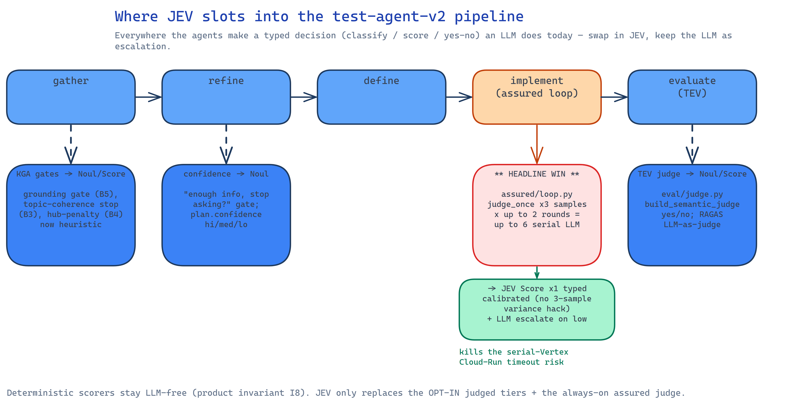
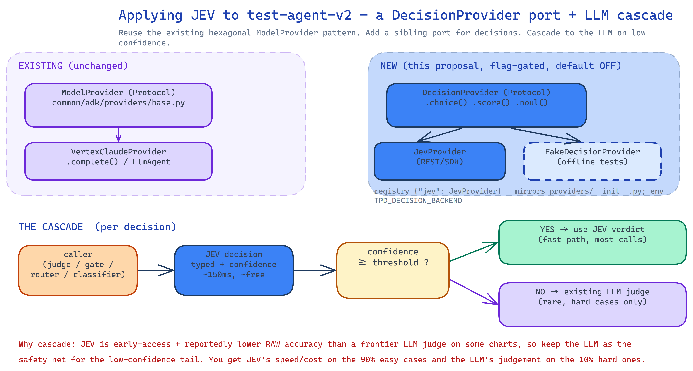

# Applying Jev (JEV) to test-agent-v2

*Research note · 2026-09-21 · companion to [`RESEARCH-typesafe-jev.md`](RESEARCH-typesafe-jev.md) (what Jev is + Jev vs LLM).*

---

## TL;DR

Our agents already make a pile of **typed decisions with an LLM** — judge a suite, gate an interrogation, score groundedness, classify relevance. Those are exactly what Jev is built for. The lazy‑but‑correct move: **add one `DecisionProvider` port next to the existing `ModelProvider`**, give it a `JevProvider` impl, and **cascade** — Jev first, existing LLM judge only on the low‑confidence tail. Flag‑gated, default OFF, LLM path untouched. **Don't reinvent** anything: we reuse the hexagonal provider pattern the codebase already has, and Jev's own SDK for transport.

---

## Where it slots (grounded in the code)



Every one of these is an LLM/heuristic decision today that Jev's **Choice/Score/Noul** can serve:

| Site | File | Today | Jev primitive |
|------|------|-------|---------------|
| **Assured‑gen judge (headline)** | `test_plan_definition/implement/assured/loop.py` | `judge_once` sampled **`TPD_JUDGE_SAMPLES=3`** × up to **2 rounds** = up to **6 serial Vertex calls**; median vs `_DEFAULT_THRESHOLD=0.7` | **Score** ×1 (calibration removes the 3‑sample variance hack) |
| **TEV semantic judge** | `test_evaluation/eval/judge.py::build_semantic_judge` | `judge(q, text) -> bool` via `provider.complete(max_tokens=8)` yes/no | **Noul** |
| **TEV RAGAS judged tier** | `test_evaluation/eval/judge.py` | LLM‑as‑judge (faithfulness/groundedness) | **Score / Noul** |
| **Refine / define gate** | `common/interrogate/loop.py`, `common/testplan/decision.py` | "enough info, stop asking?"; `plan.confidence` hi/med/lo heuristic | **Noul** |
| **KGA recall/grounding gates** | `knowledge_gathering/gather/explore/*` | grounding gate (B5), topic‑coherence stop (B3), hub‑penalty (B4) — heuristic | **Noul / Score** |
| **Model routing** (optional) | provider `tier="fast"` vs `default` | static | **Choice** (à la `ModelRouterMiddleware`) |

> **Invariant kept:** the deterministic scorers (`evaluate_pack` / `evaluate_plan` / `metrics/*`) stay **LLM‑free (I8)**. Jev only touches the **opt‑in judged tiers** and the **always‑on assured judge** — never the deterministic product path.

**The headline win** is the assured loop: it's the one *always‑on* multi‑LLM‑call site, and its serial Vertex calls are the exact thing that once tripped the Cloud‑Run liveness/request timeout (see memory: *implement serial Vertex calls → Cloud Run timeout*). One fast typed Jev Score per round removes both the latency risk and the cost.

---

## How to integrate — reuse, don't reinvent



**Jev is not a chat model** — it has no `generate_content`, so forcing it into `ModelProvider.complete()` / an ADK `LlmAgent` / a `BaseLlm` is wrong. And there's **no ADK‑native Jev integration** (not on Bedrock/OpenRouter), so nothing to plug in for free. `langchain_typesafe` exists but we're on **ADK, not LangChain** — pulling LangChain in for this one call is the opposite of lazy.

So mirror the pattern we already have (`common/adk/providers/{base,__init__}.py`) with a **sibling port**:

```python
# common/adk/providers/decision.py  (NEW — ~30 lines)
from typing import Protocol, runtime_checkable

@runtime_checkable
class DecisionProvider(Protocol):
    name: str
    def is_configured(self) -> bool: ...
    def choice(self, state: str, options: list[str], instructions: str) -> "Verdict": ...
    def score(self, state: str, instructions: str, levels: list[str]) -> "Verdict": ...
    def noul(self, state: str, statement: str) -> "Verdict": ...
    # Verdict = {value, probs, confidence} — typed, already what the callers want
```

- **`JevProvider`** — the one impl, wrapping Jev's REST/SDK. Registered in a `_DECISION_REGISTRY = {"jev": JevProvider}` exactly like the model registry; selected by `TPD_DECISION_BACKEND` (default OFF → callers keep using the LLM).
- **`FakeDecisionProvider`** — canned typed verdicts for offline tests, mirroring the existing offline fake‑model pattern (`conftest`/`tpd_fakes`). Keeps the suite network‑free.

### The cascade (the important part)

Because Jev's raw accuracy can trail a frontier LLM judge, **don't replace the LLM — front it**:

```
verdict = decision.score(state, instructions, levels)      # Jev: ~150ms, ~free
if verdict.confidence >= THRESHOLD:      #  ~90% of calls
    return verdict                        #  fast path
return existing_llm_judge(...)            #  ~10% hard tail — unchanged code
```

This is exactly Jev's own calibrated‑confidence philosophy, and it means the change is **strictly additive**: worst case we fall back to today's behaviour. Calibrate `THRESHOLD` against our golden sets (TEV already has them) before trusting it.

---

## Rollout (smallest first)

1. **Port + fake + one call site.** Add `DecisionProvider` + `JevProvider` + `FakeDecisionProvider`; wire the **TEV `build_semantic_judge`** yes/no to `noul()` behind `TPD_DECISION_BACKEND=jev`. Smallest, lowest‑risk, offline‑testable. *(skipped until here: everything else — YAGNI.)*
2. **Assured loop** (the win): replace `judge_once`×3 with `score()`×1 + LLM escalation on low confidence. Measure latency/cost vs the golden runs.
3. **Interrogation / KGA gates** only if steps 1–2 pay off on our data.

**Add when:** Jev leaves early‑access and we can benchmark calibration on our goldens. Until then this is a design, gated OFF.

---

## Open questions
- Does Jev's **32K context** hold our largest packs/plans as `state`? If not, we summarise first (the deterministic pack already exists) or keep those on the LLM.
- Data residency: Jev endpoint region vs our `europe-west6` Vertex — check before sending customer state.
- Calibration drift: re‑check the threshold whenever Jev ships a model update (calibration is per‑model).

*Sources: same as the companion note.*
