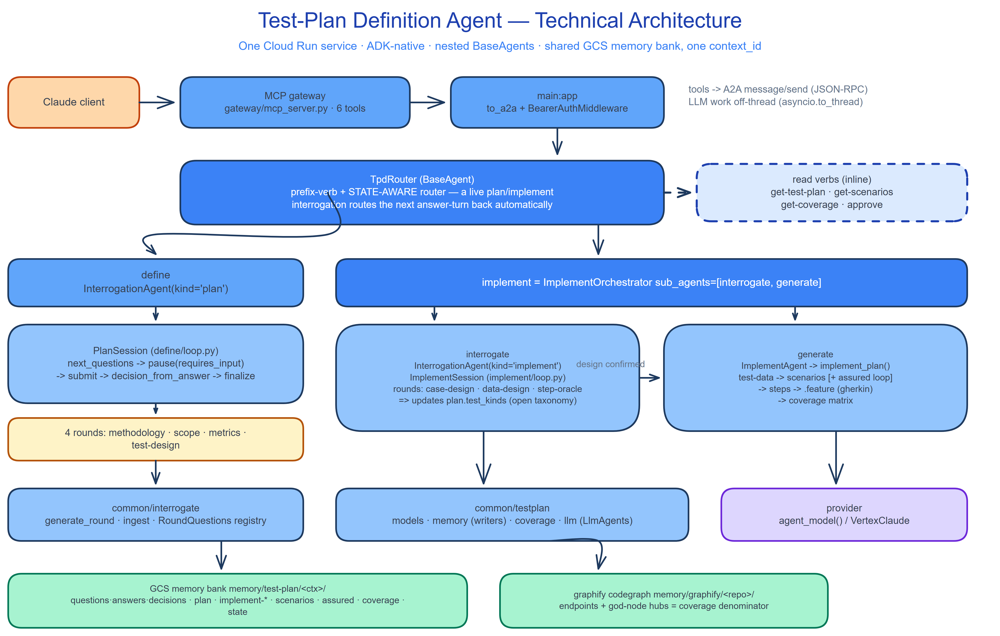
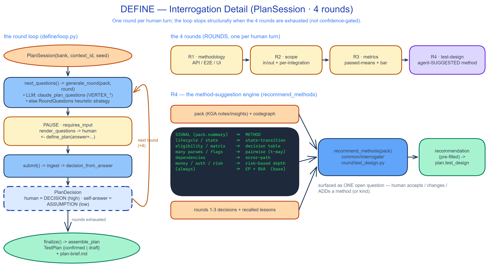
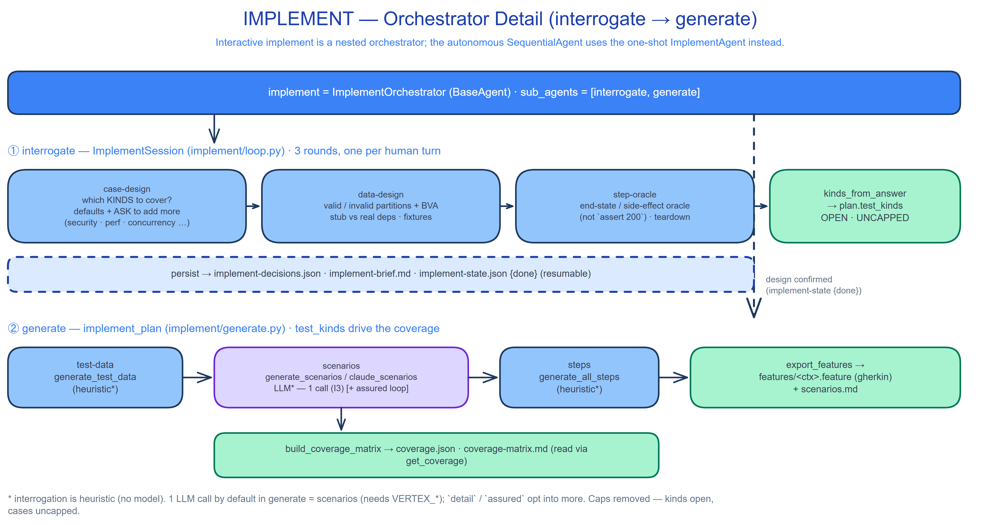
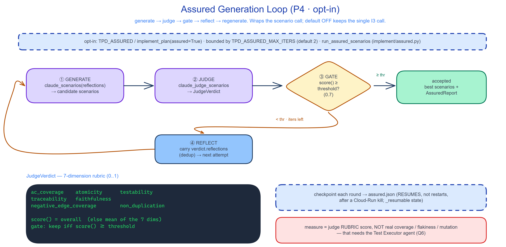
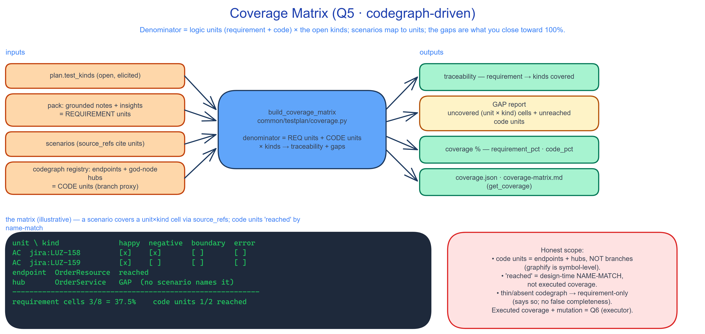

# Test-Plan Definition Agent — Technical Details

**Scope:** `test-agent-v2/src/test_plan_definition` (+ its `common/*` engine) — Step 3+4 of the
Testing Agent, as BUILT (Q1–Q5).
**Audience:** engineers / architects — real module, function, and file names; the data flow and the
invariants that constrain it.
**Companions:** the [manager overview](./test-plan-definition-agentic-loop-overview.md) (the *shape*),
[`RESEARCH-tpd-interrogative-coverage.md`](./RESEARCH-tpd-interrogative-coverage.md) (the design +
BUILT status), and [`RESEARCH-tpd-assured-generation.md`](./RESEARCH-tpd-assured-generation.md) /
[`RESEARCH-test-executor-agent.md`](./RESEARCH-test-executor-agent.md) (P4 + the deferred Q6).

---

## 0. TL;DR

TPD is one Cloud Run service, ADK-native, driven over MCP/A2A. A `TpdRouter` (a custom `BaseAgent`)
dispatches by prefix verb **and by live session state** to two nested sub-agents: an **`InterrogationAgent`
`define`** and an **`ImplementOrchestrator` `implement`** (which itself nests `interrogate` + `generate`).
Both phases are **interrogative** — a resumable `…Session` state machine asks the human the judgement
calls one round per turn — and everything persists to a shared GCS memory bank keyed by one `context_id`.
The output is a scored, traceable BDD suite plus a codegraph **coverage matrix**.

---

## 1. Architecture



**Transport / control plane.** The single MCP **gateway** (`gateway/mcp_server.py`, 6 tools:
`define_plan`, `approve_plan`, `implement_plan`, `get_plan`, `get_scenarios`, `get_coverage`) forwards
each tool call to the agent as an A2A `message/send` (JSON-RPC). The ASGI app is `main:app`
(`to_a2a(root_agent)` + `BearerAuthMiddleware`). Long LLM work runs **off the event loop**
(`asyncio.to_thread`) so a multi-second Vertex call never starves Cloud Run's `/livez` probe.

**`TpdRouter` (`test_plan_definition/agent.py`).** A deterministic, **state-aware** prefix-verb router.
`get-*` / `approve` are handled inline; otherwise it reads `plan-state.json` / `implement-state.json` and
routes a **live** interrogation's next answer-turn back to the right sub-agent automatically —
`sub_agents = [define, implement]`.

**Shared engine.** `common/interrogate` (the round engine: `generate_round`, `ingest`, the
`RoundQuestions` registry), `common/testplan` (`models`, `memory` writers, `coverage`, `llm` LlmAgents),
and the model **provider** (`agent_model()` → `VertexClaudeProvider`).

**Persistence.** The GCS **memory bank** at `memory/test-plan/<ctx>/` and the **graphify codegraph** at
`memory/graphify/<repo>/` (whose endpoints + hubs are the coverage denominator).

---

## 2. DEFINE — the interrogation state machine



`define` is an `InterrogationAgent(kind="plan")` driving a **`PlanSession`** (`define/loop.py`). One round
per human turn:

1. `next_questions()` pops the next round and calls `generate_round(pack, round)` — the LLM path
   (`claude_plan_questions`, when `VERTEX_*` is set) or the heuristic `RoundQuestions` strategy for that
   round.
2. The agent **pauses** (`requires_input`); the human answers via `define_plan(answer=…)`.
3. `submit()` → `ingest` → `decision_from_answer` distils a `PlanDecision` — a **human answer is a
   high-confidence `DECISION`**, an **agent self-answer a low-confidence `ASSUMPTION`**.
4. When the 4 rounds are exhausted, `finalize()` → `assemble_plan` writes the `TestPlan`
   (`{confirmed | draft}`) + `plan-brief.md`. **The stop condition is structural** (rounds exhausted),
   not confidence-gated.

**`ROUNDS = (methodology, scope, metrics, test-design)`** (`common/testplan/models/plan.py`). The 4th,
**`test-design`**, is agent-**suggested**: `TestDesignRound.recommend_methods(pack)`
(`common/interrogate/round/test_design.py`) maps signals in the pack to methods — *lifecycle/state →
state-transition, eligibility/matrix → decision-table, many params → pairwise, dependencies → error-path,
money/auth/risk → risk-based depth,* always **EP+BVA** as the base — combined with rounds 1–3's decisions.
It surfaces one open question with the recommendation pre-filled; the human accepts / changes / **adds**.
The choice lands on `TestPlan.test_design`.

---

## 3. IMPLEMENT — the orchestrator (interrogate → generate)



Interactive `implement` is an **`ImplementOrchestrator`** (`implement/agent.py`) with
`sub_agents = [interrogate, generate]`. (The **autonomous** `SequentialAgent` pipeline can't do HITL, so
it keeps the one-shot `ImplementAgent` directly.)

**① interrogate** — an `InterrogationAgent(kind="implement")` over an **`ImplementSession`**
(`implement/loop.py`, mirrors `PlanSession`) with 3 rounds:
- **case-design** — *which KINDS to cover?* Defaults (happy/negative/boundary/error) are a seed; the round
  **asks the human to add more**. `kinds_from_answer` distils the answer into **`plan.test_kinds`** — an
  **open, uncapped** taxonomy.
- **data-design** — valid/invalid partitions + BVA, stub-vs-real deps, fixtures.
- **step-oracle** — the oracle each case asserts (end-state / side-effect, not `assert 200`) + teardown.

State + decisions persist to `implement-decisions.json` / `implement-brief.md` /
`implement-state.json {done}` (resumable). Once confirmed, the orchestrator chains into **② generate**.

**② generate** — `implement_plan()` (`implement/generate.py`): `generate_test_data` → **`generate_scenarios`**
(`claude_scenarios`, the single **I3** LLM call by default; `[+ assured loop]`) → `generate_all_steps` →
`export_features` (`.feature`) → `build_coverage_matrix`. Interrogation is heuristic (no model);
`detail` / `assured` opt into more. **Caps are gone** — kinds are the open elicited set, cases per kind
uncapped, every grounded behaviour enumerated.

---

## 4. The Assured Generation Loop (P4 · opt-in)



`run_assured_scenarios` (`implement/assured.py`) replaces the single blind scenario call — **opt-in** via
`TPD_ASSURED` / `implement_plan(assured=True)`; default OFF keeps the I3 single call. Bounded by
`TPD_ASSURED_MAX_ITERS` (default 2):

1. **GENERATE** `claude_scenarios(reflections)` → candidates.
2. **JUDGE** `claude_judge_scenarios` → **`JudgeVerdict`** — a 7-dimension rubric (`ac_coverage`,
   `atomicity`, `testability`, `traceability`, `faithfulness`, `negative_edge_coverage`, `non_duplication`);
   `score()` = the model's `overall` or the mean of the seven.
3. **GATE** keep iff `score() ≥ threshold` (`TPD_ASSURED_THRESHOLD`, 0.7) → **accepted** (best scenarios +
   `AssuredReport`).
4. **REFLECT** below the bar with iterations left → carry `verdict.reflections` (dedup) into the next
   GENERATE.

Each round checkpoints to `assured.json` so a Cloud-Run kill **resumes, not restarts**
(`_resumable`). **Honest gap:** the "measure" is the judge rubric score, **not** real coverage / flakiness
/ mutation — that is Q6 (the executor).

---

## 5. The Coverage Matrix (Q5 · codegraph-driven)



`build_coverage_matrix` (`common/testplan/coverage.py`) builds the matrix whose **denominator = logic
units**:
- **REQUIREMENT units** — every grounded note + insight (the ACs/behaviours).
- **CODE units** — the codegraph's inbound **endpoints** + core **god-node hubs** (graphify is
  symbol-level, so these are the branch proxy), read from the `common/codegraph/store.read_registry`.

Each requirement unit is covered for kind *K* iff a scenario cites it (via `source_refs`) with kind *K*.
Code units are marked **reached** when a scenario or covered note **names** them. Outputs: a
**traceability** view, a **GAP report** (uncovered `unit × kind` cells + unreached code units), a coverage
**%** (`requirement_pct` / `code_pct`), and `coverage.json` / `coverage-matrix.md` (read via
`get_coverage`). It degrades to requirement-only when no codegraph exists and says so.

**Honest scope:** code units are endpoints/hubs, not branches; "reached" is a design-time **name-match**;
executed/branch coverage + mutation are **Q6**.

---

## 6. Persistence & resumability

All under `memory/test-plan/<ctx>/`, keyed by the one `context_id`; read-back always goes through the
**JSON sidecars** (schema-drift tolerant), `.md` files are presentational:

```
questions.json  answers.json  decisions.json          # define interrogation trail
plan.json  plan.md  plan-brief.md                     # the plan (+ test_design)
implement-state.json  implement-decisions.json  implement-brief.md   # implement interrogation
test-data.json  scenarios.json  scenarios.md  steps.json
features/<name>.feature                               # BDD export
assured.json                                          # P4 checkpoint (when enabled)
coverage.json  coverage-matrix.md                     # Q5 matrix + gap report
state.json                                            # resumable define session
```

Two session state files (`state.json`, `implement-state.json`, each `{done}`) drive resumability: the
router routes a live interrogation's answer-turn back to its sub-agent, which **rehydrates** the session
and continues from the persisted round.

---

## 7. Invariants (do not regress)

- **I3 — one LLM call by default.** Only `generate_scenarios` calls the model on the default generate path
  (interrogation is heuristic); three serial blocking Vertex calls once blew the Cloud-Run timeout.
  `detail` / `assured` are the only opt-ins.
- **Human owns every gate.** Client-owned Yes/No before each round + `approve`; **status-as-lock**
  (`TestPlan.status` *is* the lock; a `draft` blocks implement).
- **No caps.** Open elicited `test_kinds`, uncapped cases; never a fixed 4-kind / 8-note ceiling.
- **Off the request path.** Long LLM work via `asyncio.to_thread`; loop state persisted so a kill resumes.
- **Layering.** `common/*` never imports `test_plan_definition`; the two agents never import each other.

---
*Technical companion to the manager overview. Diagrams authored in Excalidraw (rendered PNGs beside this
file); regenerate with the repo's render tooling. Reflects the Q1–Q5 build (2026-09-10); Q6 (Test Executor)
deferred.*
